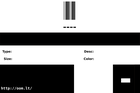
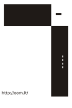

Contents
========

* [ > ](#--)
	* [Labels](#labels)
	* [EDA](#eda)
	* [Images](#images)
	* [Tags](#tags)

#  > 

- ID: ----
- Hex ID: 
- Name: 
- Description: 
- Long Link: [http://oom.lt/----](http://oom.lt/----)
- Short Link: [http://oom.lt/](http://oom.lt/)

## Labels
  
  

|label-front|label-inventory|label-spec|
| :---: | :---: | :---: |
||||

## EDA

### Symbols

## Images
  
  

|label-front|label-inventory|label-spec|
| :---: | :---: | :---: |
||||

## Tags

- oompID: ----
