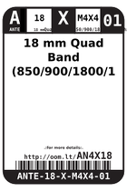
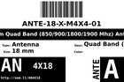
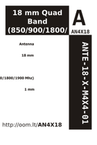

Contents
========

* [AN4X18 > 18 mm Quad Band (850/900/1800/1900 Mhz) Antenna](#an4x18--18-mm-quad-band-85090018001900-mhz-antenna)
	* [Images](#images)
	* [Datasheets](#datasheets)
	* [Labels](#labels)
	* [EDA](#eda)
	* [Tags](#tags)
  
![][im]
# AN4X18 > 18 mm Quad Band (850/900/1800/1900 Mhz) Antenna

- ID: ANTE-18-X-M4X4-01
- Hex ID: AN4X18
- Name: 18 mm Quad Band (850/900/1800/1900 Mhz) Antenna
- Description: 18 mm Quad Band (850/900/1800/1900 Mhz) Antenna

## Images
  
  

|image|image_RE|label-front|label-inventory|label-spec|
| :---: | :---: | :---: | :---: | :---: |
||||||

## Datasheets

- Datasheet: [datasheet.pdf](datasheet.pdf)

## Labels
  
  

|label-front|label-inventory|label-spec|
| :---: | :---: | :---: |
||||

## EDA

### Symbols

## Tags

- oompID: ANTE-18-X-M4X4-01
- name: 18 mm Quad Band (850/900/1800/1900 Mhz) Antenna
- hexID: AN4X18
- oompSort: ANTE18M4X4
- oompType: ANTE
- oompSize: 18
- oompColor: X
- oompDesc: M4X4
- oompIndex: 01
- oompVersion: 98
- oompSchem: template;ANTE-XXXX-X-XXXX-XX-schem
- ooDesignator: AE1

[im]: image_450.jpg
