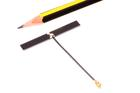
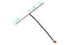
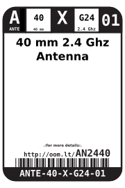
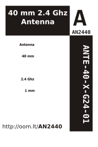

Contents
========

* [ANTE-40-X-G24-01>40 mm 2.4 Ghz Antenna](#ante-40-x-g24-0140-mm-24-ghz-antenna)
	* [Images](#images)
	* [Datasheets](#datasheets)
	* [Labels](#labels)
	* [EDA](#eda)
		* [Symbols](#symbols)
	* [Tags](#tags)
  
![][im]
# ANTE-40-X-G24-01>40 mm 2.4 Ghz Antenna

- ID: ANTE-40-X-G24-01
- Name: ANTE-40-X-G24-01

## Images
  
  

|image|image_RE|image_BOTTOM|
| :---: | :---: | :---: |
||||

## Datasheets

- Datasheet: [datasheet.pdf](datasheet.pdf)

## Labels
  
  

|label-front|label-inventory|label-spec|
| :---: | :---: | :---: |
||||

## EDA

### Symbols

## Tags

- oompID: ANTE-40-X-G24-01
- name: 40 mm 2.4 Ghz Antenna
- hexID: AN2440
- oompSort: ANTEG2440
- oompType: ANTE
- oompSize: 40
- oompColor: X
- oompDesc: G24
- oompIndex: 01
- oompVersion: 98
- oompSchem: template;ANTE-XXXX-X-XXXX-XX-schem
- ooDesignator: AE1

[im]: image_600.jpg
