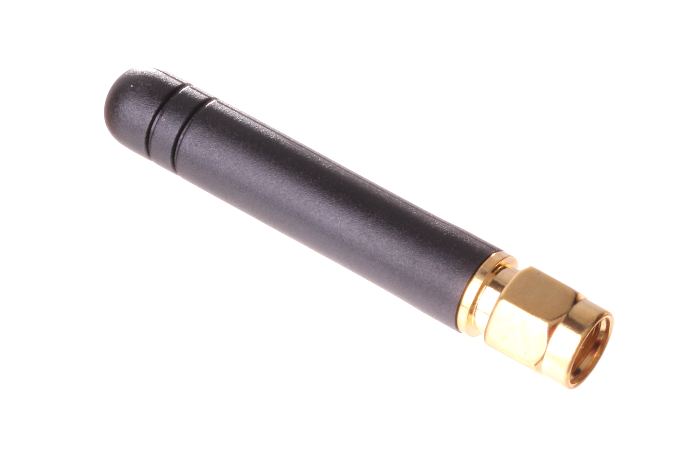
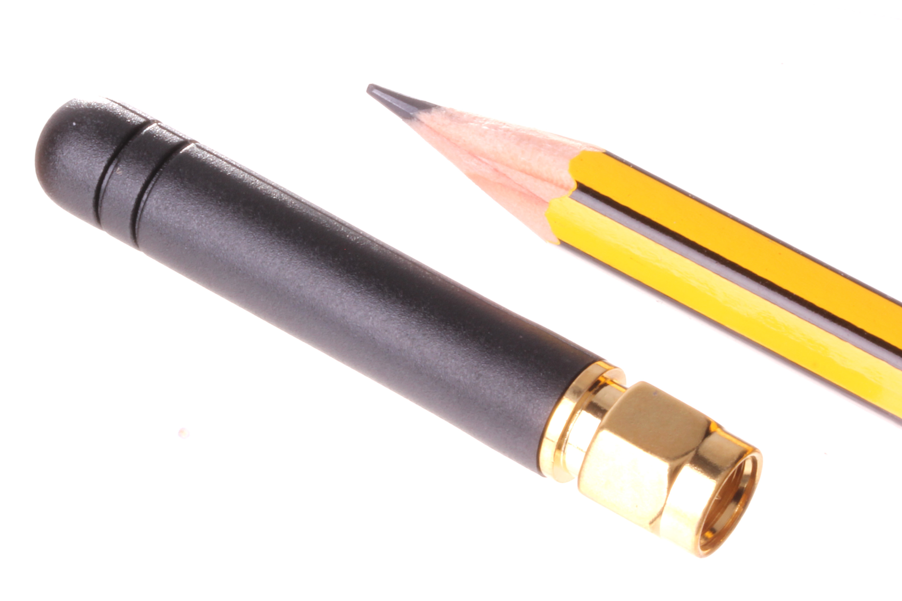

Contents
========

* [ANTE-SMA-X-G24-01>SMA 2.4 Ghz Antenna](#ante-sma-x-g24-01sma-24-ghz-antenna)
	* [Images](#images)
	* [Datasheets](#datasheets)
	* [EDA](#eda)
		* [Footprints](#footprints)
		* [Symbols](#symbols)
	* [Tags](#tags)

# ANTE-SMA-X-G24-01>SMA 2.4 Ghz Antenna

- ID: ANTE-SMA-X-G24-01
- Name: ANTE-SMA-X-G24-01

## Images
  
  

|Main|Reference|
| :---: | :---: |
|||

## Datasheets

- Datasheet: [datasheet.pdf](datasheet.pdf)

## EDA

### Footprints
  

|||||
| :---: | :---: | :---: | :---: |

### Symbols

## Tags

- index: 3
- oompID: ANTE-SMA-X-G24-01
- name: SMA 2.4 Ghz Antenna
- hexID: AN24SM
- oompSort: ANTESMAM4X4
- oompType: ANTE
- oompSize: SMA
- oompColor: X
- oompDesc: G24
- oompIndex: 01
- oompVersion: 98
- oompSchem: template;ANTE-XXXX-X-XXXX-XX-schem
- ooDesignator: AE1
