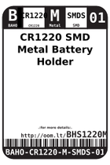
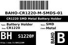
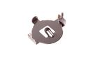

Contents
========

* [BHS1220M > CR1220 SMD Metal Battery Holder](#bhs1220m--cr1220-smd-metal-battery-holder)
	* [Datasheets](#datasheets)
	* [Labels](#labels)
	* [EDA](#eda)
	* [Images](#images)
	* [Tags](#tags)
  
![][im]
# BHS1220M > CR1220 SMD Metal Battery Holder

- ID: BAHO-CR1220-M-SMDS-01
- Hex ID: BHS1220M
- Name: CR1220 SMD Metal Battery Holder
- Description: CR1220 SMD Metal Battery Holder
- Long Link: [http://oom.lt/BAHO-CR1220-M-SMDS-01](http://oom.lt/BAHO-CR1220-M-SMDS-01)
- Long Link: [http://oom.lt/BHS1220M](http://oom.lt/BHS1220M)

## Datasheets

- Datasheet: [datasheet.pdf](datasheet.pdf)

## Labels
  
  

|label-front|label-inventory|label-spec|
| :---: | :---: | :---: |
||||

## EDA

### Symbols

## Images
  
  

|image|image_RE|image_BOTTOM|label-front|label-inventory|label-spec|
| :---: | :---: | :---: | :---: | :---: | :---: |
|||||||

## Tags

- oompID: BAHO-CR1220-M-SMDS-01
- name: CR1220 SMD Metal Battery Holder
- hexID: BHS1220M
- oompSort: BAHOCR1220SMDS
- oompType: BAHO
- oompSize: CR1220
- oompColor: M
- oompDesc: SMDS
- oompIndex: 01
- oompVersion: 98
- oompSchem: template;BAHO-XXXX-X-XXXX-XX-schem
- ooDesignator: BT1

[im]: image_450.jpg
