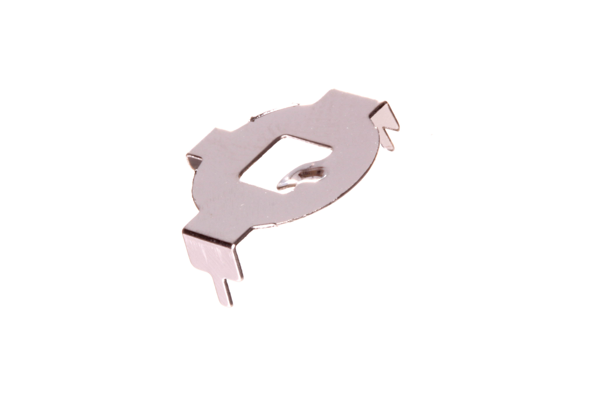
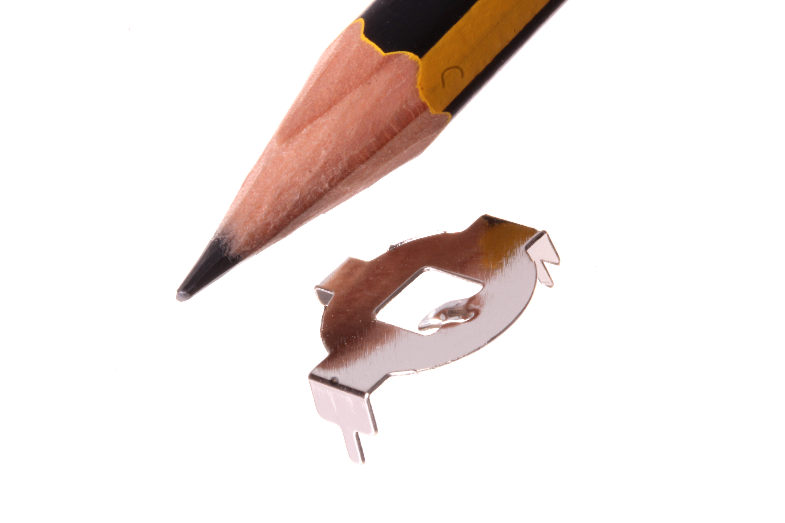
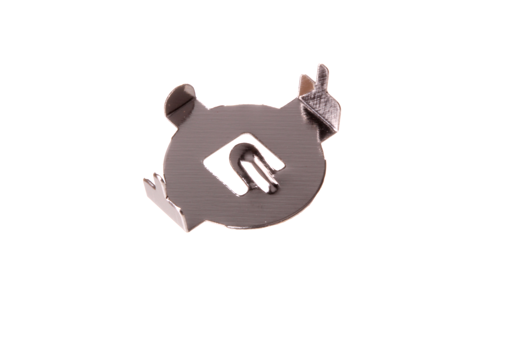

Contents
========

* [BAHO-CR1220-M-SMDS-01>CR1220 SMD Metal Battery Holder](#baho-cr1220-m-smds-01cr1220-smd-metal-battery-holder)
	* [Images](#images)
	* [Datasheets](#datasheets)
	* [Labels](#labels)
	* [EDA](#eda)
		* [Symbols](#symbols)
	* [Tags](#tags)
  
![][im]
# BAHO-CR1220-M-SMDS-01>CR1220 SMD Metal Battery Holder

- ID: BAHO-CR1220-M-SMDS-01
- Name: BAHO-CR1220-M-SMDS-01

## Images
  
  

|Main|Reference|Bottom|
| :---: | :---: | :---: |
||||

## Datasheets

- Datasheet: [datasheet.pdf](datasheet.pdf)

## Labels
  
  

|Front|Inventory|Specifications|
| :---: | :---: | :---: |
||||

## EDA

### Symbols

## Tags

- index: 12303
- oompID: BAHO-CR1220-M-SMDS-01
- name: CR1220 SMD Metal Battery Holder
- hexID: BHS1220M
- oompSort: BAHOCR1220SMDS
- oompType: BAHO
- oompSize: CR1220
- oompColor: M
- oompDesc: SMDS
- oompIndex: 01
- oompVersion: 98
- oompSchem: template;BAHO-XXXX-X-XXXX-XX-schem
- ooDesignator: BT1

[im]: image_600.jpg
