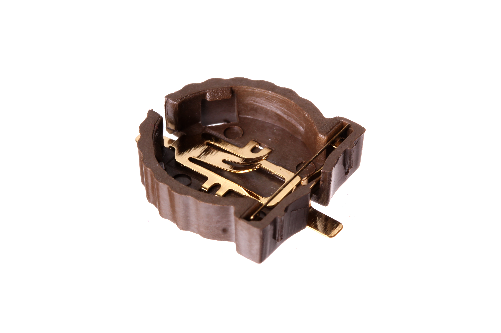
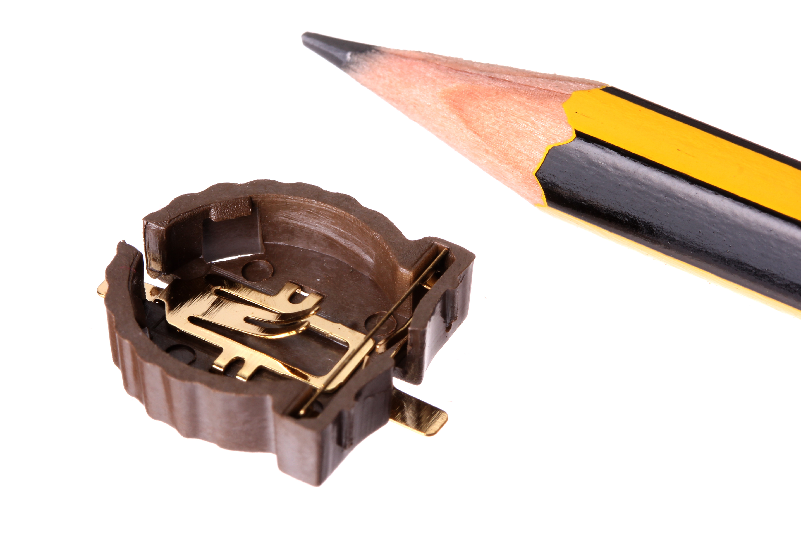

Contents
========

* [BAHO-CR1220-X-SMDS-01>CR1220 SMD Battery Holder](#baho-cr1220-x-smds-01cr1220-smd-battery-holder)
	* [Images](#images)
	* [Datasheets](#datasheets)
	* [EDA](#eda)
		* [Footprints](#footprints)
		* [Symbols](#symbols)
	* [Tags](#tags)
  
![][im]
# BAHO-CR1220-X-SMDS-01>CR1220 SMD Battery Holder

- ID: BAHO-CR1220-X-SMDS-01
- Name: BAHO-CR1220-X-SMDS-01

## Images
  
  

|Main|Reference|Bottom|
| :---: | :---: | :---: |
||||

## Datasheets

- Datasheet: [datasheet.pdf](datasheet.pdf)

## EDA

### Footprints
  

|||||
| :---: | :---: | :---: | :---: |

### Symbols

## Tags

- index: 5
- oompID: BAHO-CR1220-X-SMDS-01
- name: CR1220 SMD Battery Holder
- hexID: BHS1220
- oompSort: 
- oompClass: Surface Mount
- oompClassCode: SMDS
- oompType: BAHO
- oompSize: CR1220
- oompColor: X
- oompDesc: SMDS
- oompIndex: 01
- oompVersion: 40
- ooWidth: 15.06 mm
- ooHeight: 4.10 mm
- ooLength: 15 mm
- ooNumPins: 2
- oompAbout: A surface mount battery holder for a CR1220 lithium ion button cell. Commonly used as a battery backup for on board clocks.
- oompSchem: template;BAHO-XXXX-X-XXXX-XX-schem
- ooDesignator: BT1

[im]: image_600.jpg
