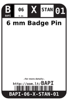

Contents
========

* [BAPI > 6 mm Badge Pin](#bapi--6-mm-badge-pin)
	* [Diagrams](#diagrams)
	* [Labels](#labels)
	* [EDA](#eda)
	* [Images](#images)
	* [Tags](#tags)
  
![][im]
# BAPI > 6 mm Badge Pin

- ID: BAPI-06-X-STAN-01
- Hex ID: BAPI
- Name: 6 mm Badge Pin
- Description: 6 mm Badge Pin
- Long Link: [http://oom.lt/BAPI-06-X-STAN-01](http://oom.lt/BAPI-06-X-STAN-01)
- Short Link: [http://oom.lt/BAPI](http://oom.lt/BAPI)

## Diagrams
  
  

|diagBBLS|diagDIAG|diagIDEN|diagSCHEM|diagSIMP|
| :---: | :---: | :---: | :---: | :---: |
||||||

## Labels
  
  

|label-front|label-inventory|label-spec|
| :---: | :---: | :---: |
||||

## EDA

### Symbols

## Images
  
  

|image|image_RE|diagBBLS|diagDIAG|diagIDEN|diagSCHEM|diagSIMP|label-front|label-inventory|label-spec|
| :---: | :---: | :---: | :---: | :---: | :---: | :---: | :---: | :---: | :---: |
|||||||||||

## Tags

- oompID: BAPI-06-X-STAN-01
- name: 6 mm Badge Pin
- hexID: BAPI
- oompSort: BAPI06THTH
- oompType: BAPI
- oompSize: 06
- oompColor: X
- oompDesc: STAN
- oompIndex: 01
- oompVersion: 98

[im]: image_450.jpg
