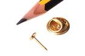
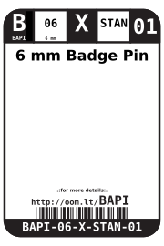
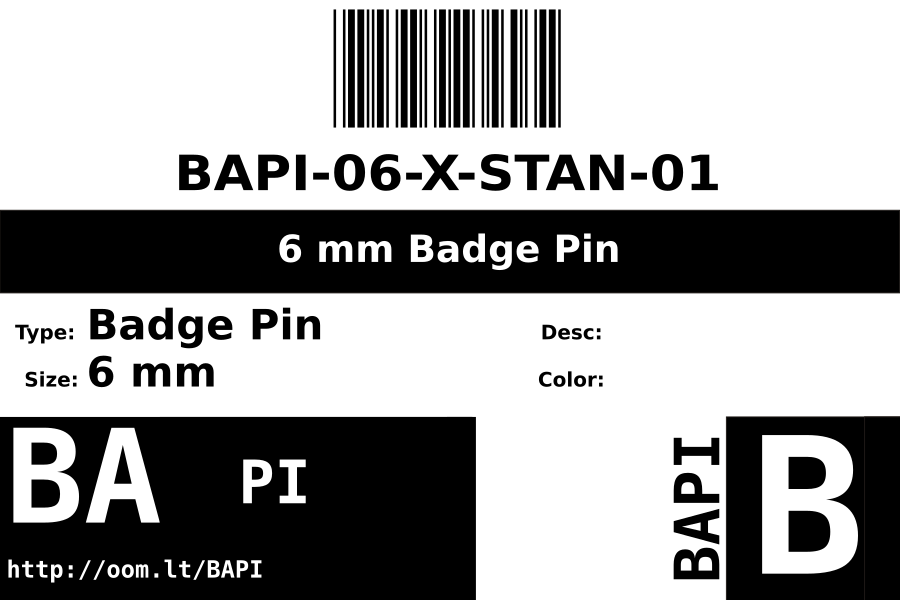
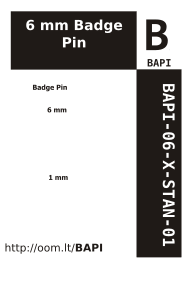

Contents
========

* [BAPI-06-X-STAN-01>6 mm Badge Pin](#bapi-06-x-stan-016-mm-badge-pin)
	* [Images](#images)
	* [Labels](#labels)
	* [EDA](#eda)
		* [Symbols](#symbols)
	* [Tags](#tags)
  
![][im]
# BAPI-06-X-STAN-01>6 mm Badge Pin

- ID: BAPI-06-X-STAN-01
- Name: BAPI-06-X-STAN-01

## Images
  
  

|image|image_RE|
| :---: | :---: |
|||

## Labels
  
  

|label-front|label-inventory|label-spec|
| :---: | :---: | :---: |
||||

## EDA

### Symbols

## Tags

- oompID: BAPI-06-X-STAN-01
- name: 6 mm Badge Pin
- hexID: BAPI
- oompSort: BAPI06THTH
- oompType: BAPI
- oompSize: 06
- oompColor: X
- oompDesc: STAN
- oompIndex: 01
- oompVersion: 98

[im]: image_600.jpg
