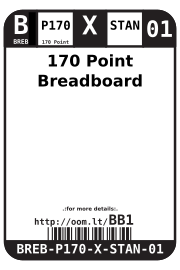

Contents
========

* [BREB-P170-X-STAN-01>170 Point Breadboard](#breb-p170-x-stan-01170-point-breadboard)
	* [Datasheets](#datasheets)
	* [Labels](#labels)
	* [EDA](#eda)
		* [Symbols](#symbols)
	* [Tags](#tags)

# BREB-P170-X-STAN-01>170 Point Breadboard

- ID: BREB-P170-X-STAN-01
- Name: BREB-P170-X-STAN-01

## Datasheets

- Datasheet: [datasheet.pdf](datasheet.pdf)

## Labels
  
  

|Front|Inventory|Specifications|
| :---: | :---: | :---: |
||||

## EDA

### Symbols

## Tags

- oompID: BREB-P170-X-STAN-01
- hexID: BB1
- oompSort: P170
- oompType: BREB
- oompSize: P170
- oompColor: X
- oompDesc: STAN
- oompIndex: 01
- oompVersion: 99
- ooPitch: 2.54 mm
- ooWidth: 35 mm
- ooHeight: 47 mm
- ooDepth: 10 mm
- useTitle: Prototyping
- useDescription: a base for prototyping new circuits.
- oompAbout: The start of any project. Great for quickly prototyping a new ciruit. Compatible with most 2.54 mm (0.1") components.
- oompClass: Wiring
- oompClassCode: WIRE
