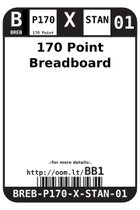
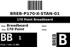
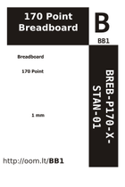

Contents
========

* [BB1 > 170 Point Breadboard](#bb1--170-point-breadboard)
	* [Images](#images)
	* [Labels](#labels)
	* [EDA](#eda)
	* [Tags](#tags)

# BB1 > 170 Point Breadboard

- ID: BREB-P170-X-STAN-01
- Hex ID: BB1
- Name: 170 Point Breadboard
- Description: 170 Point Breadboard

## Images
  
  

|label-front|label-inventory|label-spec|
| :---: | :---: | :---: |
||||

## Labels
  
  

|label-front|label-inventory|label-spec|
| :---: | :---: | :---: |
||||

## EDA

### Symbols

## Tags

- oompID: BREB-P170-X-STAN-01
- hexID: BB1
- oompSort: P170
- oompType: BREB
- oompSize: P170
- oompColor: X
- oompDesc: STAN
- oompIndex: 01
- oompVersion: 99
- ooPitch: 2.54 mm
- ooWidth: 35 mm
- ooHeight: 47 mm
- ooDepth: 10 mm
- useTitle: Prototyping
- useDescription: a base for prototyping new circuits.
- oompAbout: The start of any project. Great for quickly prototyping a new ciruit. Compatible with most 2.54 mm (0.1") components.
- oompClass: Wiring
- oompClassCode: WIRE
