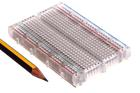
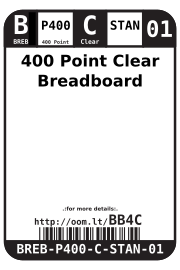

Contents
========

* [BREB-P400-C-STAN-01>400 Point Clear Breadboard](#breb-p400-c-stan-01400-point-clear-breadboard)
	* [Images](#images)
	* [Datasheets](#datasheets)
	* [Labels](#labels)
	* [EDA](#eda)
		* [Symbols](#symbols)
	* [Tags](#tags)
  
![][im]
# BREB-P400-C-STAN-01>400 Point Clear Breadboard

- ID: BREB-P400-C-STAN-01
- Name: BREB-P400-C-STAN-01

## Images
  
  

|image|image_RE|
| :---: | :---: |
|||

## Datasheets

- Datasheet: [datasheet.pdf](datasheet.pdf)

## Labels
  
  

|label-front|label-inventory|label-spec|
| :---: | :---: | :---: |
||||

## EDA

### Symbols

## Tags

- oompID: BREB-P400-C-STAN-01
- name: 400 Point Clear Breadboard
- hexID: BB4C
- oompSort: P400
- oompType: BREB
- oompSize: P400
- oompColor: C
- oompDesc: STAN
- oompIndex: 01
- oompVersion: 99
- ooPitch: 2.54 mm
- ooWidth: 53 mm
- ooHeight: 8.5 mm
- ooLength: 82 mm
- ooMaxVoltage: 300 v
- useID: 1
- importance: 1
- useTitle: Prototyping
- useDescription: a base for prototyping new circuits.
- ooNameLine3of3: Breadboard 
- oompAbout: The start of any project. Great for quickly prototyping a new ciruit. Compatible with most 2.54 mm (0.1") components.
- oompClass: Wiring
- oompClassCode: WIRE
- oompBbls: template;BREB-P400-C-STAN-01-bbls

[im]: image_600.jpg
