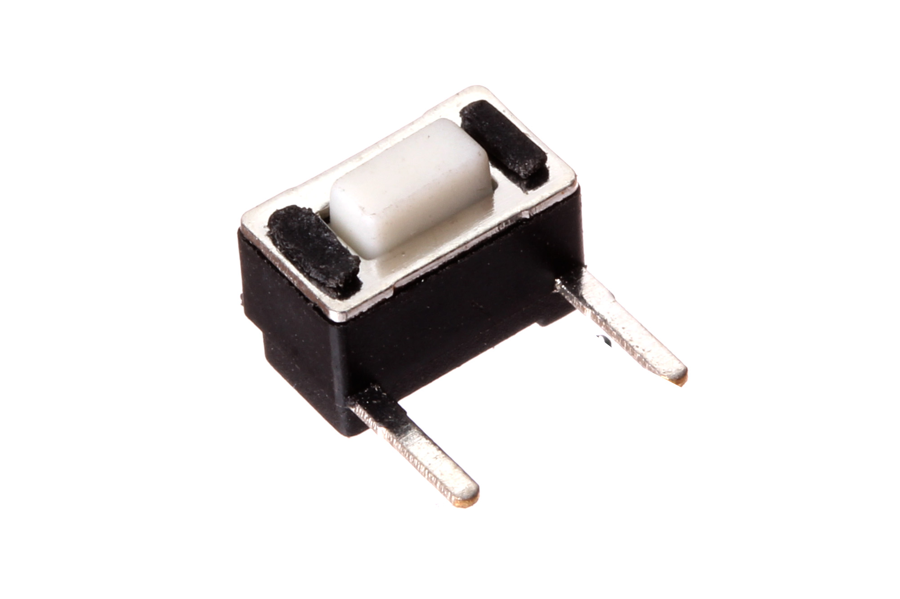
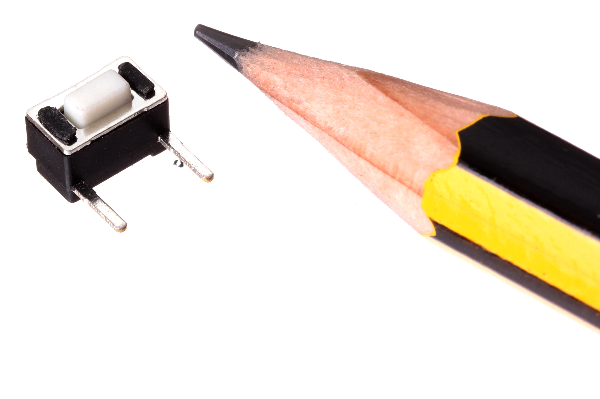
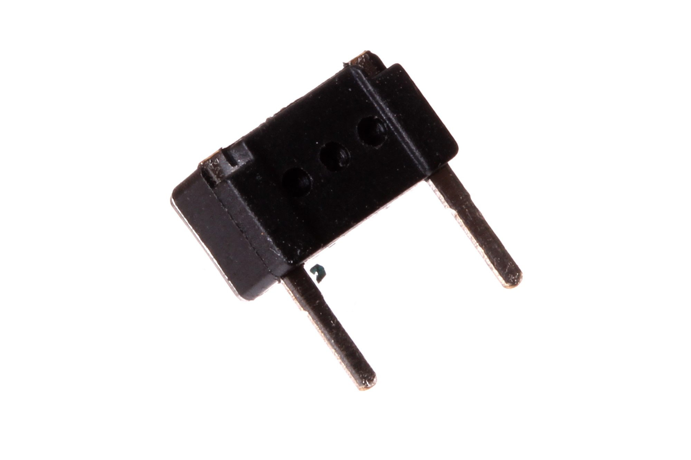

Contents
========

* [BUTA-06-X-PI02-01>6 mm 2 Pin Pushbutton (Tactile)](#buta-06-x-pi02-016-mm-2-pin-pushbutton-tactile)
	* [Images](#images)
	* [Datasheets](#datasheets)
	* [EDA](#eda)
		* [Footprints](#footprints)
		* [Symbols](#symbols)
	* [Tags](#tags)

# BUTA-06-X-PI02-01>6 mm 2 Pin Pushbutton (Tactile)

- ID: BUTA-06-X-PI02-01
- Name: BUTA-06-X-PI02-01

## Images
  
  

|Main|Reference|Bottom|
| :---: | :---: | :---: |
||||

## Datasheets

- Datasheet: [datasheet.pdf](datasheet.pdf)

## EDA

### Footprints
  

|||||
| :---: | :---: | :---: | :---: |

### Symbols

## Tags

- index: 8
- oompID: BUTA-06-X-PI02-01
- name: 6 mm 2 Pin Pushbutton (Tactile)
- hexID: BT62
- oompSort: 
- oompClass: Through Hole
- oompClassCode: THTH
- oompType: BUTA
- oompSize: 06
- oompColor: X
- oompDesc: PI02
- oompIndex: 01
- oompVersion: 40
- ooWidth: 6 mm
- ooHeight: 3.5 mm
- ooDepth: 3.5 mm
- ooNumPins: 2
- ooLifetime: 50 000 cycles
- oompAbout: A simple tactile pushbutton with two pins. This button is not commonly used. However it is imcluded in OOMP due to it being a part in the SEEED OPL. For a more commonly used through hole button we recommend (BUTA-06-X-STAN-01)
- oompSchem: template;BUTA-XXXX-X-PI02-XX-schem
- ooDesignator: S
- oompSymbol: twoSidedPackage;##ooNumPins@@/2
- ooPin1: .
- ooPin2: .
