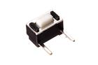

Contents
========

* [BT62 > 6 mm 2 Pin Pushbutton (Tactile)](#bt62--6-mm-2-pin-pushbutton-tactile)
	* [Diagrams](#diagrams)
	* [Datasheets](#datasheets)
	* [Labels](#labels)
	* [EDA](#eda)
	* [Images](#images)
	* [Tags](#tags)
  
![][im]
# BT62 > 6 mm 2 Pin Pushbutton (Tactile)

- ID: BUTA-06-X-PI02-01
- Hex ID: BT62
- Name: 6 mm 2 Pin Pushbutton (Tactile)
- Description: 6 mm 2 Pin Pushbutton (Tactile)
- Long Link: [http://oom.lt/BUTA-06-X-PI02-01](http://oom.lt/BUTA-06-X-PI02-01)
- Short Link: [http://oom.lt/BT62](http://oom.lt/BT62)

## Diagrams
  
  

|diagBBLS|diagDIAG|diagIDEN|diagSCHEM|diagSIMP|
| :---: | :---: | :---: | :---: | :---: |
||||||

## Datasheets

- Datasheet: [datasheet.pdf](datasheet.pdf)

## Labels
  
  

|label-front|label-inventory|label-spec|
| :---: | :---: | :---: |
||||

## EDA

### Symbols
  

|[  SYMBOL-kicad-kicad-symbols-Switch-SW_Push](https://github.com/oomlout/oomlout_OOMP_eda/tree/main/SYMBOL/kicad/kicad-symbols/Switch/SW_Push/)||||
| :---: | :---: | :---: | :---: |

## Images
  
  

|image|image_RE|image_BOTTOM|diagBBLS|diagDIAG|diagIDEN|diagSCHEM|diagSIMP|label-front|label-inventory|label-spec|
| :---: | :---: | :---: | :---: | :---: | :---: | :---: | :---: | :---: | :---: | :---: |
||||||||||||

## Tags

- oompID: BUTA-06-X-PI02-01
- name: 6 mm 2 Pin Pushbutton (Tactile)
- hexID: BT62
- oompSort: 
- oompClass: Through Hole
- oompClassCode: THTH
- oompType: BUTA
- oompSize: 06
- oompColor: X
- oompDesc: PI02
- oompIndex: 01
- oompVersion: 40
- ooWidth: 6 mm
- ooHeight: 3.5 mm
- ooDepth: 3.5 mm
- ooNumPins: 2
- ooLifetime: 50 000 cycles
- oompAbout: A simple tactile pushbutton with two pins. This button is not commonly used. However it is imcluded in OOMP due to it being a part in the SEEED OPL. For a more commonly used through hole button we recommend (BUTA-06-X-STAN-01)
- oompSchem: template;BUTA-XXXX-X-PI02-XX-schem
- ooDesignator: S
- oompSymbol: twoSidedPackage;##ooNumPins@@/2
- ooPin1: .
- ooPin2: .
- symbolKicad: SYMBOL-kicad-kicad-symbols-Switch-SW_Push

[im]: image_450.jpg
