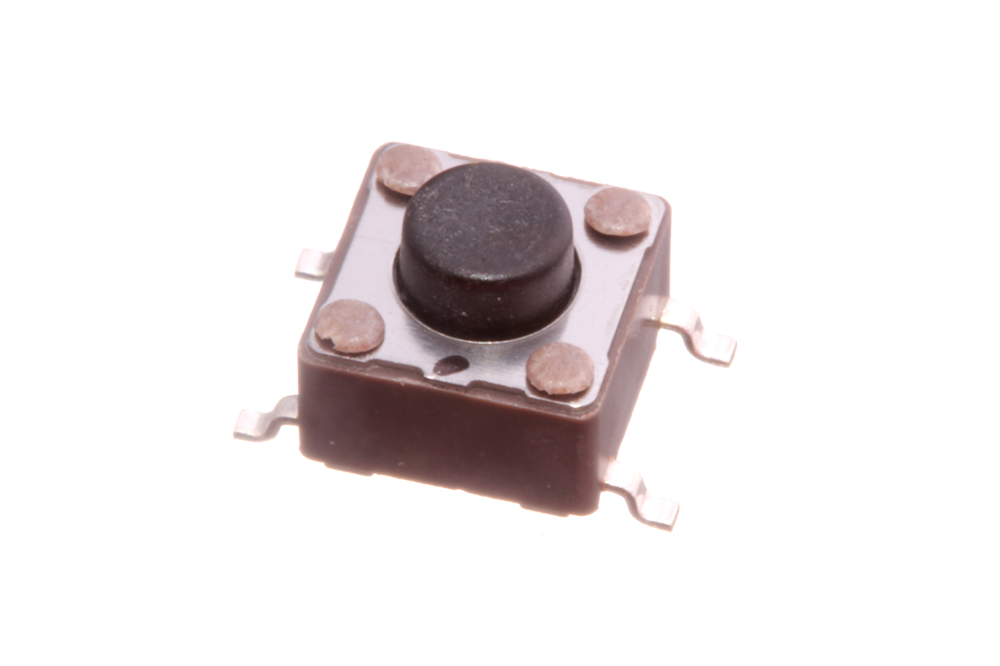
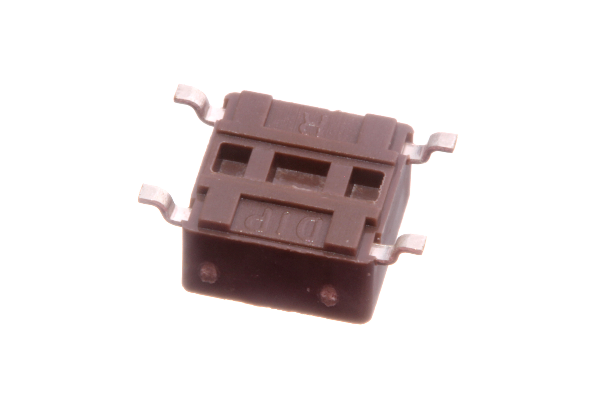

Contents
========

* [BUTA-06-X-SMDS-01>6 mm SMD Pushbutton (Tactile)](#buta-06-x-smds-016-mm-smd-pushbutton-tactile)
	* [Images](#images)
	* [Datasheets](#datasheets)
	* [EDA](#eda)
		* [Footprints](#footprints)
		* [Symbols](#symbols)
	* [Tags](#tags)
  
![][im]
# BUTA-06-X-SMDS-01>6 mm SMD Pushbutton (Tactile)

- ID: BUTA-06-X-SMDS-01
- Name: BUTA-06-X-SMDS-01

## Images
  
  

|Main|Reference|Bottom|
| :---: | :---: | :---: |
||||

## Datasheets

- Datasheet: [datasheet.pdf](datasheet.pdf)

## EDA

### Footprints
  

|||||
| :---: | :---: | :---: | :---: |

### Symbols

## Tags

- index: 9
- index: 4315
- oompID: BUTA-06-X-SMDS-01
- name: 6 mm SMD Pushbutton (Tactile)
- hexID: B06
- oompSort: 0606
- oompType: BUTA
- oompSize: 06
- oompColor: X
- oompDesc: SMDS
- oompIndex: 01
- oompVersion: 99
- ooWidth: 6.2 mm
- ooHeight: 3.5 mm
- ooLength: 6.2 mm
- ooNumPins: 4
- useID: 1
- useID: 2
- importance: 1
- importance: 2
- useTitle: Reset Button
- useTitle: Keypad Button
- useDescription: a reset button for a microcontroller.
- useDescription: a button on a keypad.
- oompAbout: <![CDATA[A commonly used through surface mount tactile pushbutton. For a through hole version of this part see <a href="http://learn.oomlout.co.uk/OO/Projects/oomp/part/BUTA-06-X-STAN-01">BUTA-06-X-STAN-01</a>.]]>
- oompClass: Surface Mount
- oompClassCode: SMDS
- oompDiag: rectangle;0;0;6.2;6.2;Main Square
- oompDiag: circle;0;0;3.5;3.5;Main Button
- oompDiag: circle;2.15;2.15;0.75;0.75;Circle Nub 1
- oompDiag: circle;-2.15;-2.15;0.75;0.75;Circle Nub 2
- oompDiag: circle;2.15;-2.15;0.75;0.75;Circle Nub 3
- oompDiag: circle;-2.15;2.15;0.75;0.75;Circle Nub 4
- oompDiag: rectangle;3.8;2.25;1.4;0.7;pad 1
- oompDiag: rectangle;-3.8;-2.25;1.4;0.7;pad 2
- oompDiag: rectangle;-3.8;2.25;1.4;0.7;pad 3
- oompDiag: rectangle;3.8;-2.25;1.4;0.7;pad 4
- oompDiag: name;0;5;20;5;##name@@
- oompDiag: oompURL;0;-5;2.835;##hexID@@
- oompSchem: template;BUTA-XXXX-X-XXXX-XX-schem
- ooDesignator: S
- oompSymbol: twoSidedPackage;##ooNumPins@@/2
- ooPin1: .
- ooPin2: .

[im]: image_600.jpg
