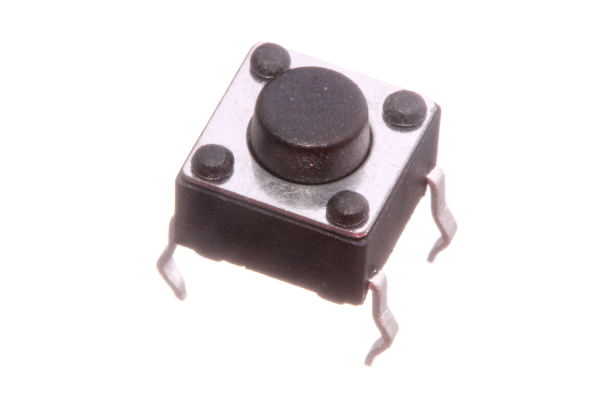
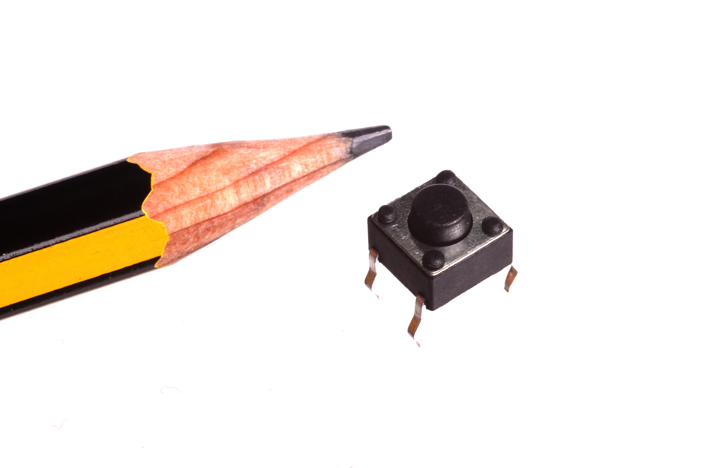
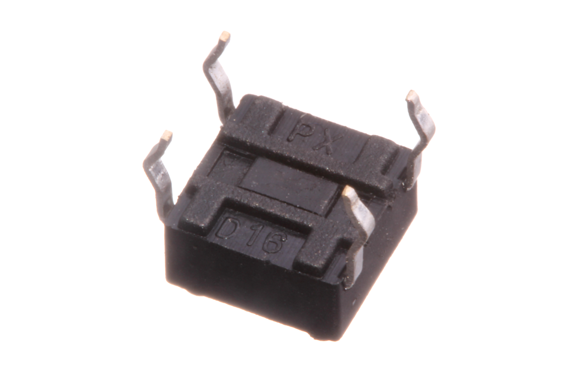
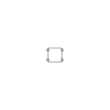
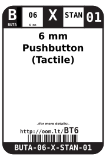
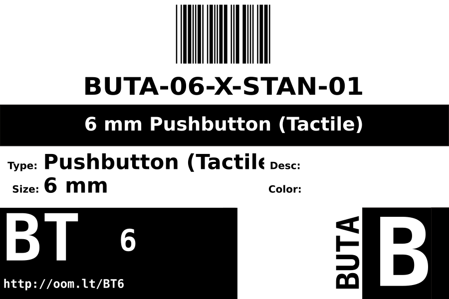
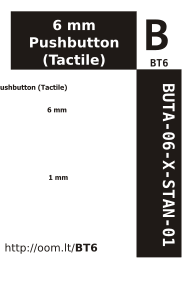

Contents
========

* [BUTA-06-X-STAN-01>6 mm Pushbutton (Tactile)](#buta-06-x-stan-016-mm-pushbutton-tactile)
	* [Images](#images)
	* [Diagrams](#diagrams)
	* [Datasheets](#datasheets)
	* [Labels](#labels)
	* [EDA](#eda)
		* [Footprints](#footprints)
		* [Symbols](#symbols)
	* [Tags](#tags)
  
![][im]
# BUTA-06-X-STAN-01>6 mm Pushbutton (Tactile)

- ID: BUTA-06-X-STAN-01
- Name: BUTA-06-X-STAN-01

## Images
  
  

|Main|Reference|Bottom|
| :---: | :---: | :---: |
||||

## Diagrams
  
  

|Breadboard Layout|Diagram|Identifier|Schematic|Simple|
| :---: | :---: | :---: | :---: | :---: |
||||||

## Datasheets

- Datasheet: [datasheet.pdf](datasheet.pdf)

## Labels
  
  

|Front|Inventory|Specifications|
| :---: | :---: | :---: |
||||

## EDA

### Footprints

### Symbols

## Tags

- index: 8771
- oompType: BUTA
- oompSize: 06
- oompColor: X
- oompDesc: STAN
- oompIndex: 01
- hexID: BT6
- oompSort: 0606
- ooWidth: 6.2 mm
- ooHeight: 3.5 mm
- ooLength: 6.2 mm
- oompAbout: The most commonly used through hole tactile pushbutton. It's often more difficult to find a PCB without one of these than with.
- oompClass: Through Hole Component
- oompClassCode: THTH
- oompBbls: template;BUTA-06-X-STAN-01
- oompBbls: template;XXXX-XXXX-X-XXXX-XX-bbls-words
- oompDiag: template;BUTA-06-X-STAN-01
- oompIden: template;BUTA-06-X-STAN-01
- oompSchem: template;BUTA-XXXX-X-XXXX-XX-schem
- ooDesignator: S
- oompSymbol: twoSidedPackage;##ooNumPins@@/2
- ooPin1: .
- ooPin2: .
- kicadSymbol: Switch>SW_Push
- kicadFootprint: Button_Switch_THT:SW_PUSH_6mm

[im]: image_600.jpg
