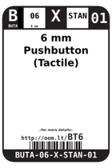
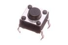
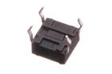

Contents
========

* [B06 > 6 mm Pushbutton (Tactile)](#b06--6-mm-pushbutton-tactile)
	* [Diagrams](#diagrams)
	* [Datasheets](#datasheets)
	* [Labels](#labels)
	* [EDA](#eda)
	* [Images](#images)
	* [Tags](#tags)
  
![][im]
# B06 > 6 mm Pushbutton (Tactile)

- ID: BUTA-06-X-STAN-01
- Hex ID: B06
- Name: 6 mm Pushbutton (Tactile)
- Description: 6 mm Pushbutton (Tactile)
- Long Link: [http://oom.lt/BUTA-06-X-STAN-01](http://oom.lt/BUTA-06-X-STAN-01)
- Short Link: [http://oom.lt/B06](http://oom.lt/B06)

## Diagrams
  
  

|diagBBLS|diagDIAG|diagIDEN|diagSCHEM|diagSIMP|
| :---: | :---: | :---: | :---: | :---: |
||||||

## Datasheets

- Datasheet: [datasheet.pdf](datasheet.pdf)

## Labels
  
  

|label-front|label-inventory|label-spec|
| :---: | :---: | :---: |
||||

## EDA

### Symbols

## Images
  
  

|image|image_RE|image_BOTTOM|diagBBLS|diagDIAG|diagIDEN|diagSCHEM|diagSIMP|label-front|label-inventory|label-spec|
| :---: | :---: | :---: | :---: | :---: | :---: | :---: | :---: | :---: | :---: | :---: |
||||||||||||

## Tags

- hexID: B06
- oompSort: 0606
- oompType: BUTA
- oompSize: 06
- oompColor: X
- oompDesc: STAN
- oompIndex: 01
- oompID: BUTA-06-X-STAN-01

[im]: image_450.jpg
