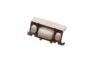
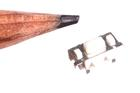
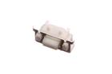
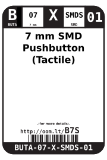
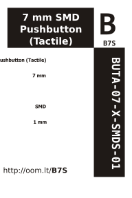

Contents
========

* [BUTA-07-X-SMDS-01>7 mm SMD Pushbutton (Tactile)](#buta-07-x-smds-017-mm-smd-pushbutton-tactile)
	* [Images](#images)
	* [Datasheets](#datasheets)
	* [Labels](#labels)
	* [EDA](#eda)
		* [Symbols](#symbols)
	* [Tags](#tags)
  
![][im]
# BUTA-07-X-SMDS-01>7 mm SMD Pushbutton (Tactile)

- ID: BUTA-07-X-SMDS-01
- Name: BUTA-07-X-SMDS-01

## Images
  
  

|image|image_RE|image_BOTTOM|
| :---: | :---: | :---: |
||||

## Datasheets

- Datasheet: [datasheet.pdf](datasheet.pdf)

## Labels
  
  

|label-front|label-inventory|label-spec|
| :---: | :---: | :---: |
||||

## EDA

### Symbols

## Tags

- oompID: BUTA-07-X-SMDS-01
- name: 7 mm SMD Pushbutton (Tactile)
- hexID: B7S
- oompSort: 0707
- oompType: BUTA
- oompSize: 07
- oompColor: X
- oompDesc: SMDS
- oompIndex: 01
- oompVersion: 99
- ooWidth: 3.5 mm
- ooHeight: 3.55 mm
- ooLength: 7 mm
- ooManufacturer: C-BEST
- ooManufacturerPartNumber: Shenzhen Best Electronics
- useID: 1
- importance: 1
- useTitle: Reset Button
- useDescription: a reset button for a microcontroller.
- ooSEEEDsku: 3100060P1
- ooSEEEDdesc: SMD Button	
- oompAbout: A commonly used surface mount pushbutton. With the button on the side rather than the top.
- ooSEEED3dModel: http://www.seeedstudio.com/wiki/File:4P-SMD-7.0X3.5X3.5H-90D.zip
- oompClass: Surface Mount
- oompClassCode: SMDS
- oompSchem: template;BUTA-XXXX-X-02PI-XX-schem
- ooDesignator: S
- oompSymbol: twoSidedPackage;##ooNumPins@@/2
- ooPin1: .
- ooPin2: .

[im]: image_600.jpg
