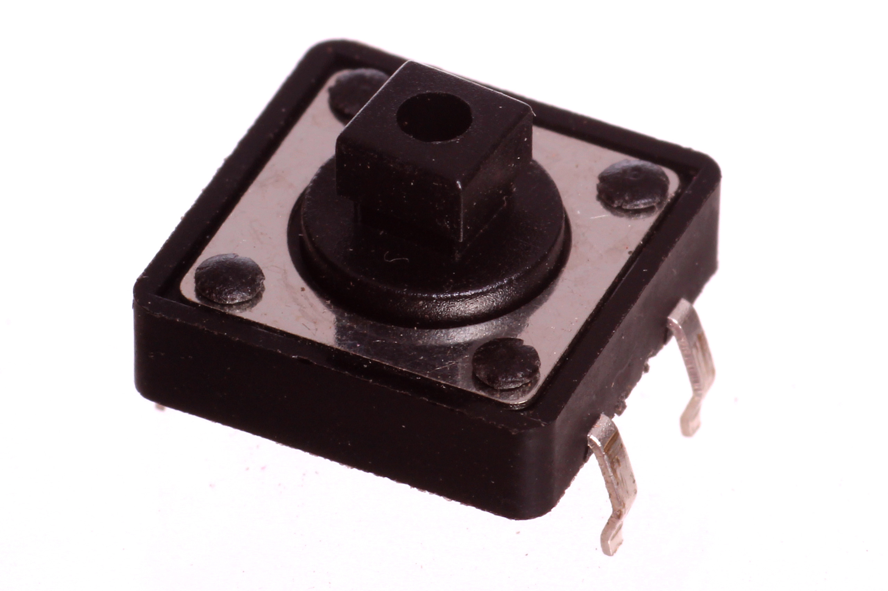
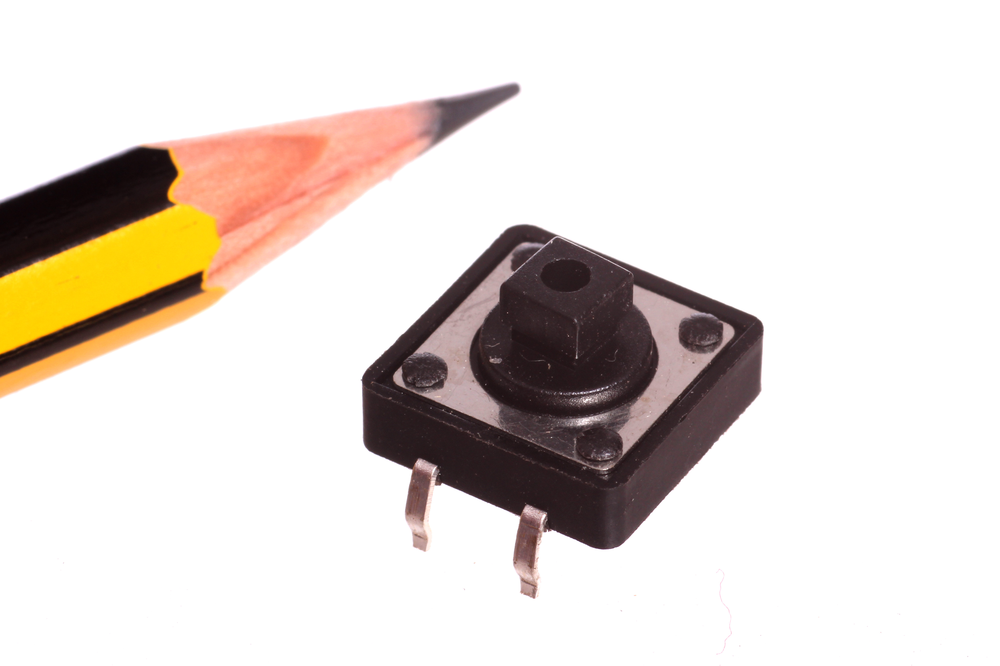
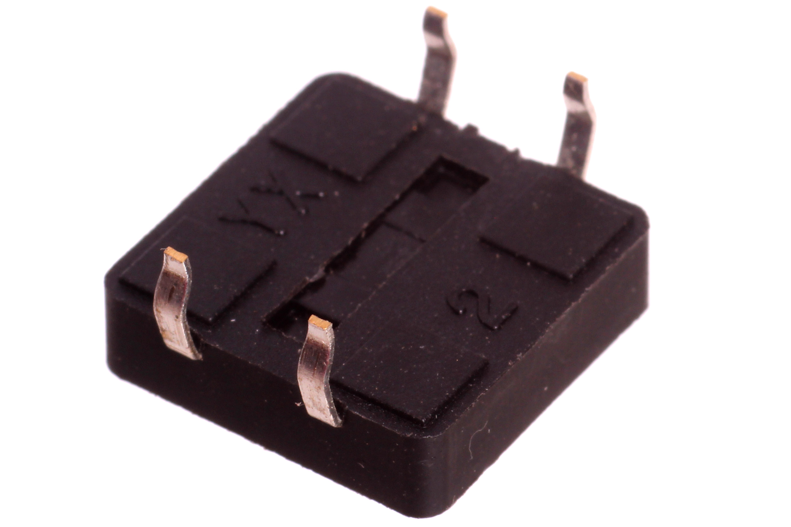
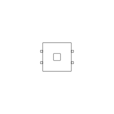
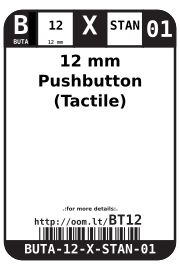
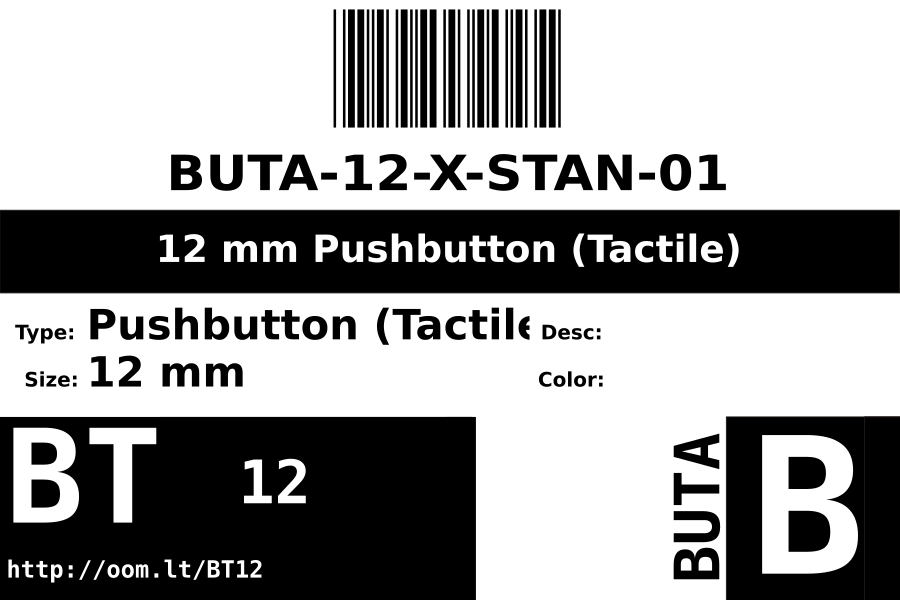
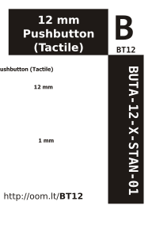

Contents
========

* [BUTA-12-X-STAN-01>12 mm Pushbutton (Tactile)](#buta-12-x-stan-0112-mm-pushbutton-tactile)
	* [Images](#images)
	* [Diagrams](#diagrams)
	* [Datasheets](#datasheets)
	* [Labels](#labels)
	* [Tags](#tags)
  
![][im]
# BUTA-12-X-STAN-01>12 mm Pushbutton (Tactile)

- ID: BUTA-12-X-STAN-01
- Name: BUTA-12-X-STAN-01

## Images
  
  

|Main|Reference|Bottom|
| :---: | :---: | :---: |
||||

## Diagrams
  
  

|Diagram|
| :---: |
||

## Datasheets

- Datasheet: [datasheet.pdf](datasheet.pdf)

## Labels
  
  

|Front|Inventory|Specifications|
| :---: | :---: | :---: |
||||

## Tags

- index: 8773
- oompType: BUTA
- oompSize: 12
- oompColor: X
- oompDesc: STAN
- oompIndex: 01
- ooPin1: .
- ooPin2: .
- ooDesignator: S
- hexID: BT12
- manufacturer: ['Diptronics', 'C-DIPT', '', 'DTS-24R-V', '', '']
- bigDistributor: ['Rapid Electronics', '7.3mm Sq 12x12 Tactile Switch 260gf', '78-0631', 'http://www.rapidonline.com/Electronic-Components/7-3mm-Sq-12x12-Tactile-Switch-260gf-78-0631', '']
- bigDistributor: ['Sparkfun', 'C-SPAR', 'Tactile Button Assortment', '9190', 'https://www.sparkfun.com/products/10302', '']
- bigDistributor: ['Adafruit', 'C-ADAF', 'Colorful Round Tactile Button Switch Assortment - 15 pack', '1009', 'http://www.adafruit.com/products/1009', '']
- oompClassCode: THTH
- oompBbls: template;BUTA-12-X-STAN-01
- oompBbls: template;XXXX-XXXX-X-XXXX-XX-bbls-words
- oompDiag: template;BUTA-12-X-STAN-01
- oompDiag: template;XXXX-XXXX-X-XXXX-XX-diag-words
- oompIden: template;BUTA-12-X-STAN-01
- oompIden: template;XXXX-XXXX-X-XXXX-XX-iden-words
- oompSchem: template;BUTA-XXXX-X-XXXX-XX-schem
- oompSimp: template;BUTA-12-X-STAN-01
- oompSimp: template;XXXX-XXXX-X-XXXX-XX-simp-words
- oompSymbol: twoSidedPackage;##ooNumPins@@/2
- kicadSymbol: Switch>SW_Push
- kicadFootprint: Button_Switch_THT:SW_PUSH-12mm

[im]: image_600.jpg
