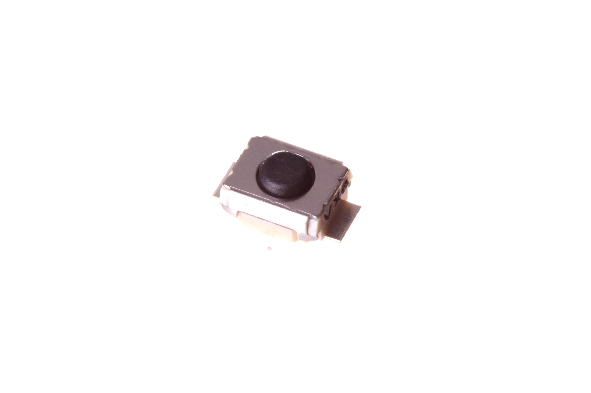
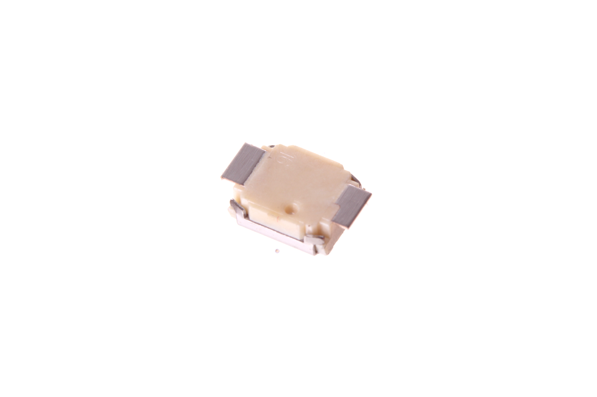

Contents
========

* [BUTA-3025-X-PI02-01>SMD (3025) 2 Pin Pushbutton (Tactile)](#buta-3025-x-pi02-01smd-3025-2-pin-pushbutton-tactile)
	* [Images](#images)
	* [Datasheets](#datasheets)
	* [Labels](#labels)
	* [EDA](#eda)
		* [Symbols](#symbols)
	* [Tags](#tags)
  
![][im]
# BUTA-3025-X-PI02-01>SMD (3025) 2 Pin Pushbutton (Tactile)

- ID: BUTA-3025-X-PI02-01
- Name: BUTA-3025-X-PI02-01

## Images
  
  

|Main|Reference|Bottom|
| :---: | :---: | :---: |
||||

## Datasheets

- Datasheet: [datasheet.pdf](datasheet.pdf)

## Labels
  
  

|Front|Inventory|Specifications|
| :---: | :---: | :---: |
||||

## EDA

### Symbols

## Tags

- index: 12314
- oompID: BUTA-3025-X-PI02-01
- name: SMD (3025) 2 Pin Pushbutton (Tactile)
- hexID: BT3025
- oompSort: BUTA302502PI
- oompType: BUTA
- oompSize: 3025
- oompColor: X
- oompDesc: PI02
- oompIndex: 01
- oompVersion: 98
- ooNumPins: 2
- oompSchem: template;BUTA-XXXX-X-PI02-XX-schem
- ooDesignator: S
- oompSymbol: twoSidedPackage;##ooNumPins@@/2
- ooPin1: .
- ooPin2: .

[im]: image_600.jpg
