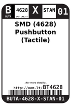
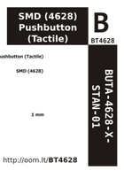

Contents
========

* [BT4628 > SMD (4628) Pushbutton (Tactile)](#bt4628--smd-4628-pushbutton-tactile)
	* [Labels](#labels)
	* [EDA](#eda)
	* [Images](#images)
	* [Tags](#tags)

# BT4628 > SMD (4628) Pushbutton (Tactile)

- ID: BUTA-4628-X-STAN-01
- Hex ID: BT4628
- Name: SMD (4628) Pushbutton (Tactile)
- Description: SMD (4628) Pushbutton (Tactile)
- Long Link: [http://oom.lt/BUTA-4628-X-STAN-01](http://oom.lt/BUTA-4628-X-STAN-01)
- Short Link: [http://oom.lt/BT4628](http://oom.lt/BT4628)

## Labels
  
  

|label-front|label-inventory|label-spec|
| :---: | :---: | :---: |
||||

## EDA

### Instances
  
  
Used 85 times.  
Prevalance: (85\9905) 0.8582%  

|OOMP Instances|
| :---: |
|[PROJ-ADAF-1222-STAN-01  Adafruit Gemma PCB  Used 1 times. Q1](https://github.com/oomlout/oomlout_OOMP_projects/tree/main/PROJ-ADAF-1222-STAN-01/)|
|[PROJ-ADAF-1500-STAN-01  Adafruit Trinket PCB  Used 1 times. Q1](https://github.com/oomlout/oomlout_OOMP_projects/tree/main/PROJ-ADAF-1500-STAN-01/)|
|[PROJ-ADAF-1963-STAN-01  Adafruit FONA 800 GSM Breakout PCB  Used 1 times. SW1](https://github.com/oomlout/oomlout_OOMP_projects/tree/main/PROJ-ADAF-1963-STAN-01/)|
|[PROJ-ADAF-2000-STAN-01  Adafruit Pro Trinket PCBs  Used 1 times. Q1](https://github.com/oomlout/oomlout_OOMP_projects/tree/main/PROJ-ADAF-2000-STAN-01/)|
|[PROJ-ADAF-2267-STAN-01  Adafruit Bluefruit LE USB Friend and Sniffer PCB  Used 1 times. SW1](https://github.com/oomlout/oomlout_OOMP_projects/tree/main/PROJ-ADAF-2267-STAN-01/)|
|[PROJ-ADAF-2471-STAN-01  Adafruit Huzzah ESP8266 Basic Breakout PCB  Used 2 times. SW1, SW2](https://github.com/oomlout/oomlout_OOMP_projects/tree/main/PROJ-ADAF-2471-STAN-01/)|
|[PROJ-ADAF-2487-STAN-01  Adafruit Flora Bluefruit LE PCB  Used 1 times. DFU](https://github.com/oomlout/oomlout_OOMP_projects/tree/main/PROJ-ADAF-2487-STAN-01/)|
|[PROJ-ADAF-2542-STAN-01  Adafruit FONA 808 Breakout PCB  Used 1 times. SW1](https://github.com/oomlout/oomlout_OOMP_projects/tree/main/PROJ-ADAF-2542-STAN-01/)|
|[PROJ-ADAF-2746-STAN-01  Adafruit Bluefruit LE Shield PCB  Used 1 times. SW1](https://github.com/oomlout/oomlout_OOMP_projects/tree/main/PROJ-ADAF-2746-STAN-01/)|
|[PROJ-ADAF-2821-STAN-01  Adafruit Feather ESP8266 HUZZAH PCB  Used 1 times. SW2](https://github.com/oomlout/oomlout_OOMP_projects/tree/main/PROJ-ADAF-2821-STAN-01/)|
|[PROJ-ADAF-2900-STAN-01  Adafruit OLED FeatherWing PCB  Used 4 times. SW1, SW2, SW3, SW4](https://github.com/oomlout/oomlout_OOMP_projects/tree/main/PROJ-ADAF-2900-STAN-01/)|
|[PROJ-ADAF-2922-STAN-01  Adafruit Adalogger FeatherWing PCB  Used 1 times. SW1](https://github.com/oomlout/oomlout_OOMP_projects/tree/main/PROJ-ADAF-2922-STAN-01/)|
|[PROJ-ADAF-2923-STAN-01  Adafruit Relay FeatherWing PCBs  Used 1 times. SW1](https://github.com/oomlout/oomlout_OOMP_projects/tree/main/PROJ-ADAF-2923-STAN-01/)|
|[PROJ-ADAF-2927-STAN-01  Adafruit DC Stepper Motor FeatherWing PCB  Used 1 times. SW1](https://github.com/oomlout/oomlout_OOMP_projects/tree/main/PROJ-ADAF-2927-STAN-01/)|
|[PROJ-ADAF-2928-STAN-01  Adafruit PWM Servo FeatherWing PCB  Used 1 times. SW1](https://github.com/oomlout/oomlout_OOMP_projects/tree/main/PROJ-ADAF-2928-STAN-01/)|
|[PROJ-ADAF-2945-STAN-01  Adafruit NeoPixel FeatherWing PCB  Used 1 times. SW1](https://github.com/oomlout/oomlout_OOMP_projects/tree/main/PROJ-ADAF-2945-STAN-01/)|
|[PROJ-ADAF-3000-STAN-01  Adafruit Circuit Playground PCB  Used 1 times. RESET](https://github.com/oomlout/oomlout_OOMP_projects/tree/main/PROJ-ADAF-3000-STAN-01/)|
|[PROJ-ADAF-3028-STAN-01  Adafruit DS3231 Precision RTC FeatherWing PCB  Used 1 times. SW1](https://github.com/oomlout/oomlout_OOMP_projects/tree/main/PROJ-ADAF-3028-STAN-01/)|
|[PROJ-ADAF-3056-STAN-01  Adafruit WICED WiFi Feather PCB  Used 1 times. SW1](https://github.com/oomlout/oomlout_OOMP_projects/tree/main/PROJ-ADAF-3056-STAN-01/)|
|[PROJ-ADAF-3133-STAN-01  Adafruit Ultimate GPS FeatherWing PCB  Used 1 times. SW1](https://github.com/oomlout/oomlout_OOMP_projects/tree/main/PROJ-ADAF-3133-STAN-01/)|
|[PROJ-ADAF-3191-STAN-01  Adafruit Power Relay FeatherWing PCB  Used 1 times. SW1](https://github.com/oomlout/oomlout_OOMP_projects/tree/main/PROJ-ADAF-3191-STAN-01/)|
|[PROJ-ADAF-3201-STAN-01  Adafruit Ethernet FeatherWing PCB  Used 1 times. SW1](https://github.com/oomlout/oomlout_OOMP_projects/tree/main/PROJ-ADAF-3201-STAN-01/)|
|[PROJ-ADAF-3229-STAN-01  Adafruit Radio FeatherWing PCB  Used 1 times. SW1](https://github.com/oomlout/oomlout_OOMP_projects/tree/main/PROJ-ADAF-3229-STAN-01/)|
|[PROJ-ADAF-3321-STAN-01  Adafruit Mini TFT with Joystick Featherwing PCB  Used 1 times. SW1](https://github.com/oomlout/oomlout_OOMP_projects/tree/main/PROJ-ADAF-3321-STAN-01/)|
|[PROJ-ADAF-3333-STAN-01  Adafruit Circuit Playground Express PCB  Used 1 times. RESET](https://github.com/oomlout/oomlout_OOMP_projects/tree/main/PROJ-ADAF-3333-STAN-01/)|
|[PROJ-ADAF-3357-STAN-01  Adafruit Music Maker FeatherWing PCB  Used 1 times. SW1](https://github.com/oomlout/oomlout_OOMP_projects/tree/main/PROJ-ADAF-3357-STAN-01/)|
|[PROJ-ADAF-3364-STAN-01  Adafruit pIRKey PCB  Used 1 times. Q2](https://github.com/oomlout/oomlout_OOMP_projects/tree/main/PROJ-ADAF-3364-STAN-01/)|
|[PROJ-ADAF-3405-STAN-01  Adafruit HUZZAH32 ESP32 Feather PCB  Used 1 times. SW2](https://github.com/oomlout/oomlout_OOMP_projects/tree/main/PROJ-ADAF-3405-STAN-01/)|
|[PROJ-ADAF-3449-STAN-01  Adafruit DotStar FeatherWing PCB  Used 1 times. SW1](https://github.com/oomlout/oomlout_OOMP_projects/tree/main/PROJ-ADAF-3449-STAN-01/)|
|[PROJ-ADAF-3458-STAN-01  Adafruit Feather 328P PCB  Used 1 times. SW2](https://github.com/oomlout/oomlout_OOMP_projects/tree/main/PROJ-ADAF-3458-STAN-01/)|
|[PROJ-ADAF-3464-STAN-01  Adafruit Joy Bonnet PCB  Used 2 times. 1, 2](https://github.com/oomlout/oomlout_OOMP_projects/tree/main/PROJ-ADAF-3464-STAN-01/)|
|[PROJ-ADAF-3500-STAN-01  Adafruit Trinket M0 PCB  Used 1 times. Q2](https://github.com/oomlout/oomlout_OOMP_projects/tree/main/PROJ-ADAF-3500-STAN-01/)|
|[PROJ-ADAF-3501-STAN-01  Adafruit Gemma M0 PCB  Used 1 times. Q1](https://github.com/oomlout/oomlout_OOMP_projects/tree/main/PROJ-ADAF-3501-STAN-01/)|
|[PROJ-ADAF-3632-STAN-01  Adafruit Joy Featherwing PCB  Used 2 times. SW6, SW7](https://github.com/oomlout/oomlout_OOMP_projects/tree/main/PROJ-ADAF-3632-STAN-01/)|
|[PROJ-ADAF-3657-STAN-01  Adafruit SAMD09 Breakout PCB  Used 1 times. SW1](https://github.com/oomlout/oomlout_OOMP_projects/tree/main/PROJ-ADAF-3657-STAN-01/)|
|[PROJ-ADAF-3857-STAN-01  Adafruit Feather M4 Express PCB  Used 1 times. SW1](https://github.com/oomlout/oomlout_OOMP_projects/tree/main/PROJ-ADAF-3857-STAN-01/)|
|[PROJ-ADAF-3988-STAN-01  Adafruit Prop Maker FeatherWing PCB  Used 1 times. SW1](https://github.com/oomlout/oomlout_OOMP_projects/tree/main/PROJ-ADAF-3988-STAN-01/)|
|[PROJ-ADAF-4172-STAN-01  Adafruit ESP32 HUZZAH Breakout PCB  Used 2 times. SW1, SW2](https://github.com/oomlout/oomlout_OOMP_projects/tree/main/PROJ-ADAF-4172-STAN-01/)|
|[PROJ-ADAF-4300-STAN-01  Adafruit Hallowing M4 PCB  Used 1 times. SW3](https://github.com/oomlout/oomlout_OOMP_projects/tree/main/PROJ-ADAF-4300-STAN-01/)|
|[PROJ-ADAF-4319-STAN-01  Adafruit PyRuler PCB  Used 1 times. Q2](https://github.com/oomlout/oomlout_OOMP_projects/tree/main/PROJ-ADAF-4319-STAN-01/)|
|[PROJ-ADAF-4333-STAN-01  Adafruit Circuit Playground Bluefruit PCB  Used 1 times. RESET](https://github.com/oomlout/oomlout_OOMP_projects/tree/main/PROJ-ADAF-4333-STAN-01/)|
|[PROJ-ADAF-4363-STAN-01  Adafruit Airlift Bitsy Add On PCB  Used 1 times. SW2](https://github.com/oomlout/oomlout_OOMP_projects/tree/main/PROJ-ADAF-4363-STAN-01/)|
|[PROJ-ADAF-4382-STAN-01  Adafruit Feather STM32F405 Express PCB  Used 1 times. SW1](https://github.com/oomlout/oomlout_OOMP_projects/tree/main/PROJ-ADAF-4382-STAN-01/)|
|[PROJ-ADAF-4481-STAN-01  Adafruit ItsyBitsy nRF52840 Express PCB  Used 2 times. SW1, SW2](https://github.com/oomlout/oomlout_OOMP_projects/tree/main/PROJ-ADAF-4481-STAN-01/)|
|[PROJ-ADAF-4516-STAN-01  Adafruit Feather nRF52840 Sense PCB  Used 2 times. SW1, SW2](https://github.com/oomlout/oomlout_OOMP_projects/tree/main/PROJ-ADAF-4516-STAN-01/)|
|[PROJ-ADAF-4569-STAN-01  Adafruit ISM330DHCX LIS3MDL FeatherWing PCB  Used 1 times. SW1](https://github.com/oomlout/oomlout_OOMP_projects/tree/main/PROJ-ADAF-4569-STAN-01/)|
|[PROJ-ADAF-4600-STAN-01  Adafruit QT Py PCB  Used 1 times. Q2](https://github.com/oomlout/oomlout_OOMP_projects/tree/main/PROJ-ADAF-4600-STAN-01/)|
|[PROJ-ADAF-4702-STAN-01  Adafruit RGB Matrix FeatherWing PCB  Used 1 times. SW1](https://github.com/oomlout/oomlout_OOMP_projects/tree/main/PROJ-ADAF-4702-STAN-01/)|
|[PROJ-ADAF-4759-STAN-01  Adafruit Feather M4 CAN PCB  Used 1 times. SW1](https://github.com/oomlout/oomlout_OOMP_projects/tree/main/PROJ-ADAF-4759-STAN-01/)|
|[PROJ-ADAF-4870-STAN-01  Adafruit Neo Trinkey PCB  Used 1 times. Q2](https://github.com/oomlout/oomlout_OOMP_projects/tree/main/PROJ-ADAF-4870-STAN-01/)|
|[PROJ-ADAF-4888-STAN-01  Adafruit ItsyBitsy RP2040 PCB  Used 2 times. SW2, SW3](https://github.com/oomlout/oomlout_OOMP_projects/tree/main/PROJ-ADAF-4888-STAN-01/)|
|[PROJ-ADAF-4900-STAN-01  Adafruit QT Py RP2040 PCB  Used 2 times. SW1, SW2](https://github.com/oomlout/oomlout_OOMP_projects/tree/main/PROJ-ADAF-4900-STAN-01/)|
|[PROJ-ADAF-4964-STAN-01  Adafruit Rotary Trinkey PCB  Used 1 times. Q2](https://github.com/oomlout/oomlout_OOMP_projects/tree/main/PROJ-ADAF-4964-STAN-01/)|
|[PROJ-ADAF-5000-STAN-01  Adafruit Feather ESP32 S2 PCB  Used 2 times. SW1, SW2](https://github.com/oomlout/oomlout_OOMP_projects/tree/main/PROJ-ADAF-5000-STAN-01/)|
|[PROJ-ADAF-5020-STAN-01  Adafruit NeoKey Trinkey PCB  Used 1 times. RESET](https://github.com/oomlout/oomlout_OOMP_projects/tree/main/PROJ-ADAF-5020-STAN-01/)|
|[PROJ-ADAF-5021-STAN-01  Adafruit Slider Trinkey PCB  Used 1 times. Q2](https://github.com/oomlout/oomlout_OOMP_projects/tree/main/PROJ-ADAF-5021-STAN-01/)|
|[PROJ-ADAF-5022-STAN-01  Adafruit Proximity Trinkey PCB  Used 1 times. Q2](https://github.com/oomlout/oomlout_OOMP_projects/tree/main/PROJ-ADAF-5022-STAN-01/)|
|[PROJ-ADAF-5300-STAN-01  Adafruit ESP32 S2 TFT Feather PCB  Used 2 times. SW1, SW2](https://github.com/oomlout/oomlout_OOMP_projects/tree/main/PROJ-ADAF-5300-STAN-01/)|
|[PROJ-ADAF-5302-STAN-01  Adafruit KB2040 PCB  Used 2 times. SW2, SW3](https://github.com/oomlout/oomlout_OOMP_projects/tree/main/PROJ-ADAF-5302-STAN-01/)|
|[PROJ-ADAF-5323-STAN-01  Adafruit Feather ESP32 S3 PCB  Used 2 times. SW1, SW2](https://github.com/oomlout/oomlout_OOMP_projects/tree/main/PROJ-ADAF-5323-STAN-01/)|
|[PROJ-ADAF-5325-STAN-01  Adafruit QT Py ESP32 S2 PCB  Used 2 times. Q1, Q2](https://github.com/oomlout/oomlout_OOMP_projects/tree/main/PROJ-ADAF-5325-STAN-01/)|
|[PROJ-ADAF-5395-STAN-01  Adafruit QT Py ESP32 Pico PCB  Used 2 times. Q1, Q2](https://github.com/oomlout/oomlout_OOMP_projects/tree/main/PROJ-ADAF-5395-STAN-01/)|
|[PROJ-ADAF-5400-STAN-01  Adafruit ESP32 Feather V2 PCB  Used 2 times. SW1, SW2](https://github.com/oomlout/oomlout_OOMP_projects/tree/main/PROJ-ADAF-5400-STAN-01/)|
|[PROJ-ADAF-5405-STAN-01  Adafruit QT Py ESP32 C3 PCB  Used 1 times. Q1](https://github.com/oomlout/oomlout_OOMP_projects/tree/main/PROJ-ADAF-5405-STAN-01/)|
|[PROJ-ADAF-5426-STAN-01  Adafruit QT Py ESP32 S3 PCB  Used 2 times. Q1, Q2](https://github.com/oomlout/oomlout_OOMP_projects/tree/main/PROJ-ADAF-5426-STAN-01/)|
|[PROJ-ADAF-904-STAN-01  Adafruit INA219 Current Sensor PCB  Used 1 times. SW1](https://github.com/oomlout/oomlout_OOMP_projects/tree/main/PROJ-ADAF-904-STAN-01/)|

### Symbols

## Images
  
  

|label-front|label-inventory|label-spec|
| :---: | :---: | :---: |
||||

## Tags

- oompType: BUTA
- oompSize: 4628
- oompColor: X
- oompDesc: STAN
- oompIndex: 01
- hexID: BT4628
- oompID: BUTA-4628-X-STAN-01
- oompInstances: {'PROJECT': 'PROJ-ADAF-1222-STAN-01', 'ID': 'Q1'}
- oompInstances: {'PROJECT': 'PROJ-ADAF-1500-STAN-01', 'ID': 'Q1'}
- oompInstances: {'PROJECT': 'PROJ-ADAF-1963-STAN-01', 'ID': 'SW1'}
- oompInstances: {'PROJECT': 'PROJ-ADAF-2000-STAN-01', 'ID': 'Q1'}
- oompInstances: {'PROJECT': 'PROJ-ADAF-2267-STAN-01', 'ID': 'SW1'}
- oompInstances: {'PROJECT': 'PROJ-ADAF-2471-STAN-01', 'ID': 'SW1'}
- oompInstances: {'PROJECT': 'PROJ-ADAF-2471-STAN-01', 'ID': 'SW2'}
- oompInstances: {'PROJECT': 'PROJ-ADAF-2487-STAN-01', 'ID': 'DFU'}
- oompInstances: {'PROJECT': 'PROJ-ADAF-2542-STAN-01', 'ID': 'SW1'}
- oompInstances: {'PROJECT': 'PROJ-ADAF-2746-STAN-01', 'ID': 'SW1'}
- oompInstances: {'PROJECT': 'PROJ-ADAF-2821-STAN-01', 'ID': 'SW2'}
- oompInstances: {'PROJECT': 'PROJ-ADAF-2900-STAN-01', 'ID': 'SW1'}
- oompInstances: {'PROJECT': 'PROJ-ADAF-2900-STAN-01', 'ID': 'SW2'}
- oompInstances: {'PROJECT': 'PROJ-ADAF-2900-STAN-01', 'ID': 'SW3'}
- oompInstances: {'PROJECT': 'PROJ-ADAF-2900-STAN-01', 'ID': 'SW4'}
- oompInstances: {'PROJECT': 'PROJ-ADAF-2922-STAN-01', 'ID': 'SW1'}
- oompInstances: {'PROJECT': 'PROJ-ADAF-2923-STAN-01', 'ID': 'SW1'}
- oompInstances: {'PROJECT': 'PROJ-ADAF-2927-STAN-01', 'ID': 'SW1'}
- oompInstances: {'PROJECT': 'PROJ-ADAF-2928-STAN-01', 'ID': 'SW1'}
- oompInstances: {'PROJECT': 'PROJ-ADAF-2945-STAN-01', 'ID': 'SW1'}
- oompInstances: {'PROJECT': 'PROJ-ADAF-3000-STAN-01', 'ID': 'RESET'}
- oompInstances: {'PROJECT': 'PROJ-ADAF-3028-STAN-01', 'ID': 'SW1'}
- oompInstances: {'PROJECT': 'PROJ-ADAF-3056-STAN-01', 'ID': 'SW1'}
- oompInstances: {'PROJECT': 'PROJ-ADAF-3133-STAN-01', 'ID': 'SW1'}
- oompInstances: {'PROJECT': 'PROJ-ADAF-3191-STAN-01', 'ID': 'SW1'}
- oompInstances: {'PROJECT': 'PROJ-ADAF-3201-STAN-01', 'ID': 'SW1'}
- oompInstances: {'PROJECT': 'PROJ-ADAF-3229-STAN-01', 'ID': 'SW1'}
- oompInstances: {'PROJECT': 'PROJ-ADAF-3321-STAN-01', 'ID': 'SW1'}
- oompInstances: {'PROJECT': 'PROJ-ADAF-3333-STAN-01', 'ID': 'RESET'}
- oompInstances: {'PROJECT': 'PROJ-ADAF-3357-STAN-01', 'ID': 'SW1'}
- oompInstances: {'PROJECT': 'PROJ-ADAF-3364-STAN-01', 'ID': 'Q2'}
- oompInstances: {'PROJECT': 'PROJ-ADAF-3405-STAN-01', 'ID': 'SW2'}
- oompInstances: {'PROJECT': 'PROJ-ADAF-3449-STAN-01', 'ID': 'SW1'}
- oompInstances: {'PROJECT': 'PROJ-ADAF-3458-STAN-01', 'ID': 'SW2'}
- oompInstances: {'PROJECT': 'PROJ-ADAF-3464-STAN-01', 'ID': '1'}
- oompInstances: {'PROJECT': 'PROJ-ADAF-3464-STAN-01', 'ID': '2'}
- oompInstances: {'PROJECT': 'PROJ-ADAF-3500-STAN-01', 'ID': 'Q2'}
- oompInstances: {'PROJECT': 'PROJ-ADAF-3501-STAN-01', 'ID': 'Q1'}
- oompInstances: {'PROJECT': 'PROJ-ADAF-3632-STAN-01', 'ID': 'SW6'}
- oompInstances: {'PROJECT': 'PROJ-ADAF-3632-STAN-01', 'ID': 'SW7'}
- oompInstances: {'PROJECT': 'PROJ-ADAF-3657-STAN-01', 'ID': 'SW1'}
- oompInstances: {'PROJECT': 'PROJ-ADAF-3857-STAN-01', 'ID': 'SW1'}
- oompInstances: {'PROJECT': 'PROJ-ADAF-3988-STAN-01', 'ID': 'SW1'}
- oompInstances: {'PROJECT': 'PROJ-ADAF-4172-STAN-01', 'ID': 'SW1'}
- oompInstances: {'PROJECT': 'PROJ-ADAF-4172-STAN-01', 'ID': 'SW2'}
- oompInstances: {'PROJECT': 'PROJ-ADAF-4300-STAN-01', 'ID': 'SW3'}
- oompInstances: {'PROJECT': 'PROJ-ADAF-4319-STAN-01', 'ID': 'Q2'}
- oompInstances: {'PROJECT': 'PROJ-ADAF-4333-STAN-01', 'ID': 'RESET'}
- oompInstances: {'PROJECT': 'PROJ-ADAF-4363-STAN-01', 'ID': 'SW2'}
- oompInstances: {'PROJECT': 'PROJ-ADAF-4382-STAN-01', 'ID': 'SW1'}
- oompInstances: {'PROJECT': 'PROJ-ADAF-4481-STAN-01', 'ID': 'SW1'}
- oompInstances: {'PROJECT': 'PROJ-ADAF-4481-STAN-01', 'ID': 'SW2'}
- oompInstances: {'PROJECT': 'PROJ-ADAF-4516-STAN-01', 'ID': 'SW1'}
- oompInstances: {'PROJECT': 'PROJ-ADAF-4516-STAN-01', 'ID': 'SW2'}
- oompInstances: {'PROJECT': 'PROJ-ADAF-4569-STAN-01', 'ID': 'SW1'}
- oompInstances: {'PROJECT': 'PROJ-ADAF-4600-STAN-01', 'ID': 'Q2'}
- oompInstances: {'PROJECT': 'PROJ-ADAF-4702-STAN-01', 'ID': 'SW1'}
- oompInstances: {'PROJECT': 'PROJ-ADAF-4759-STAN-01', 'ID': 'SW1'}
- oompInstances: {'PROJECT': 'PROJ-ADAF-4870-STAN-01', 'ID': 'Q2'}
- oompInstances: {'PROJECT': 'PROJ-ADAF-4888-STAN-01', 'ID': 'SW2'}
- oompInstances: {'PROJECT': 'PROJ-ADAF-4888-STAN-01', 'ID': 'SW3'}
- oompInstances: {'PROJECT': 'PROJ-ADAF-4900-STAN-01', 'ID': 'SW1'}
- oompInstances: {'PROJECT': 'PROJ-ADAF-4900-STAN-01', 'ID': 'SW2'}
- oompInstances: {'PROJECT': 'PROJ-ADAF-4964-STAN-01', 'ID': 'Q2'}
- oompInstances: {'PROJECT': 'PROJ-ADAF-5000-STAN-01', 'ID': 'SW1'}
- oompInstances: {'PROJECT': 'PROJ-ADAF-5000-STAN-01', 'ID': 'SW2'}
- oompInstances: {'PROJECT': 'PROJ-ADAF-5020-STAN-01', 'ID': 'RESET'}
- oompInstances: {'PROJECT': 'PROJ-ADAF-5021-STAN-01', 'ID': 'Q2'}
- oompInstances: {'PROJECT': 'PROJ-ADAF-5022-STAN-01', 'ID': 'Q2'}
- oompInstances: {'PROJECT': 'PROJ-ADAF-5300-STAN-01', 'ID': 'SW1'}
- oompInstances: {'PROJECT': 'PROJ-ADAF-5300-STAN-01', 'ID': 'SW2'}
- oompInstances: {'PROJECT': 'PROJ-ADAF-5302-STAN-01', 'ID': 'SW2'}
- oompInstances: {'PROJECT': 'PROJ-ADAF-5302-STAN-01', 'ID': 'SW3'}
- oompInstances: {'PROJECT': 'PROJ-ADAF-5323-STAN-01', 'ID': 'SW1'}
- oompInstances: {'PROJECT': 'PROJ-ADAF-5323-STAN-01', 'ID': 'SW2'}
- oompInstances: {'PROJECT': 'PROJ-ADAF-5325-STAN-01', 'ID': 'Q1'}
- oompInstances: {'PROJECT': 'PROJ-ADAF-5325-STAN-01', 'ID': 'Q2'}
- oompInstances: {'PROJECT': 'PROJ-ADAF-5395-STAN-01', 'ID': 'Q1'}
- oompInstances: {'PROJECT': 'PROJ-ADAF-5395-STAN-01', 'ID': 'Q2'}
- oompInstances: {'PROJECT': 'PROJ-ADAF-5400-STAN-01', 'ID': 'SW1'}
- oompInstances: {'PROJECT': 'PROJ-ADAF-5400-STAN-01', 'ID': 'SW2'}
- oompInstances: {'PROJECT': 'PROJ-ADAF-5405-STAN-01', 'ID': 'Q1'}
- oompInstances: {'PROJECT': 'PROJ-ADAF-5426-STAN-01', 'ID': 'Q1'}
- oompInstances: {'PROJECT': 'PROJ-ADAF-5426-STAN-01', 'ID': 'Q2'}
- oompInstances: {'PROJECT': 'PROJ-ADAF-904-STAN-01', 'ID': 'SW1'}
