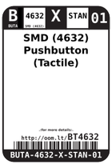
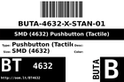

Contents
========

* [BT4632 > SMD (4632) Pushbutton (Tactile)](#bt4632--smd-4632-pushbutton-tactile)
	* [Datasheets](#datasheets)
	* [Labels](#labels)
	* [EDA](#eda)
	* [Images](#images)
	* [Tags](#tags)

# BT4632 > SMD (4632) Pushbutton (Tactile)

- ID: BUTA-4632-X-STAN-01
- Hex ID: BT4632
- Name: SMD (4632) Pushbutton (Tactile)
- Description: SMD (4632) Pushbutton (Tactile)
- Long Link: [http://oom.lt/BUTA-4632-X-STAN-01](http://oom.lt/BUTA-4632-X-STAN-01)
- Short Link: [http://oom.lt/BT4632](http://oom.lt/BT4632)

## Datasheets

- Datasheet: [datasheet.pdf](datasheet.pdf)

## Labels
  
  

|label-front|label-inventory|label-spec|
| :---: | :---: | :---: |
||||

## EDA

### Symbols
  

|[  SYMBOL-kicad-kicad-symbols-Switch-SW_Push](https://github.com/oomlout/oomlout_OOMP_eda/tree/main/SYMBOL/kicad/kicad-symbols/Switch/SW_Push/)||||
| :---: | :---: | :---: | :---: |

## Images
  
  

|label-front|label-inventory|label-spec|
| :---: | :---: | :---: |
||||

## Tags

- oompID: BUTA-4632-X-STAN-01
- name: SMD (4632) Pushbutton (Tactile)
- hexID: BT4632
- oompSort: BUTA4632STAN
- oompType: BUTA
- oompSize: 4632
- oompColor: X
- oompDesc: STAN
- oompIndex: 01
- oompVersion: 98
- ooNumPins: 4
- oompSchem: template;BUTA-XXXX-X-PI02-XX-schem
- ooDesignator: S
- oompSymbol: twoSidedPackage;##ooNumPins@@/2
- ooPin1: .
- ooPin2: .
- symbolKicad: SYMBOL-kicad-kicad-symbols-Switch-SW_Push
