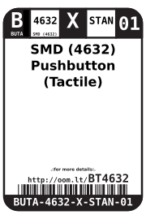
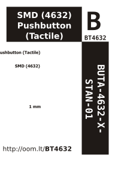

Contents
========

* [BUTA-4632-X-STAN-01>SMD (4632) Pushbutton (Tactile)](#buta-4632-x-stan-01smd-4632-pushbutton-tactile)
	* [Datasheets](#datasheets)
	* [Labels](#labels)
	* [EDA](#eda)
		* [Symbols](#symbols)
	* [Tags](#tags)

# BUTA-4632-X-STAN-01>SMD (4632) Pushbutton (Tactile)

- ID: BUTA-4632-X-STAN-01
- Name: BUTA-4632-X-STAN-01

## Datasheets

- Datasheet: [datasheet.pdf](datasheet.pdf)

## Labels
  
  

|label-front|label-inventory|label-spec|
| :---: | :---: | :---: |
||||

## EDA

### Symbols

## Tags

- oompID: BUTA-4632-X-STAN-01
- name: SMD (4632) Pushbutton (Tactile)
- hexID: BT4632
- oompSort: BUTA4632STAN
- oompType: BUTA
- oompSize: 4632
- oompColor: X
- oompDesc: STAN
- oompIndex: 01
- oompVersion: 98
- ooNumPins: 4
- oompSchem: template;BUTA-XXXX-X-PI02-XX-schem
- ooDesignator: S
- oompSymbol: twoSidedPackage;##ooNumPins@@/2
- ooPin1: .
- ooPin2: .
