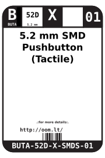
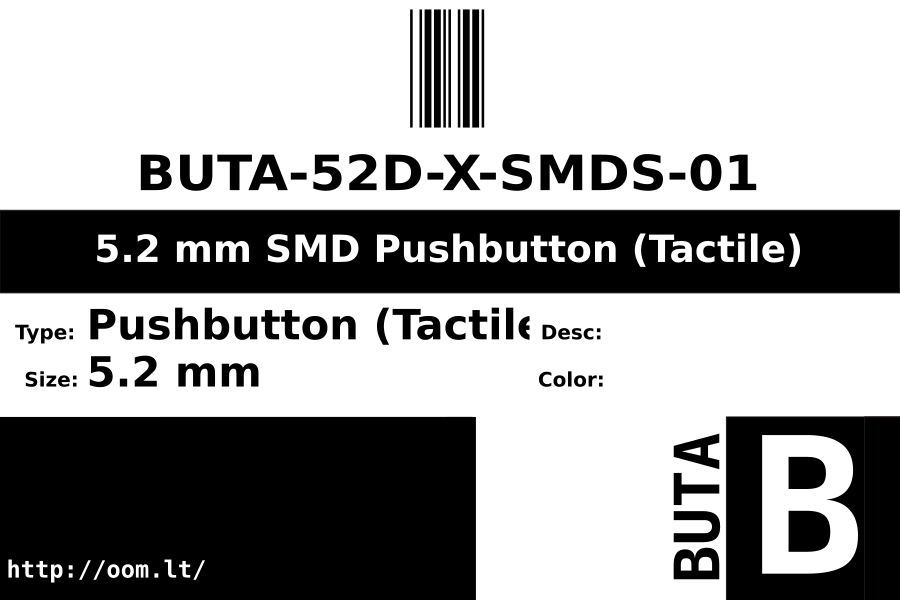

Contents
========

* [BUTA-52D-X-SMDS-01>5.2 mm SMD Pushbutton (Tactile)](#buta-52d-x-smds-0152-mm-smd-pushbutton-tactile)
	* [Labels](#labels)
	* [EDA](#eda)
		* [Symbols](#symbols)
	* [Tags](#tags)

# BUTA-52D-X-SMDS-01>5.2 mm SMD Pushbutton (Tactile)

- ID: BUTA-52D-X-SMDS-01
- Name: BUTA-52D-X-SMDS-01

## Labels
  
  

|label-front|label-inventory|label-spec|
| :---: | :---: | :---: |
||||

## EDA

### Symbols

## Tags

- oompID: BUTA-52D-X-SMDS-01
- name: 5.2 mm SMD Pushbutton (Tactile)
- oompType: BUTA
- oompSize: 52D
- oompColor: X
- oompIndex: 01
- oompVersion: 999
- ooWidth: 4.8mm
- ooHeight: 1.5mm
- ooLength: 4.8mm
- oompSchem: template;BUTA-XXXX-X-PI02-XX-schem
- ooDesignator: S
- oompSymbol: twoSidedPackage;##ooNumPins@@/2
- ooPin1: .
- ooPin2: .
