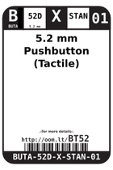
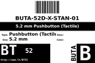
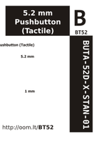

Contents
========

* [BT52 > 5.2 mm Pushbutton (Tactile)](#bt52--52-mm-pushbutton-tactile)
	* [Datasheets](#datasheets)
	* [Labels](#labels)
	* [EDA](#eda)
	* [Images](#images)
	* [Tags](#tags)

# BT52 > 5.2 mm Pushbutton (Tactile)

- ID: BUTA-52D-X-STAN-01
- Hex ID: BT52
- Name: 5.2 mm Pushbutton (Tactile)
- Description: 5.2 mm Pushbutton (Tactile)
- Long Link: [http://oom.lt/BUTA-52D-X-STAN-01](http://oom.lt/BUTA-52D-X-STAN-01)
- Long Link: [http://oom.lt/BT52](http://oom.lt/BT52)

## Datasheets

- Datasheet: [datasheet.pdf](datasheet.pdf)

## Labels
  
  

|label-front|label-inventory|label-spec|
| :---: | :---: | :---: |
||||

## EDA

### Symbols

## Images
  
  

|label-front|label-inventory|label-spec|
| :---: | :---: | :---: |
||||

## Tags

- oompID: BUTA-52D-X-STAN-01
- name: 5.2 mm Pushbutton (Tactile)
- hexID: BT52
- oompSort: BUTA52DSTAN
- oompType: BUTA
- oompSize: 52D
- oompColor: X
- oompDesc: STAN
- oompIndex: 01
- oompVersion: 98
- ooNumPins: 4
- oompSchem: template;BUTA-XXXX-X-PI02-XX-schem
- ooDesignator: S
- oompSymbol: twoSidedPackage;##ooNumPins@@/2
- ooPin1: .
- ooPin2: .
