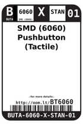
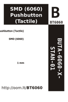

Contents
========

* [BT6060 > SMD (6060) Pushbutton (Tactile)](#bt6060--smd-6060-pushbutton-tactile)
	* [Datasheets](#datasheets)
	* [Labels](#labels)
	* [EDA](#eda)
	* [Images](#images)
	* [Tags](#tags)

# BT6060 > SMD (6060) Pushbutton (Tactile)

- ID: BUTA-6060-X-STAN-01
- Hex ID: BT6060
- Name: SMD (6060) Pushbutton (Tactile)
- Description: SMD (6060) Pushbutton (Tactile)
- Long Link: [http://oom.lt/BUTA-6060-X-STAN-01](http://oom.lt/BUTA-6060-X-STAN-01)
- Short Link: [http://oom.lt/BT6060](http://oom.lt/BT6060)

## Datasheets

- Datasheet: [datasheet.pdf](datasheet.pdf)

## Labels
  
  

|label-front|label-inventory|label-spec|
| :---: | :---: | :---: |
||||

## EDA
  

### Instances
  
Used 55 times.  
Prevalance: (55\10986) 0.5006%  

|Project|Occur- rences|Identifiers|
| :---: | :---: | :---: |
|[PROJ-ADAF-1272-STAN-01 Adafruit GPS Logger Shield PCB](https://github.com/oomlout/oomlout_OOMP_projects/tree/main/PROJ-ADAF-1272-STAN-01/)|[1](https://github.com/oomlout/oomlout_OOMP_projects/tree/main/PROJ-ADAF-1272-STAN-01/)|[RESET](https://github.com/oomlout/oomlout_OOMP_projects/tree/main/PROJ-ADAF-1272-STAN-01/)|
|[PROJ-ADAF-1411-STAN-01 Adafruit 16 channel PWM Servo Shield](https://github.com/oomlout/oomlout_OOMP_projects/tree/main/PROJ-ADAF-1411-STAN-01/)|[1](https://github.com/oomlout/oomlout_OOMP_projects/tree/main/PROJ-ADAF-1411-STAN-01/)|[SW1](https://github.com/oomlout/oomlout_OOMP_projects/tree/main/PROJ-ADAF-1411-STAN-01/)|
|[PROJ-ADAF-1430-STAN-01 Adafruit NeoPixel Shield PCB](https://github.com/oomlout/oomlout_OOMP_projects/tree/main/PROJ-ADAF-1430-STAN-01/)|[1](https://github.com/oomlout/oomlout_OOMP_projects/tree/main/PROJ-ADAF-1430-STAN-01/)|[SW1](https://github.com/oomlout/oomlout_OOMP_projects/tree/main/PROJ-ADAF-1430-STAN-01/)|
|[PROJ-ADAF-1628-STAN-01 Adafruit Bluefruit EZ Link Shield PCB](https://github.com/oomlout/oomlout_OOMP_projects/tree/main/PROJ-ADAF-1628-STAN-01/)|[1](https://github.com/oomlout/oomlout_OOMP_projects/tree/main/PROJ-ADAF-1628-STAN-01/)|[SW3](https://github.com/oomlout/oomlout_OOMP_projects/tree/main/PROJ-ADAF-1628-STAN-01/)|
|[PROJ-ADAF-1651-STAN-01 Adafruit 2.8 TFT Shield v2 PCB](https://github.com/oomlout/oomlout_OOMP_projects/tree/main/PROJ-ADAF-1651-STAN-01/)|[1](https://github.com/oomlout/oomlout_OOMP_projects/tree/main/PROJ-ADAF-1651-STAN-01/)|[SW1](https://github.com/oomlout/oomlout_OOMP_projects/tree/main/PROJ-ADAF-1651-STAN-01/)|
|[PROJ-ADAF-1716-STAN-01 Adafruit Qualia Driver PCB](https://github.com/oomlout/oomlout_OOMP_projects/tree/main/PROJ-ADAF-1716-STAN-01/)|[3](https://github.com/oomlout/oomlout_OOMP_projects/tree/main/PROJ-ADAF-1716-STAN-01/)|[SW1, SW2, SW3](https://github.com/oomlout/oomlout_OOMP_projects/tree/main/PROJ-ADAF-1716-STAN-01/)|
|[PROJ-ADAF-1788-STAN-01 Adafruit Music Maker MP3 Shield PCB](https://github.com/oomlout/oomlout_OOMP_projects/tree/main/PROJ-ADAF-1788-STAN-01/)|[1](https://github.com/oomlout/oomlout_OOMP_projects/tree/main/PROJ-ADAF-1788-STAN-01/)|[SW2](https://github.com/oomlout/oomlout_OOMP_projects/tree/main/PROJ-ADAF-1788-STAN-01/)|
|[PROJ-ADAF-2024-STAN-01 Adafruit MPR121 Capacitive Touch Shield PCB](https://github.com/oomlout/oomlout_OOMP_projects/tree/main/PROJ-ADAF-2024-STAN-01/)|[1](https://github.com/oomlout/oomlout_OOMP_projects/tree/main/PROJ-ADAF-2024-STAN-01/)|[SW2](https://github.com/oomlout/oomlout_OOMP_projects/tree/main/PROJ-ADAF-2024-STAN-01/)|
|[PROJ-ADAF-2315-STAN-01 Adafruit PiTFT 2.2 Inch HAT PCB](https://github.com/oomlout/oomlout_OOMP_projects/tree/main/PROJ-ADAF-2315-STAN-01/)|[4](https://github.com/oomlout/oomlout_OOMP_projects/tree/main/PROJ-ADAF-2315-STAN-01/)|[SW1, SW2, SW3, SW4](https://github.com/oomlout/oomlout_OOMP_projects/tree/main/PROJ-ADAF-2315-STAN-01/)|
|[PROJ-ADAF-2466-STAN-01 Adafruit METRO 328 PCB](https://github.com/oomlout/oomlout_OOMP_projects/tree/main/PROJ-ADAF-2466-STAN-01/)|[1](https://github.com/oomlout/oomlout_OOMP_projects/tree/main/PROJ-ADAF-2466-STAN-01/)|[RESET](https://github.com/oomlout/oomlout_OOMP_projects/tree/main/PROJ-ADAF-2466-STAN-01/)|
|[PROJ-ADAF-2468-STAN-01 Adafruit FONA 800 Shield PCB](https://github.com/oomlout/oomlout_OOMP_projects/tree/main/PROJ-ADAF-2468-STAN-01/)|[1](https://github.com/oomlout/oomlout_OOMP_projects/tree/main/PROJ-ADAF-2468-STAN-01/)|[SW1](https://github.com/oomlout/oomlout_OOMP_projects/tree/main/PROJ-ADAF-2468-STAN-01/)|
|[PROJ-ADAF-2636-STAN-01 Adafruit FONA808 Shield PCB](https://github.com/oomlout/oomlout_OOMP_projects/tree/main/PROJ-ADAF-2636-STAN-01/)|[1](https://github.com/oomlout/oomlout_OOMP_projects/tree/main/PROJ-ADAF-2636-STAN-01/)|[SW1](https://github.com/oomlout/oomlout_OOMP_projects/tree/main/PROJ-ADAF-2636-STAN-01/)|
|[PROJ-ADAF-2746-STAN-01 Adafruit Bluefruit LE Shield PCB](https://github.com/oomlout/oomlout_OOMP_projects/tree/main/PROJ-ADAF-2746-STAN-01/)|[1](https://github.com/oomlout/oomlout_OOMP_projects/tree/main/PROJ-ADAF-2746-STAN-01/)|[SW2](https://github.com/oomlout/oomlout_OOMP_projects/tree/main/PROJ-ADAF-2746-STAN-01/)|
|[PROJ-ADAF-3000-STAN-01 Adafruit Circuit Playground PCB](https://github.com/oomlout/oomlout_OOMP_projects/tree/main/PROJ-ADAF-3000-STAN-01/)|[2](https://github.com/oomlout/oomlout_OOMP_projects/tree/main/PROJ-ADAF-3000-STAN-01/)|[SW1, SW2](https://github.com/oomlout/oomlout_OOMP_projects/tree/main/PROJ-ADAF-3000-STAN-01/)|
|[PROJ-ADAF-3315-STAN-01 Adafruit 2.4 TFT FeatherWing PCB](https://github.com/oomlout/oomlout_OOMP_projects/tree/main/PROJ-ADAF-3315-STAN-01/)|[1](https://github.com/oomlout/oomlout_OOMP_projects/tree/main/PROJ-ADAF-3315-STAN-01/)|[SW1](https://github.com/oomlout/oomlout_OOMP_projects/tree/main/PROJ-ADAF-3315-STAN-01/)|
|[PROJ-ADAF-3321-STAN-01 Adafruit Mini TFT with Joystick Featherwing PCB](https://github.com/oomlout/oomlout_OOMP_projects/tree/main/PROJ-ADAF-3321-STAN-01/)|[2](https://github.com/oomlout/oomlout_OOMP_projects/tree/main/PROJ-ADAF-3321-STAN-01/)|[SW2, SW3](https://github.com/oomlout/oomlout_OOMP_projects/tree/main/PROJ-ADAF-3321-STAN-01/)|
|[PROJ-ADAF-3333-STAN-01 Adafruit Circuit Playground Express PCB](https://github.com/oomlout/oomlout_OOMP_projects/tree/main/PROJ-ADAF-3333-STAN-01/)|[2](https://github.com/oomlout/oomlout_OOMP_projects/tree/main/PROJ-ADAF-3333-STAN-01/)|[SW1, SW2](https://github.com/oomlout/oomlout_OOMP_projects/tree/main/PROJ-ADAF-3333-STAN-01/)|
|[PROJ-ADAF-3382-STAN-01 Adafruit Metro M4 Express PCB](https://github.com/oomlout/oomlout_OOMP_projects/tree/main/PROJ-ADAF-3382-STAN-01/)|[1](https://github.com/oomlout/oomlout_OOMP_projects/tree/main/PROJ-ADAF-3382-STAN-01/)|[RESET](https://github.com/oomlout/oomlout_OOMP_projects/tree/main/PROJ-ADAF-3382-STAN-01/)|
|[PROJ-ADAF-3435-STAN-01 Adafruit TPL5110 Power Timer Breakout PCB](https://github.com/oomlout/oomlout_OOMP_projects/tree/main/PROJ-ADAF-3435-STAN-01/)|[1](https://github.com/oomlout/oomlout_OOMP_projects/tree/main/PROJ-ADAF-3435-STAN-01/)|[SW1](https://github.com/oomlout/oomlout_OOMP_projects/tree/main/PROJ-ADAF-3435-STAN-01/)|
|[PROJ-ADAF-3464-STAN-01 Adafruit Joy Bonnet PCB](https://github.com/oomlout/oomlout_OOMP_projects/tree/main/PROJ-ADAF-3464-STAN-01/)|[6](https://github.com/oomlout/oomlout_OOMP_projects/tree/main/PROJ-ADAF-3464-STAN-01/)|[SW1, SW2, SW3, SW4, SW5, SW8](https://github.com/oomlout/oomlout_OOMP_projects/tree/main/PROJ-ADAF-3464-STAN-01/)|
|[PROJ-ADAF-3505-STAN-01 Adafruit Metro M0 Express PCB](https://github.com/oomlout/oomlout_OOMP_projects/tree/main/PROJ-ADAF-3505-STAN-01/)|[1](https://github.com/oomlout/oomlout_OOMP_projects/tree/main/PROJ-ADAF-3505-STAN-01/)|[RESET](https://github.com/oomlout/oomlout_OOMP_projects/tree/main/PROJ-ADAF-3505-STAN-01/)|
|[PROJ-ADAF-3531-STAN-01 Adafruit 128x64 OLED Bonnet for Raspberry Pi PCB](https://github.com/oomlout/oomlout_OOMP_projects/tree/main/PROJ-ADAF-3531-STAN-01/)|[2](https://github.com/oomlout/oomlout_OOMP_projects/tree/main/PROJ-ADAF-3531-STAN-01/)|[SW1, SW2](https://github.com/oomlout/oomlout_OOMP_projects/tree/main/PROJ-ADAF-3531-STAN-01/)|
|[PROJ-ADAF-3573-STAN-01 Adafruit TPL5111 Reset Enable Timer PCB](https://github.com/oomlout/oomlout_OOMP_projects/tree/main/PROJ-ADAF-3573-STAN-01/)|[1](https://github.com/oomlout/oomlout_OOMP_projects/tree/main/PROJ-ADAF-3573-STAN-01/)|[SW1](https://github.com/oomlout/oomlout_OOMP_projects/tree/main/PROJ-ADAF-3573-STAN-01/)|
|[PROJ-ADAF-3632-STAN-01 Adafruit Joy Featherwing PCB](https://github.com/oomlout/oomlout_OOMP_projects/tree/main/PROJ-ADAF-3632-STAN-01/)|[4](https://github.com/oomlout/oomlout_OOMP_projects/tree/main/PROJ-ADAF-3632-STAN-01/)|[DOWN, LEFT, RIGHT, UP](https://github.com/oomlout/oomlout_OOMP_projects/tree/main/PROJ-ADAF-3632-STAN-01/)|
|[PROJ-ADAF-3651-STAN-01 Adafruit 3.5in TFT Featherwing PCB](https://github.com/oomlout/oomlout_OOMP_projects/tree/main/PROJ-ADAF-3651-STAN-01/)|[1](https://github.com/oomlout/oomlout_OOMP_projects/tree/main/PROJ-ADAF-3651-STAN-01/)|[SW1](https://github.com/oomlout/oomlout_OOMP_projects/tree/main/PROJ-ADAF-3651-STAN-01/)|
|[PROJ-ADAF-4000-STAN-01 Adafruit Metro M4 Express AirLift PCB](https://github.com/oomlout/oomlout_OOMP_projects/tree/main/PROJ-ADAF-4000-STAN-01/)|[1](https://github.com/oomlout/oomlout_OOMP_projects/tree/main/PROJ-ADAF-4000-STAN-01/)|[RESET](https://github.com/oomlout/oomlout_OOMP_projects/tree/main/PROJ-ADAF-4000-STAN-01/)|
|[PROJ-ADAF-4064-STAN-01 Adafruit Grand Central PCB](https://github.com/oomlout/oomlout_OOMP_projects/tree/main/PROJ-ADAF-4064-STAN-01/)|[1](https://github.com/oomlout/oomlout_OOMP_projects/tree/main/PROJ-ADAF-4064-STAN-01/)|[RESET](https://github.com/oomlout/oomlout_OOMP_projects/tree/main/PROJ-ADAF-4064-STAN-01/)|
|[PROJ-ADAF-4074-STAN-01 Adafruit Radio Bonnet PCB](https://github.com/oomlout/oomlout_OOMP_projects/tree/main/PROJ-ADAF-4074-STAN-01/)|[3](https://github.com/oomlout/oomlout_OOMP_projects/tree/main/PROJ-ADAF-4074-STAN-01/)|[SW1, SW2, SW3](https://github.com/oomlout/oomlout_OOMP_projects/tree/main/PROJ-ADAF-4074-STAN-01/)|
|[PROJ-ADAF-4333-STAN-01 Adafruit Circuit Playground Bluefruit PCB](https://github.com/oomlout/oomlout_OOMP_projects/tree/main/PROJ-ADAF-4333-STAN-01/)|[2](https://github.com/oomlout/oomlout_OOMP_projects/tree/main/PROJ-ADAF-4333-STAN-01/)|[SW1, SW2](https://github.com/oomlout/oomlout_OOMP_projects/tree/main/PROJ-ADAF-4333-STAN-01/)|
|[PROJ-ADAF-4393-STAN-01 Adafruit Mini PiTFT 240x135 TFT PCB](https://github.com/oomlout/oomlout_OOMP_projects/tree/main/PROJ-ADAF-4393-STAN-01/)|[2](https://github.com/oomlout/oomlout_OOMP_projects/tree/main/PROJ-ADAF-4393-STAN-01/)|[SW1, SW2](https://github.com/oomlout/oomlout_OOMP_projects/tree/main/PROJ-ADAF-4393-STAN-01/)|
|[PROJ-ADAF-4500-STAN-01 Adafruit CLUE PCB](https://github.com/oomlout/oomlout_OOMP_projects/tree/main/PROJ-ADAF-4500-STAN-01/)|[1](https://github.com/oomlout/oomlout_OOMP_projects/tree/main/PROJ-ADAF-4500-STAN-01/)|[SW1](https://github.com/oomlout/oomlout_OOMP_projects/tree/main/PROJ-ADAF-4500-STAN-01/)|
|[PROJ-ADAF-4757-STAN-01 Adafruit Voice Bonnet PCB](https://github.com/oomlout/oomlout_OOMP_projects/tree/main/PROJ-ADAF-4757-STAN-01/)|[1](https://github.com/oomlout/oomlout_OOMP_projects/tree/main/PROJ-ADAF-4757-STAN-01/)|[SW1](https://github.com/oomlout/oomlout_OOMP_projects/tree/main/PROJ-ADAF-4757-STAN-01/)|
|[PROJ-ADAF-802-STAN-01 Adafruit 1.8 TFT Shield PCB](https://github.com/oomlout/oomlout_OOMP_projects/tree/main/PROJ-ADAF-802-STAN-01/)|[1](https://github.com/oomlout/oomlout_OOMP_projects/tree/main/PROJ-ADAF-802-STAN-01/)|[U$4](https://github.com/oomlout/oomlout_OOMP_projects/tree/main/PROJ-ADAF-802-STAN-01/)|
|[PROJ-ADAF-91-STAN-01 Adafruit_USB_Boarduino_PCB](https://github.com/oomlout/oomlout_OOMP_projects/tree/main/PROJ-ADAF-91-STAN-01/)|[1](https://github.com/oomlout/oomlout_OOMP_projects/tree/main/PROJ-ADAF-91-STAN-01/)|[S1](https://github.com/oomlout/oomlout_OOMP_projects/tree/main/PROJ-ADAF-91-STAN-01/)|

## Images
  
  

|label-front|label-inventory|label-spec|
| :---: | :---: | :---: |
||||

## Tags

- oompType: BUTA
- oompSize: 6060
- oompColor: X
- oompDesc: STAN
- oompIndex: 01
- hexID: BT6060
- oompID: BUTA-6060-X-STAN-01
- oompInstances: {'PROJECT': 'PROJ-ADAF-1272-STAN-01', 'ID': 'RESET'}
- oompInstances: {'PROJECT': 'PROJ-ADAF-1411-STAN-01', 'ID': 'SW1'}
- oompInstances: {'PROJECT': 'PROJ-ADAF-1430-STAN-01', 'ID': 'SW1'}
- oompInstances: {'PROJECT': 'PROJ-ADAF-1628-STAN-01', 'ID': 'SW3'}
- oompInstances: {'PROJECT': 'PROJ-ADAF-1651-STAN-01', 'ID': 'SW1'}
- oompInstances: {'PROJECT': 'PROJ-ADAF-1716-STAN-01', 'ID': 'SW1'}
- oompInstances: {'PROJECT': 'PROJ-ADAF-1716-STAN-01', 'ID': 'SW2'}
- oompInstances: {'PROJECT': 'PROJ-ADAF-1716-STAN-01', 'ID': 'SW3'}
- oompInstances: {'PROJECT': 'PROJ-ADAF-1788-STAN-01', 'ID': 'SW2'}
- oompInstances: {'PROJECT': 'PROJ-ADAF-2024-STAN-01', 'ID': 'SW2'}
- oompInstances: {'PROJECT': 'PROJ-ADAF-2315-STAN-01', 'ID': 'SW1'}
- oompInstances: {'PROJECT': 'PROJ-ADAF-2315-STAN-01', 'ID': 'SW2'}
- oompInstances: {'PROJECT': 'PROJ-ADAF-2315-STAN-01', 'ID': 'SW3'}
- oompInstances: {'PROJECT': 'PROJ-ADAF-2315-STAN-01', 'ID': 'SW4'}
- oompInstances: {'PROJECT': 'PROJ-ADAF-2466-STAN-01', 'ID': 'RESET'}
- oompInstances: {'PROJECT': 'PROJ-ADAF-2468-STAN-01', 'ID': 'SW1'}
- oompInstances: {'PROJECT': 'PROJ-ADAF-2636-STAN-01', 'ID': 'SW1'}
- oompInstances: {'PROJECT': 'PROJ-ADAF-2746-STAN-01', 'ID': 'SW2'}
- oompInstances: {'PROJECT': 'PROJ-ADAF-3000-STAN-01', 'ID': 'SW1'}
- oompInstances: {'PROJECT': 'PROJ-ADAF-3000-STAN-01', 'ID': 'SW2'}
- oompInstances: {'PROJECT': 'PROJ-ADAF-3315-STAN-01', 'ID': 'SW1'}
- oompInstances: {'PROJECT': 'PROJ-ADAF-3321-STAN-01', 'ID': 'SW2'}
- oompInstances: {'PROJECT': 'PROJ-ADAF-3321-STAN-01', 'ID': 'SW3'}
- oompInstances: {'PROJECT': 'PROJ-ADAF-3333-STAN-01', 'ID': 'SW1'}
- oompInstances: {'PROJECT': 'PROJ-ADAF-3333-STAN-01', 'ID': 'SW2'}
- oompInstances: {'PROJECT': 'PROJ-ADAF-3382-STAN-01', 'ID': 'RESET'}
- oompInstances: {'PROJECT': 'PROJ-ADAF-3435-STAN-01', 'ID': 'SW1'}
- oompInstances: {'PROJECT': 'PROJ-ADAF-3464-STAN-01', 'ID': 'SW1'}
- oompInstances: {'PROJECT': 'PROJ-ADAF-3464-STAN-01', 'ID': 'SW2'}
- oompInstances: {'PROJECT': 'PROJ-ADAF-3464-STAN-01', 'ID': 'SW3'}
- oompInstances: {'PROJECT': 'PROJ-ADAF-3464-STAN-01', 'ID': 'SW4'}
- oompInstances: {'PROJECT': 'PROJ-ADAF-3464-STAN-01', 'ID': 'SW5'}
- oompInstances: {'PROJECT': 'PROJ-ADAF-3464-STAN-01', 'ID': 'SW8'}
- oompInstances: {'PROJECT': 'PROJ-ADAF-3505-STAN-01', 'ID': 'RESET'}
- oompInstances: {'PROJECT': 'PROJ-ADAF-3531-STAN-01', 'ID': 'SW1'}
- oompInstances: {'PROJECT': 'PROJ-ADAF-3531-STAN-01', 'ID': 'SW2'}
- oompInstances: {'PROJECT': 'PROJ-ADAF-3573-STAN-01', 'ID': 'SW1'}
- oompInstances: {'PROJECT': 'PROJ-ADAF-3632-STAN-01', 'ID': 'DOWN'}
- oompInstances: {'PROJECT': 'PROJ-ADAF-3632-STAN-01', 'ID': 'LEFT'}
- oompInstances: {'PROJECT': 'PROJ-ADAF-3632-STAN-01', 'ID': 'RIGHT'}
- oompInstances: {'PROJECT': 'PROJ-ADAF-3632-STAN-01', 'ID': 'UP'}
- oompInstances: {'PROJECT': 'PROJ-ADAF-3651-STAN-01', 'ID': 'SW1'}
- oompInstances: {'PROJECT': 'PROJ-ADAF-4000-STAN-01', 'ID': 'RESET'}
- oompInstances: {'PROJECT': 'PROJ-ADAF-4064-STAN-01', 'ID': 'RESET'}
- oompInstances: {'PROJECT': 'PROJ-ADAF-4074-STAN-01', 'ID': 'SW1'}
- oompInstances: {'PROJECT': 'PROJ-ADAF-4074-STAN-01', 'ID': 'SW2'}
- oompInstances: {'PROJECT': 'PROJ-ADAF-4074-STAN-01', 'ID': 'SW3'}
- oompInstances: {'PROJECT': 'PROJ-ADAF-4333-STAN-01', 'ID': 'SW1'}
- oompInstances: {'PROJECT': 'PROJ-ADAF-4333-STAN-01', 'ID': 'SW2'}
- oompInstances: {'PROJECT': 'PROJ-ADAF-4393-STAN-01', 'ID': 'SW1'}
- oompInstances: {'PROJECT': 'PROJ-ADAF-4393-STAN-01', 'ID': 'SW2'}
- oompInstances: {'PROJECT': 'PROJ-ADAF-4500-STAN-01', 'ID': 'SW1'}
- oompInstances: {'PROJECT': 'PROJ-ADAF-4757-STAN-01', 'ID': 'SW1'}
- oompInstances: {'PROJECT': 'PROJ-ADAF-802-STAN-01', 'ID': 'U$4'}
- oompInstances: {'PROJECT': 'PROJ-ADAF-91-STAN-01', 'ID': 'S1'}
