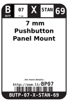
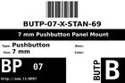

Contents
========

* [BP07 >  7 mm Pushbutton Panel Mount ](#bp07---7-mm-pushbutton-panel-mount-)
	* [Datasheets](#datasheets)
	* [Labels](#labels)
	* [EDA](#eda)
	* [Images](#images)
	* [Tags](#tags)

# BP07 >  7 mm Pushbutton Panel Mount 

- ID: BUTP-07-X-STAN-69
- Hex ID: BP07
- Name:  7 mm Pushbutton Panel Mount 
- Description:  7 mm Pushbutton Panel Mount 
- Long Link: [http://oom.lt/BUTP-07-X-STAN-69](http://oom.lt/BUTP-07-X-STAN-69)
- Short Link: [http://oom.lt/BP07](http://oom.lt/BP07)

## Datasheets

- Datasheet: [datasheet.pdf](datasheet.pdf)

## Labels
  
  

|label-front|label-inventory|label-spec|
| :---: | :---: | :---: |
||||

## EDA

### Symbols

## Images
  
  

|label-front|label-inventory|label-spec|
| :---: | :---: | :---: |
||||

## Tags

- oompID: BUTP-07-X-STAN-69
- name:  7 mm Pushbutton Panel Mount 
- hexID: BP07
- oompSort: BUTP07STAN
- oompType: BUTP
- oompSize: 07
- oompColor: X
- oompDesc: STAN
- oompIndex: 69
- oompVersion: 98
