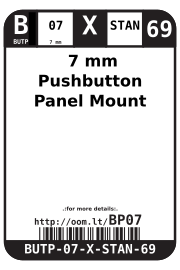
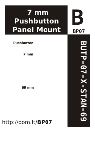

Contents
========

* [BUTP-07-X-STAN-69> 7 mm Pushbutton Panel Mount ](#butp-07-x-stan-69-7-mm-pushbutton-panel-mount-)
	* [Datasheets](#datasheets)
	* [Labels](#labels)
	* [EDA](#eda)
		* [Symbols](#symbols)
	* [Tags](#tags)

# BUTP-07-X-STAN-69> 7 mm Pushbutton Panel Mount 

- ID: BUTP-07-X-STAN-69
- Name: BUTP-07-X-STAN-69

## Datasheets

- Datasheet: [datasheet.pdf](datasheet.pdf)

## Labels
  
  

|label-front|label-inventory|label-spec|
| :---: | :---: | :---: |
||||

## EDA

### Symbols

## Tags

- oompID: BUTP-07-X-STAN-69
- name:  7 mm Pushbutton Panel Mount 
- hexID: BP07
- oompSort: BUTP07STAN
- oompType: BUTP
- oompSize: 07
- oompColor: X
- oompDesc: STAN
- oompIndex: 69
- oompVersion: 98
