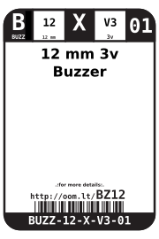
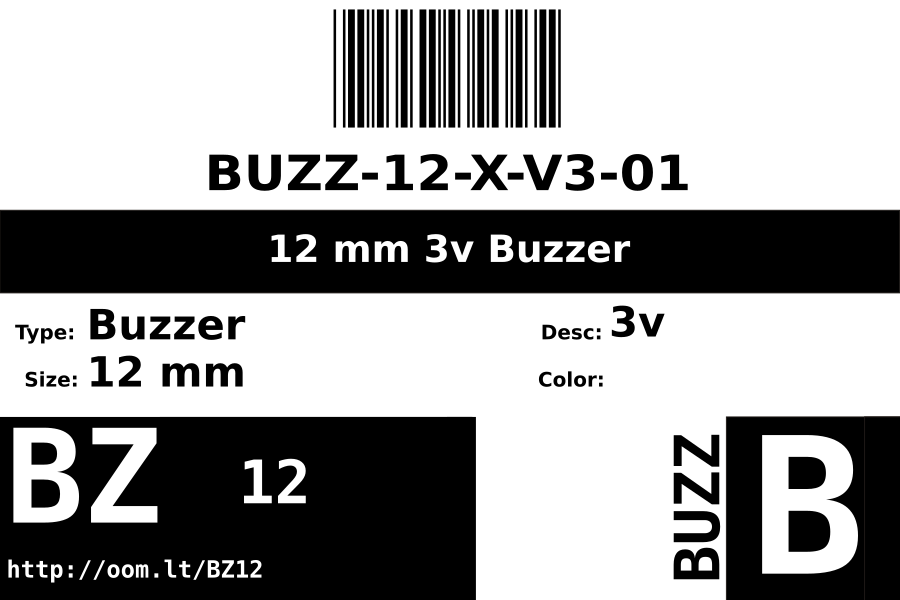
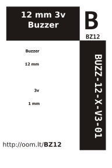

Contents
========

* [BUZZ-12-X-V3-01>12 mm 3v Buzzer](#buzz-12-x-v3-0112-mm-3v-buzzer)
	* [Images](#images)
	* [Datasheets](#datasheets)
	* [Labels](#labels)
	* [EDA](#eda)
		* [Symbols](#symbols)
	* [Tags](#tags)
  
![][im]
# BUZZ-12-X-V3-01>12 mm 3v Buzzer

- ID: BUZZ-12-X-V3-01
- Name: BUZZ-12-X-V3-01

## Images
  
  

|image|image_RE|image_BOTTOM|
| :---: | :---: | :---: |
||||

## Datasheets

- Datasheet: [datasheet.pdf](datasheet.pdf)

## Labels
  
  

|label-front|label-inventory|label-spec|
| :---: | :---: | :---: |
||||

## EDA

### Symbols

## Tags

- oompID: BUZZ-12-X-V3-01
- name: 12 mm 3v Buzzer
- hexID: BZ12
- oompSort: BUZZ12V3
- oompType: BUZZ
- oompSize: 12
- oompColor: X
- oompDesc: V3
- oompIndex: 01
- oompVersion: 98
- oompSchem: template;BUZZ-XXXX-X-XXXX-XX-schem
- ooDesignator: LS1

[im]: image_600.jpg
