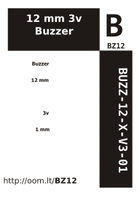

Contents
========

* [BZ12 > 12 mm 3v Buzzer](#bz12--12-mm-3v-buzzer)
	* [Datasheets](#datasheets)
	* [Labels](#labels)
	* [EDA](#eda)
	* [Images](#images)
	* [Tags](#tags)
  
![][im]
# BZ12 > 12 mm 3v Buzzer

- ID: BUZZ-12-X-V3-01
- Hex ID: BZ12
- Name: 12 mm 3v Buzzer
- Description: 12 mm 3v Buzzer
- Long Link: [http://oom.lt/BUZZ-12-X-V3-01](http://oom.lt/BUZZ-12-X-V3-01)
- Short Link: [http://oom.lt/BZ12](http://oom.lt/BZ12)

## Datasheets

- Datasheet: [datasheet.pdf](datasheet.pdf)

## Labels
  
  

|label-front|label-inventory|label-spec|
| :---: | :---: | :---: |
||||

## EDA

## Images
  
  

|image|image_RE|image_BOTTOM|label-front|label-inventory|label-spec|
| :---: | :---: | :---: | :---: | :---: | :---: |
|||||||

## Tags

- oompID: BUZZ-12-X-V3-01
- name: 12 mm 3v Buzzer
- hexID: BZ12
- oompSort: BUZZ12V3
- oompType: BUZZ
- oompSize: 12
- oompColor: X
- oompDesc: V3
- oompIndex: 01
- oompVersion: 98
- oompSchem: template;BUZZ-XXXX-X-XXXX-XX-schem
- ooDesignator: LS1

[im]: image_450.jpg
