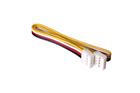
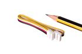
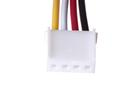
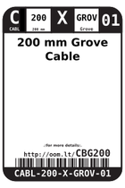
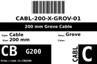

Contents
========

* [CBG200 > 200 mm Grove Cable](#cbg200--200-mm-grove-cable)
	* [Images](#images)
	* [Datasheets](#datasheets)
	* [Labels](#labels)
	* [EDA](#eda)
	* [Tags](#tags)
  
![][im]
# CBG200 > 200 mm Grove Cable

- ID: CABL-200-X-GROV-01
- Hex ID: CBG200
- Name: 200 mm Grove Cable
- Description: 200 mm Grove Cable

## Images
  
  

|image|image_RE|image_BOTTOM|label-front|label-inventory|label-spec|
| :---: | :---: | :---: | :---: | :---: | :---: |
|||||||

## Datasheets

- Datasheet: [datasheet.pdf](datasheet.pdf)

## Labels
  
  

|label-front|label-inventory|label-spec|
| :---: | :---: | :---: |
||||

## EDA

### Symbols

## Tags

- oompID: CABL-200-X-GROV-01
- name: 200 mm Grove Cable
- hexID: CBG200
- oompSort: CABL200GROV
- oompType: CABL
- oompSize: 200
- oompColor: X
- oompDesc: GROV
- oompIndex: 01
- oompVersion: 98

[im]: image_450.jpg
