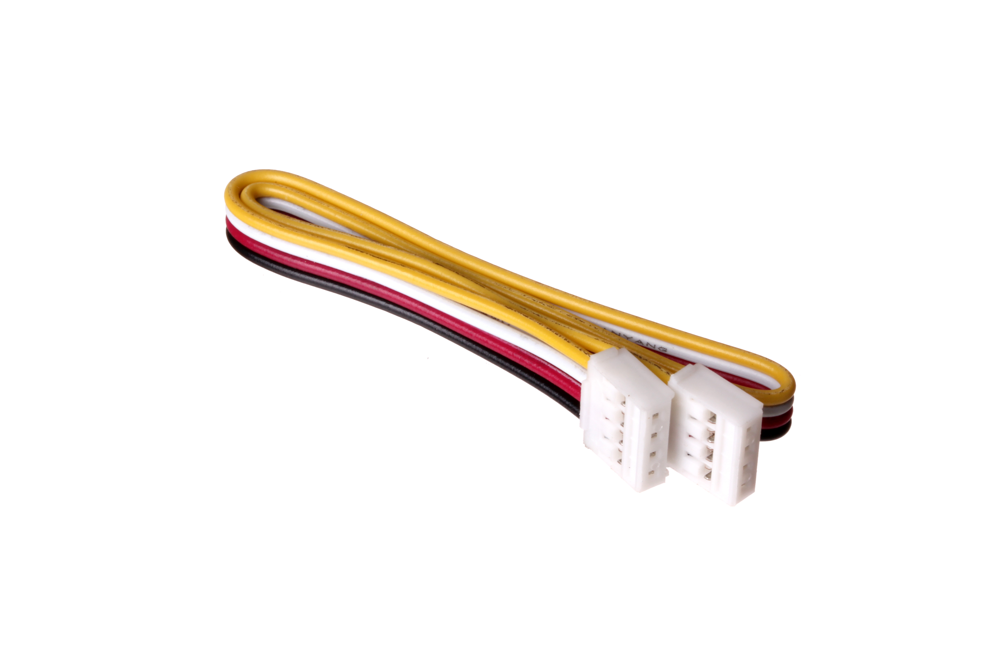
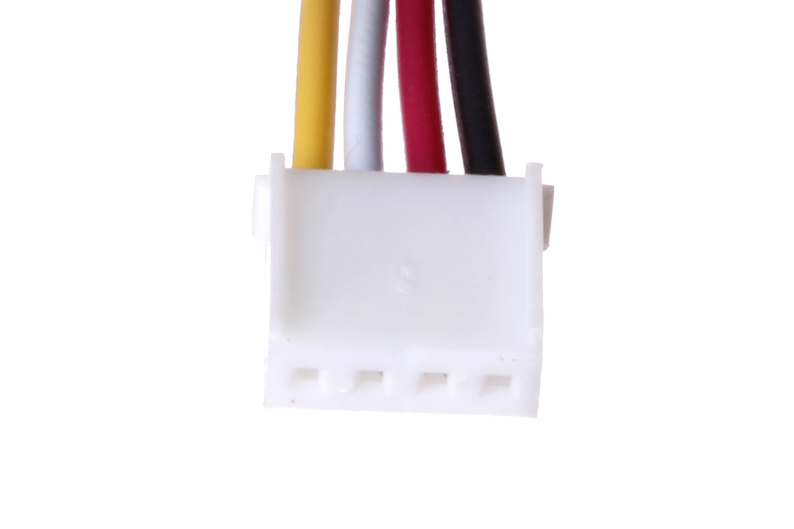

Contents
========

* [CABL-200-X-GROV-01>200 mm Grove Cable](#cabl-200-x-grov-01200-mm-grove-cable)
	* [Images](#images)
	* [Datasheets](#datasheets)
	* [EDA](#eda)
		* [Footprints](#footprints)
		* [Symbols](#symbols)
	* [Tags](#tags)
  
![][im]
# CABL-200-X-GROV-01>200 mm Grove Cable

- ID: CABL-200-X-GROV-01
- Name: CABL-200-X-GROV-01

## Images
  
  

|Main|Reference|Bottom|
| :---: | :---: | :---: |
||||

## Datasheets

- Datasheet: [datasheet.pdf](datasheet.pdf)

## EDA

### Footprints
  

|||||
| :---: | :---: | :---: | :---: |

### Symbols

## Tags

- index: 22
- oompID: CABL-200-X-GROV-01
- name: 200 mm Grove Cable
- hexID: CBG200
- oompSort: CABL200GROV
- oompType: CABL
- oompSize: 200
- oompColor: X
- oompDesc: GROV
- oompIndex: 01
- oompVersion: 98

[im]: image_600.jpg
