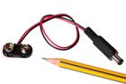
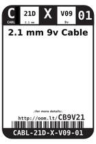
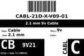
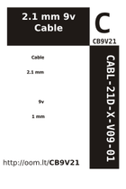

Contents
========

* [CB9V21 > 2.1 mm 9v Cable](#cb9v21--21-mm-9v-cable)
	* [Images](#images)
	* [Datasheets](#datasheets)
	* [Labels](#labels)
	* [EDA](#eda)
	* [Tags](#tags)
  
![][im]
# CB9V21 > 2.1 mm 9v Cable

- ID: CABL-21D-X-V09-01
- Hex ID: CB9V21
- Name: 2.1 mm 9v Cable
- Description: 2.1 mm 9v Cable

## Images
  
  

|image|image_RE|label-front|label-inventory|label-spec|
| :---: | :---: | :---: | :---: | :---: |
||||||

## Datasheets

- Datasheet: [datasheet.pdf](datasheet.pdf)

## Labels
  
  

|label-front|label-inventory|label-spec|
| :---: | :---: | :---: |
||||

## EDA

### Symbols

## Tags

- oompID: CABL-21D-X-V09-01
- name: 2.1 mm 9v Cable
- hexID: CB9V21
- oompSort: CABL21D09V
- oompType: CABL
- oompSize: 21D
- oompColor: X
- oompDesc: V09
- oompIndex: 01
- oompVersion: 98

[im]: image_450.jpg
