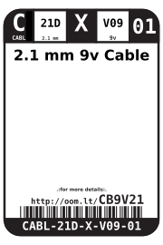
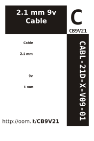

Contents
========

* [CABL-21D-X-V09-01>2.1 mm 9v Cable](#cabl-21d-x-v09-0121-mm-9v-cable)
	* [Images](#images)
	* [Datasheets](#datasheets)
	* [Labels](#labels)
	* [EDA](#eda)
		* [Symbols](#symbols)
	* [Tags](#tags)
  
![][im]
# CABL-21D-X-V09-01>2.1 mm 9v Cable

- ID: CABL-21D-X-V09-01
- Name: CABL-21D-X-V09-01

## Images
  
  

|Main|Reference|
| :---: | :---: |
|||

## Datasheets

- Datasheet: [datasheet.pdf](datasheet.pdf)

## Labels
  
  

|Front|Inventory|Specifications|
| :---: | :---: | :---: |
||||

## EDA

### Symbols

## Tags

- index: 23
- oompID: CABL-21D-X-V09-01
- name: 2.1 mm 9v Cable
- hexID: CB9V21
- oompSort: CABL21D09V
- oompType: CABL
- oompSize: 21D
- oompColor: X
- oompDesc: V09
- oompIndex: 01
- oompVersion: 98

[im]: image_600.jpg
