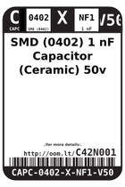
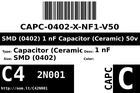
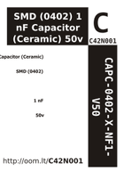

Contents
========

* [C4N1 > SMD (0402) 1 nF Capacitor (Ceramic) 50v](#c4n1--smd-0402-1-nf-capacitor-ceramic-50v)
	* [Datasheets](#datasheets)
	* [Labels](#labels)
	* [EDA](#eda)
	* [Images](#images)
	* [Tags](#tags)
  
![][im]
# C4N1 > SMD (0402) 1 nF Capacitor (Ceramic) 50v

- ID: CAPC-0402-X-NF1-V50
- Hex ID: C4N1
- Name: SMD (0402) 1 nF Capacitor (Ceramic) 50v
- Description: SMD (0402) 1 nF Capacitor (Ceramic) 50v
- Long Link: [http://oom.lt/CAPC-0402-X-NF1-V50](http://oom.lt/CAPC-0402-X-NF1-V50)
- Short Link: [http://oom.lt/C4N1](http://oom.lt/C4N1)

## Datasheets

- Datasheet: [datasheet.pdf](datasheet.pdf)

## Labels
  
  

|label-front|label-inventory|label-spec|
| :---: | :---: | :---: |
||||

## EDA

### Footprints
  

|[  FOOTPRINT-kicad-kicad-footprints-Capacitor_SMD-C_0402_1005Metric](https://github.com/oomlout/oomlout_OOMP_eda/tree/main/FOOTPRINT/kicad/kicad-footprints/Capacitor_SMD/C_0402_1005Metric/)|[  FOOTPRINT-kicad-kicad-footprints-Capacitor_SMD-C_0402_1005Metric_Pad0.74x0.62mm_HandSolder](https://github.com/oomlout/oomlout_OOMP_eda/tree/main/FOOTPRINT/kicad/kicad-footprints/Capacitor_SMD/C_0402_1005Metric_Pad0.74x0.62mm_HandSolder/)|||
| :---: | :---: | :---: | :---: |

### Symbols
  

|[  SYMBOL-kicad-kicad-symbols-Device-C](https://github.com/oomlout/oomlout_OOMP_eda/tree/main/SYMBOL/kicad/kicad-symbols/Device/C/)||||
| :---: | :---: | :---: | :---: |
  

### Instances
  
Used 4 times.  
Prevalance: (4\10986) 0.0364%  

|Project|Occur- rences|Identifiers|
| :---: | :---: | :---: |
|[PROJ-SPAR-11013-STAN-01 LilyPad MP3 Player](https://github.com/oomlout/oomlout_OOMP_projects/tree/main/PROJ-SPAR-11013-STAN-01/)|[4](https://github.com/oomlout/oomlout_OOMP_projects/tree/main/PROJ-SPAR-11013-STAN-01/)|[C30, C31, C32, C33](https://github.com/oomlout/oomlout_OOMP_projects/tree/main/PROJ-SPAR-11013-STAN-01/)|

## Images
  
  

|image|label-front|label-inventory|label-spec|
| :---: | :---: | :---: | :---: |
|||||

## Tags

- oompType: CAPC
- oompSize: 0402
- oompColor: X
- oompDesc: NF1
- oompIndex: V50
- oplPartNumber: {'code': 'C-JLCC', 'name': 'JLC Parts Library', 'partID': 'C1523', 'desc': '50V 1nF X7R ??10% 0402  Multilayer Ceramic Capacitors MLCC - SMD/SMT ROHS'}
- distributorPartNumber: {'code': 'C-LCSC', 'name': 'LCSC', 'partID': 'C1523'}
- manufacturerPartNumber: {'code': 'C-XXXX', 'name': 'FH (Guangdong Fenghua Advanced Tech)', 'partID': '0402B102K500NT'}
- hexID: C4N1
- oompID: CAPC-0402-X-NF1-V50
- oompInstances: {'PROJECT': 'PROJ-SPAR-11013-STAN-01', 'ID': 'C30'}
- oompInstances: {'PROJECT': 'PROJ-SPAR-11013-STAN-01', 'ID': 'C31'}
- oompInstances: {'PROJECT': 'PROJ-SPAR-11013-STAN-01', 'ID': 'C32'}
- oompInstances: {'PROJECT': 'PROJ-SPAR-11013-STAN-01', 'ID': 'C33'}
- footprintKicad: FOOTPRINT-kicad-kicad-footprints-Capacitor_SMD-C_0402_1005Metric
- footprintKicad: FOOTPRINT-kicad-kicad-footprints-Capacitor_SMD-C_0402_1005Metric_Pad0.74x0.62mm_HandSolder
- symbolKicad: SYMBOL-kicad-kicad-symbols-Device-C

[im]: image_450.jpg
