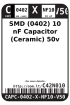
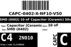
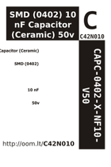

Contents
========

* [C42N010 > SMD (0402) 10 nF Capacitor (Ceramic) 50v](#c42n010--smd-0402-10-nf-capacitor-ceramic-50v)
	* [Datasheets](#datasheets)
	* [Labels](#labels)
	* [EDA](#eda)
	* [Images](#images)
	* [Tags](#tags)
  
![][im]
# C42N010 > SMD (0402) 10 nF Capacitor (Ceramic) 50v

- ID: CAPC-0402-X-NF10-V50
- Hex ID: C42N010
- Name: SMD (0402) 10 nF Capacitor (Ceramic) 50v
- Description: SMD (0402) 10 nF Capacitor (Ceramic) 50v
- Long Link: [http://oom.lt/CAPC-0402-X-NF10-V50](http://oom.lt/CAPC-0402-X-NF10-V50)
- Short Link: [http://oom.lt/C42N010](http://oom.lt/C42N010)

## Datasheets

- Datasheet: [datasheet.pdf](datasheet.pdf)

## Labels
  
  

|label-front|label-inventory|label-spec|
| :---: | :---: | :---: |
||||

## EDA
  

### Instances
  
Used 16 times.  
Prevalance: (16\10986) 0.1456%  

|Project|Occur- rences|Identifiers|
| :---: | :---: | :---: |
|[PROJ-SPAR-10587-STAN-01 Music Instrument Shield](https://github.com/oomlout/oomlout_OOMP_projects/tree/main/PROJ-SPAR-10587-STAN-01/)|[2](https://github.com/oomlout/oomlout_OOMP_projects/tree/main/PROJ-SPAR-10587-STAN-01/)|[C10, C11](https://github.com/oomlout/oomlout_OOMP_projects/tree/main/PROJ-SPAR-10587-STAN-01/)|
|[PROJ-SPAR-10608-STAN-01 MP3 Breakout-VS1033D](https://github.com/oomlout/oomlout_OOMP_projects/tree/main/PROJ-SPAR-10608-STAN-01/)|[4](https://github.com/oomlout/oomlout_OOMP_projects/tree/main/PROJ-SPAR-10608-STAN-01/)|[C10, C12, C23, C24](https://github.com/oomlout/oomlout_OOMP_projects/tree/main/PROJ-SPAR-10608-STAN-01/)|
|[PROJ-SPAR-10612-STAN-01 Tri-Axis Gyro Breakout-L3G4200D](https://github.com/oomlout/oomlout_OOMP_projects/tree/main/PROJ-SPAR-10612-STAN-01/)|[1](https://github.com/oomlout/oomlout_OOMP_projects/tree/main/PROJ-SPAR-10612-STAN-01/)|[C3](https://github.com/oomlout/oomlout_OOMP_projects/tree/main/PROJ-SPAR-10612-STAN-01/)|
|[PROJ-SPAR-10617-STAN-01 Lipo Fuel Gauge](https://github.com/oomlout/oomlout_OOMP_projects/tree/main/PROJ-SPAR-10617-STAN-01/)|[1](https://github.com/oomlout/oomlout_OOMP_projects/tree/main/PROJ-SPAR-10617-STAN-01/)|[C2](https://github.com/oomlout/oomlout_OOMP_projects/tree/main/PROJ-SPAR-10617-STAN-01/)|
|[PROJ-SPAR-11013-STAN-01 LilyPad MP3 Player](https://github.com/oomlout/oomlout_OOMP_projects/tree/main/PROJ-SPAR-11013-STAN-01/)|[2](https://github.com/oomlout/oomlout_OOMP_projects/tree/main/PROJ-SPAR-11013-STAN-01/)|[C14, C15](https://github.com/oomlout/oomlout_OOMP_projects/tree/main/PROJ-SPAR-11013-STAN-01/)|
|[PROJ-SPAR-11341-STAN-01 Gyro Breakout-LPY503AL](https://github.com/oomlout/oomlout_OOMP_projects/tree/main/PROJ-SPAR-11341-STAN-01/)|[1](https://github.com/oomlout/oomlout_OOMP_projects/tree/main/PROJ-SPAR-11341-STAN-01/)|[C6](https://github.com/oomlout/oomlout_OOMP_projects/tree/main/PROJ-SPAR-11341-STAN-01/)|
|[PROJ-SPAR-11486-STAN-01 MPU-9150 Breakout](https://github.com/oomlout/oomlout_OOMP_projects/tree/main/PROJ-SPAR-11486-STAN-01/)|[1](https://github.com/oomlout/oomlout_OOMP_projects/tree/main/PROJ-SPAR-11486-STAN-01/)|[C3](https://github.com/oomlout/oomlout_OOMP_projects/tree/main/PROJ-SPAR-11486-STAN-01/)|
|[PROJ-SPAR-11684-STAN-01 MP3 Breakout-VS1063](https://github.com/oomlout/oomlout_OOMP_projects/tree/main/PROJ-SPAR-11684-STAN-01/)|[4](https://github.com/oomlout/oomlout_OOMP_projects/tree/main/PROJ-SPAR-11684-STAN-01/)|[C10, C12, C23, C24](https://github.com/oomlout/oomlout_OOMP_projects/tree/main/PROJ-SPAR-11684-STAN-01/)|

## Images
  
  

|image|label-front|label-inventory|label-spec|
| :---: | :---: | :---: | :---: |
|||||

## Tags

- oompID: CAPC-0402-X-NF10-V50
- name: SMD (0402) 10 nF Capacitor (Ceramic) 50v
- hexID: C42N010
- oompType: CAPC
- oompSize: 0402
- oompColor: X
- oompDesc: NF10
- oompIndex: V50
- oompVersion: 999
- ooWidth: 0.5mm
- ooHeight: 0.5mm
- ooLength: 1mm
- oompBbls: template;XXXX-0402-X-XXXX-XX-bbls
- oompDiag: template;XXXX-0402-X-XXXX-XX-diag
- oompIden: template;XXXX-0402-X-XXXX-XX-iden
- oompSchem: template;CAPC-XXXX-X-XXXX-XX-schem
- oompSimp: template;XXXX-0402-X-XXXX-XX-simp
- ooDesignator: C1
- oompInstances: {'PROJECT': 'PROJ-SPAR-10587-STAN-01', 'ID': 'C10'}
- oompInstances: {'PROJECT': 'PROJ-SPAR-10587-STAN-01', 'ID': 'C11'}
- oompInstances: {'PROJECT': 'PROJ-SPAR-10608-STAN-01', 'ID': 'C10'}
- oompInstances: {'PROJECT': 'PROJ-SPAR-10608-STAN-01', 'ID': 'C12'}
- oompInstances: {'PROJECT': 'PROJ-SPAR-10608-STAN-01', 'ID': 'C23'}
- oompInstances: {'PROJECT': 'PROJ-SPAR-10608-STAN-01', 'ID': 'C24'}
- oompInstances: {'PROJECT': 'PROJ-SPAR-10612-STAN-01', 'ID': 'C3'}
- oompInstances: {'PROJECT': 'PROJ-SPAR-10617-STAN-01', 'ID': 'C2'}
- oompInstances: {'PROJECT': 'PROJ-SPAR-11013-STAN-01', 'ID': 'C14'}
- oompInstances: {'PROJECT': 'PROJ-SPAR-11013-STAN-01', 'ID': 'C15'}
- oompInstances: {'PROJECT': 'PROJ-SPAR-11341-STAN-01', 'ID': 'C6'}
- oompInstances: {'PROJECT': 'PROJ-SPAR-11486-STAN-01', 'ID': 'C3'}
- oompInstances: {'PROJECT': 'PROJ-SPAR-11684-STAN-01', 'ID': 'C10'}
- oompInstances: {'PROJECT': 'PROJ-SPAR-11684-STAN-01', 'ID': 'C12'}
- oompInstances: {'PROJECT': 'PROJ-SPAR-11684-STAN-01', 'ID': 'C23'}
- oompInstances: {'PROJECT': 'PROJ-SPAR-11684-STAN-01', 'ID': 'C24'}

[im]: image_450.jpg
