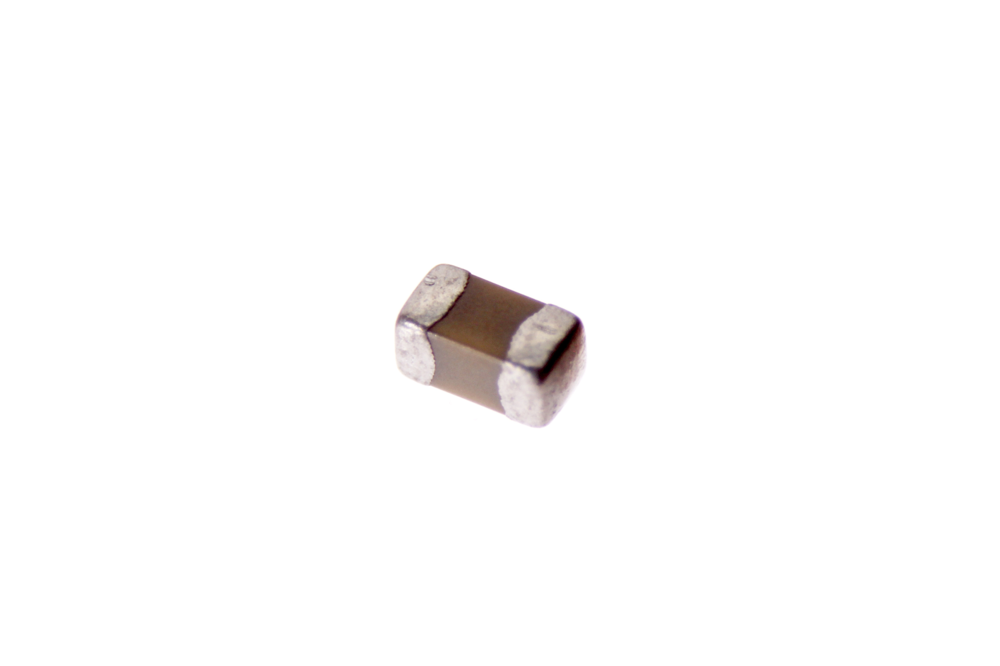

Contents
========

* [CAPC-0402-X-NF100-V10>SMD (0402) 100 nF Capacitor (Ceramic) 10v](#capc-0402-x-nf100-v10smd-0402-100-nf-capacitor-ceramic-10v)
	* [Images](#images)
	* [Datasheets](#datasheets)
	* [EDA](#eda)
		* [Footprints](#footprints)
		* [Symbols](#symbols)
	* [Tags](#tags)

# CAPC-0402-X-NF100-V10>SMD (0402) 100 nF Capacitor (Ceramic) 10v

- ID: CAPC-0402-X-NF100-V10
- Name: CAPC-0402-X-NF100-V10

## Images
  
  

|Main|
| :---: |
||

## Datasheets

- Datasheet: [datasheet.pdf](datasheet.pdf)

## EDA

### Footprints
  

|||||
| :---: | :---: | :---: | :---: |

### Symbols

## Tags

- index: 26
- oompID: CAPC-0402-X-NF100-V10
- name: SMD (0402) 100 nF Capacitor (Ceramic) 10v
- hexID: C42N100
- oompType: CAPC
- oompSize: 0402
- oompColor: X
- oompDesc: NF100
- oompIndex: V10
- oompVersion: 999
- ooWidth: 0.5mm
- ooHeight: 0.5mm
- ooLength: 1mm
- oompBbls: template;XXXX-0402-X-XXXX-XX-bbls
- oompDiag: template;XXXX-0402-X-XXXX-XX-diag
- oompIden: template;XXXX-0402-X-XXXX-XX-iden
- oompSchem: template;CAPC-XXXX-X-XXXX-XX-schem
- oompSimp: template;XXXX-0402-X-XXXX-XX-simp
- ooDesignator: C1
