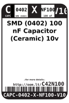
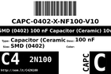
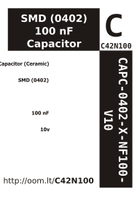

Contents
========

* [C42N100 > SMD (0402) 100 nF Capacitor (Ceramic) 10v](#c42n100--smd-0402-100-nf-capacitor-ceramic-10v)
	* [Datasheets](#datasheets)
	* [Labels](#labels)
	* [EDA](#eda)
	* [Images](#images)
	* [Tags](#tags)
  
![][im]
# C42N100 > SMD (0402) 100 nF Capacitor (Ceramic) 10v

- ID: CAPC-0402-X-NF100-V10
- Hex ID: C42N100
- Name: SMD (0402) 100 nF Capacitor (Ceramic) 10v
- Description: SMD (0402) 100 nF Capacitor (Ceramic) 10v
- Long Link: [http://oom.lt/CAPC-0402-X-NF100-V10](http://oom.lt/CAPC-0402-X-NF100-V10)
- Short Link: [http://oom.lt/C42N100](http://oom.lt/C42N100)

## Datasheets

- Datasheet: [datasheet.pdf](datasheet.pdf)

## Labels
  
  

|label-front|label-inventory|label-spec|
| :---: | :---: | :---: |
||||

## EDA
  

### Instances
  
Used 323 times.  
Prevalance: (323\10986) 2.9401%  

|Project|Occur- rences|Identifiers|
| :---: | :---: | :---: |
|[PROJ-ADAF-4888-STAN-01 Adafruit ItsyBitsy RP2040 PCB](https://github.com/oomlout/oomlout_OOMP_projects/tree/main/PROJ-ADAF-4888-STAN-01/)|[6](https://github.com/oomlout/oomlout_OOMP_projects/tree/main/PROJ-ADAF-4888-STAN-01/)|[C3, C4, C10, C12, C13, C16](https://github.com/oomlout/oomlout_OOMP_projects/tree/main/PROJ-ADAF-4888-STAN-01/)|
|[PROJ-ADAF-4900-STAN-01 Adafruit QT Py RP2040 PCB](https://github.com/oomlout/oomlout_OOMP_projects/tree/main/PROJ-ADAF-4900-STAN-01/)|[7](https://github.com/oomlout/oomlout_OOMP_projects/tree/main/PROJ-ADAF-4900-STAN-01/)|[C7, C9, C11, C13, C14, C16, C17](https://github.com/oomlout/oomlout_OOMP_projects/tree/main/PROJ-ADAF-4900-STAN-01/)|
|[PROJ-ADAF-5302-STAN-01 Adafruit KB2040 PCB](https://github.com/oomlout/oomlout_OOMP_projects/tree/main/PROJ-ADAF-5302-STAN-01/)|[7](https://github.com/oomlout/oomlout_OOMP_projects/tree/main/PROJ-ADAF-5302-STAN-01/)|[C7, C9, C11, C13, C14, C16, C17](https://github.com/oomlout/oomlout_OOMP_projects/tree/main/PROJ-ADAF-5302-STAN-01/)|
|[PROJ-ADAF-5325-STAN-01 Adafruit QT Py ESP32 S2 PCB](https://github.com/oomlout/oomlout_OOMP_projects/tree/main/PROJ-ADAF-5325-STAN-01/)|[7](https://github.com/oomlout/oomlout_OOMP_projects/tree/main/PROJ-ADAF-5325-STAN-01/)|[C4, C7, C9, C10, C11, C12, C14](https://github.com/oomlout/oomlout_OOMP_projects/tree/main/PROJ-ADAF-5325-STAN-01/)|
|[PROJ-ADAF-5395-STAN-01 Adafruit QT Py ESP32 Pico PCB](https://github.com/oomlout/oomlout_OOMP_projects/tree/main/PROJ-ADAF-5395-STAN-01/)|[2](https://github.com/oomlout/oomlout_OOMP_projects/tree/main/PROJ-ADAF-5395-STAN-01/)|[C5, C11](https://github.com/oomlout/oomlout_OOMP_projects/tree/main/PROJ-ADAF-5395-STAN-01/)|
|[PROJ-ADAF-5405-STAN-01 Adafruit QT Py ESP32 C3 PCB](https://github.com/oomlout/oomlout_OOMP_projects/tree/main/PROJ-ADAF-5405-STAN-01/)|[5](https://github.com/oomlout/oomlout_OOMP_projects/tree/main/PROJ-ADAF-5405-STAN-01/)|[C4, C7, C9, C10, C14](https://github.com/oomlout/oomlout_OOMP_projects/tree/main/PROJ-ADAF-5405-STAN-01/)|
|[PROJ-ADAF-5426-STAN-01 Adafruit QT Py ESP32 S3 PCB](https://github.com/oomlout/oomlout_OOMP_projects/tree/main/PROJ-ADAF-5426-STAN-01/)|[8](https://github.com/oomlout/oomlout_OOMP_projects/tree/main/PROJ-ADAF-5426-STAN-01/)|[C4, C7, C9, C10, C11, C12, C14, C16](https://github.com/oomlout/oomlout_OOMP_projects/tree/main/PROJ-ADAF-5426-STAN-01/)|
|[PROJ-ARDU-DUE-STAN-01 Arduino DUE](https://github.com/oomlout/oomlout_OOMP_projects/tree/main/PROJ-ARDU-DUE-STAN-01/)|[22](https://github.com/oomlout/oomlout_OOMP_projects/tree/main/PROJ-ARDU-DUE-STAN-01/)|[C4, C5, C6, C7, C8, C9, C10, C12, C13, C14, C15, C16, C17, C18, C19, C28, C30, C31, C32, C34, C36, C37](https://github.com/oomlout/oomlout_OOMP_projects/tree/main/PROJ-ARDU-DUE-STAN-01/)|
|[PROJ-SPAR-10103-STAN-01 Serial Alphanumeric Display Driver](https://github.com/oomlout/oomlout_OOMP_projects/tree/main/PROJ-SPAR-10103-STAN-01/)|[1](https://github.com/oomlout/oomlout_OOMP_projects/tree/main/PROJ-SPAR-10103-STAN-01/)|[C2](https://github.com/oomlout/oomlout_OOMP_projects/tree/main/PROJ-SPAR-10103-STAN-01/)|
|[PROJ-SPAR-10116-STAN-01 Arduino Fio](https://github.com/oomlout/oomlout_OOMP_projects/tree/main/PROJ-SPAR-10116-STAN-01/)|[3](https://github.com/oomlout/oomlout_OOMP_projects/tree/main/PROJ-SPAR-10116-STAN-01/)|[C2, C3, C6](https://github.com/oomlout/oomlout_OOMP_projects/tree/main/PROJ-SPAR-10116-STAN-01/)|
|[PROJ-SPAR-10274-STAN-01 LilyPad Arduino Simple](https://github.com/oomlout/oomlout_OOMP_projects/tree/main/PROJ-SPAR-10274-STAN-01/)|[2](https://github.com/oomlout/oomlout_OOMP_projects/tree/main/PROJ-SPAR-10274-STAN-01/)|[C1, C4](https://github.com/oomlout/oomlout_OOMP_projects/tree/main/PROJ-SPAR-10274-STAN-01/)|
|[PROJ-SPAR-10345-STAN-01 Triple Axis Accelerometer Breakout-LIS331](https://github.com/oomlout/oomlout_OOMP_projects/tree/main/PROJ-SPAR-10345-STAN-01/)|[1](https://github.com/oomlout/oomlout_OOMP_projects/tree/main/PROJ-SPAR-10345-STAN-01/)|[C2](https://github.com/oomlout/oomlout_OOMP_projects/tree/main/PROJ-SPAR-10345-STAN-01/)|
|[PROJ-SPAR-10406-STAN-01 RFID Evaluation Shield](https://github.com/oomlout/oomlout_OOMP_projects/tree/main/PROJ-SPAR-10406-STAN-01/)|[2](https://github.com/oomlout/oomlout_OOMP_projects/tree/main/PROJ-SPAR-10406-STAN-01/)|[C1, C8](https://github.com/oomlout/oomlout_OOMP_projects/tree/main/PROJ-SPAR-10406-STAN-01/)|
|[PROJ-SPAR-10507-STAN-01 Quadstepper Motor Driver](https://github.com/oomlout/oomlout_OOMP_projects/tree/main/PROJ-SPAR-10507-STAN-01/)|[22](https://github.com/oomlout/oomlout_OOMP_projects/tree/main/PROJ-SPAR-10507-STAN-01/)|[C1, C5, C6, C7, C9, C10, C11, C12, C13, C15, C16, C17, C18, C19, C21, C22, C23, C24, C25, C27, C28, C29](https://github.com/oomlout/oomlout_OOMP_projects/tree/main/PROJ-SPAR-10507-STAN-01/)|
|[PROJ-SPAR-10530-STAN-01 Triple Axis Magnetometer-HMC5883L](https://github.com/oomlout/oomlout_OOMP_projects/tree/main/PROJ-SPAR-10530-STAN-01/)|[1](https://github.com/oomlout/oomlout_OOMP_projects/tree/main/PROJ-SPAR-10530-STAN-01/)|[C1](https://github.com/oomlout/oomlout_OOMP_projects/tree/main/PROJ-SPAR-10530-STAN-01/)|
|[PROJ-SPAR-10587-STAN-01 Music Instrument Shield](https://github.com/oomlout/oomlout_OOMP_projects/tree/main/PROJ-SPAR-10587-STAN-01/)|[6](https://github.com/oomlout/oomlout_OOMP_projects/tree/main/PROJ-SPAR-10587-STAN-01/)|[C2, C5, C13, C14, C15, C16](https://github.com/oomlout/oomlout_OOMP_projects/tree/main/PROJ-SPAR-10587-STAN-01/)|
|[PROJ-SPAR-10608-STAN-01 MP3 Breakout-VS1033D](https://github.com/oomlout/oomlout_OOMP_projects/tree/main/PROJ-SPAR-10608-STAN-01/)|[14](https://github.com/oomlout/oomlout_OOMP_projects/tree/main/PROJ-SPAR-10608-STAN-01/)|[C2, C5, C7, C9, C13, C14, C15, C16, C17, C18, C19, C20, C21, C22](https://github.com/oomlout/oomlout_OOMP_projects/tree/main/PROJ-SPAR-10608-STAN-01/)|
|[PROJ-SPAR-10612-STAN-01 Tri-Axis Gyro Breakout-L3G4200D](https://github.com/oomlout/oomlout_OOMP_projects/tree/main/PROJ-SPAR-10612-STAN-01/)|[1](https://github.com/oomlout/oomlout_OOMP_projects/tree/main/PROJ-SPAR-10612-STAN-01/)|[C1](https://github.com/oomlout/oomlout_OOMP_projects/tree/main/PROJ-SPAR-10612-STAN-01/)|
|[PROJ-SPAR-10615-STAN-01 PWM Shield](https://github.com/oomlout/oomlout_OOMP_projects/tree/main/PROJ-SPAR-10615-STAN-01/)|[1](https://github.com/oomlout/oomlout_OOMP_projects/tree/main/PROJ-SPAR-10615-STAN-01/)|[C3](https://github.com/oomlout/oomlout_OOMP_projects/tree/main/PROJ-SPAR-10615-STAN-01/)|
|[PROJ-SPAR-10740-STAN-01 IR Thermometer Evaluation Board-MLX90614](https://github.com/oomlout/oomlout_OOMP_projects/tree/main/PROJ-SPAR-10740-STAN-01/)|[3](https://github.com/oomlout/oomlout_OOMP_projects/tree/main/PROJ-SPAR-10740-STAN-01/)|[C1, C3, C5](https://github.com/oomlout/oomlout_OOMP_projects/tree/main/PROJ-SPAR-10740-STAN-01/)|
|[PROJ-SPAR-10743-STAN-01 Mega Pro Mini](https://github.com/oomlout/oomlout_OOMP_projects/tree/main/PROJ-SPAR-10743-STAN-01/)|[7](https://github.com/oomlout/oomlout_OOMP_projects/tree/main/PROJ-SPAR-10743-STAN-01/)|[C2, C3, C4, C5, C6, C9, C10](https://github.com/oomlout/oomlout_OOMP_projects/tree/main/PROJ-SPAR-10743-STAN-01/)|
|[PROJ-SPAR-10864-STAN-01 PoEthernet Shield](https://github.com/oomlout/oomlout_OOMP_projects/tree/main/PROJ-SPAR-10864-STAN-01/)|[11](https://github.com/oomlout/oomlout_OOMP_projects/tree/main/PROJ-SPAR-10864-STAN-01/)|[C1, C7, C8, C9, C10, C11, C12, C13, C15, C17, C21](https://github.com/oomlout/oomlout_OOMP_projects/tree/main/PROJ-SPAR-10864-STAN-01/)|
|[PROJ-SPAR-10888-STAN-01 LSM303 Breakout](https://github.com/oomlout/oomlout_OOMP_projects/tree/main/PROJ-SPAR-10888-STAN-01/)|[1](https://github.com/oomlout/oomlout_OOMP_projects/tree/main/PROJ-SPAR-10888-STAN-01/)|[C2](https://github.com/oomlout/oomlout_OOMP_projects/tree/main/PROJ-SPAR-10888-STAN-01/)|
|[PROJ-SPAR-10889-STAN-01 ProtoSnap-Pro Mini](https://github.com/oomlout/oomlout_OOMP_projects/tree/main/PROJ-SPAR-10889-STAN-01/)|[6](https://github.com/oomlout/oomlout_OOMP_projects/tree/main/PROJ-SPAR-10889-STAN-01/)|[C1, C2, C3, C4, C6, C10](https://github.com/oomlout/oomlout_OOMP_projects/tree/main/PROJ-SPAR-10889-STAN-01/)|
|[PROJ-SPAR-10901-STAN-01 Infrared Proximity Breakout-VCNL4000](https://github.com/oomlout/oomlout_OOMP_projects/tree/main/PROJ-SPAR-10901-STAN-01/)|[2](https://github.com/oomlout/oomlout_OOMP_projects/tree/main/PROJ-SPAR-10901-STAN-01/)|[C1, C2](https://github.com/oomlout/oomlout_OOMP_projects/tree/main/PROJ-SPAR-10901-STAN-01/)|
|[PROJ-SPAR-10914-STAN-01 Arduino Pro 328](https://github.com/oomlout/oomlout_OOMP_projects/tree/main/PROJ-SPAR-10914-STAN-01/)|[4](https://github.com/oomlout/oomlout_OOMP_projects/tree/main/PROJ-SPAR-10914-STAN-01/)|[C1, C2, C3, C10](https://github.com/oomlout/oomlout_OOMP_projects/tree/main/PROJ-SPAR-10914-STAN-01/)|
|[PROJ-SPAR-10941-STAN-01 LilyPad Arduino SimpleSnap](https://github.com/oomlout/oomlout_OOMP_projects/tree/main/PROJ-SPAR-10941-STAN-01/)|[2](https://github.com/oomlout/oomlout_OOMP_projects/tree/main/PROJ-SPAR-10941-STAN-01/)|[C1, C4](https://github.com/oomlout/oomlout_OOMP_projects/tree/main/PROJ-SPAR-10941-STAN-01/)|
|[PROJ-SPAR-10995-STAN-01 GPS Evaluation Board GP-2106](https://github.com/oomlout/oomlout_OOMP_projects/tree/main/PROJ-SPAR-10995-STAN-01/)|[1](https://github.com/oomlout/oomlout_OOMP_projects/tree/main/PROJ-SPAR-10995-STAN-01/)|[C3](https://github.com/oomlout/oomlout_OOMP_projects/tree/main/PROJ-SPAR-10995-STAN-01/)|
|[PROJ-SPAR-11007-STAN-01 Mega Pro](https://github.com/oomlout/oomlout_OOMP_projects/tree/main/PROJ-SPAR-11007-STAN-01/)|[6](https://github.com/oomlout/oomlout_OOMP_projects/tree/main/PROJ-SPAR-11007-STAN-01/)|[C1, C4, C5, C6, C7, C8](https://github.com/oomlout/oomlout_OOMP_projects/tree/main/PROJ-SPAR-11007-STAN-01/)|
|[PROJ-SPAR-11013-STAN-01 LilyPad MP3 Player](https://github.com/oomlout/oomlout_OOMP_projects/tree/main/PROJ-SPAR-11013-STAN-01/)|[11](https://github.com/oomlout/oomlout_OOMP_projects/tree/main/PROJ-SPAR-11013-STAN-01/)|[C1, C4, C6, C8, C18, C19, C20, C21, C23, C24, C25](https://github.com/oomlout/oomlout_OOMP_projects/tree/main/PROJ-SPAR-11013-STAN-01/)|
|[PROJ-SPAR-11018-STAN-01 RFM22 Shield-434MHz](https://github.com/oomlout/oomlout_OOMP_projects/tree/main/PROJ-SPAR-11018-STAN-01/)|[2](https://github.com/oomlout/oomlout_OOMP_projects/tree/main/PROJ-SPAR-11018-STAN-01/)|[C2, C3](https://github.com/oomlout/oomlout_OOMP_projects/tree/main/PROJ-SPAR-11018-STAN-01/)|
|[PROJ-SPAR-11058-STAN-01 Venus GPS SMA Connector](https://github.com/oomlout/oomlout_OOMP_projects/tree/main/PROJ-SPAR-11058-STAN-01/)|[2](https://github.com/oomlout/oomlout_OOMP_projects/tree/main/PROJ-SPAR-11058-STAN-01/)|[C1, C5](https://github.com/oomlout/oomlout_OOMP_projects/tree/main/PROJ-SPAR-11058-STAN-01/)|
|[PROJ-SPAR-11083-STAN-01 FM Tuner Basic Breakout-Si4703](https://github.com/oomlout/oomlout_OOMP_projects/tree/main/PROJ-SPAR-11083-STAN-01/)|[1](https://github.com/oomlout/oomlout_OOMP_projects/tree/main/PROJ-SPAR-11083-STAN-01/)|[C1](https://github.com/oomlout/oomlout_OOMP_projects/tree/main/PROJ-SPAR-11083-STAN-01/)|
|[PROJ-SPAR-11084-STAN-01 MPL3115A2 Breakout](https://github.com/oomlout/oomlout_OOMP_projects/tree/main/PROJ-SPAR-11084-STAN-01/)|[2](https://github.com/oomlout/oomlout_OOMP_projects/tree/main/PROJ-SPAR-11084-STAN-01/)|[C1, C3](https://github.com/oomlout/oomlout_OOMP_projects/tree/main/PROJ-SPAR-11084-STAN-01/)|
|[PROJ-SPAR-11088-STAN-01 Run-SPOT-Run](https://github.com/oomlout/oomlout_OOMP_projects/tree/main/PROJ-SPAR-11088-STAN-01/)|[4](https://github.com/oomlout/oomlout_OOMP_projects/tree/main/PROJ-SPAR-11088-STAN-01/)|[C4, C7, C10, C15](https://github.com/oomlout/oomlout_OOMP_projects/tree/main/PROJ-SPAR-11088-STAN-01/)|
|[PROJ-SPAR-11113-STAN-01 Pro Mini Candy](https://github.com/oomlout/oomlout_OOMP_projects/tree/main/PROJ-SPAR-11113-STAN-01/)|[4](https://github.com/oomlout/oomlout_OOMP_projects/tree/main/PROJ-SPAR-11113-STAN-01/)|[C1, C2, C3, C10](https://github.com/oomlout/oomlout_OOMP_projects/tree/main/PROJ-SPAR-11113-STAN-01/)|
|[PROJ-SPAR-11129-STAN-01 Si4707 Breakout](https://github.com/oomlout/oomlout_OOMP_projects/tree/main/PROJ-SPAR-11129-STAN-01/)|[3](https://github.com/oomlout/oomlout_OOMP_projects/tree/main/PROJ-SPAR-11129-STAN-01/)|[C2, C10, C11](https://github.com/oomlout/oomlout_OOMP_projects/tree/main/PROJ-SPAR-11129-STAN-01/)|
|[PROJ-SPAR-11197-STAN-01 ATmega128RFA1 Dev](https://github.com/oomlout/oomlout_OOMP_projects/tree/main/PROJ-SPAR-11197-STAN-01/)|[4](https://github.com/oomlout/oomlout_OOMP_projects/tree/main/PROJ-SPAR-11197-STAN-01/)|[C13, C15, C16, C17](https://github.com/oomlout/oomlout_OOMP_projects/tree/main/PROJ-SPAR-11197-STAN-01/)|
|[PROJ-SPAR-11201-STAN-01 ProtoSnap-LilyPad Dev Simple](https://github.com/oomlout/oomlout_OOMP_projects/tree/main/PROJ-SPAR-11201-STAN-01/)|[2](https://github.com/oomlout/oomlout_OOMP_projects/tree/main/PROJ-SPAR-11201-STAN-01/)|[C1, C4](https://github.com/oomlout/oomlout_OOMP_projects/tree/main/PROJ-SPAR-11201-STAN-01/)|
|[PROJ-SPAR-11257-STAN-01 Mr.Roboto](https://github.com/oomlout/oomlout_OOMP_projects/tree/main/PROJ-SPAR-11257-STAN-01/)|[4](https://github.com/oomlout/oomlout_OOMP_projects/tree/main/PROJ-SPAR-11257-STAN-01/)|[C1, C2, C3, C10](https://github.com/oomlout/oomlout_OOMP_projects/tree/main/PROJ-SPAR-11257-STAN-01/)|
|[PROJ-SPAR-11262-STAN-01 ProtoSnap-LilyPad Development Board](https://github.com/oomlout/oomlout_OOMP_projects/tree/main/PROJ-SPAR-11262-STAN-01/)|[2](https://github.com/oomlout/oomlout_OOMP_projects/tree/main/PROJ-SPAR-11262-STAN-01/)|[C1, C4](https://github.com/oomlout/oomlout_OOMP_projects/tree/main/PROJ-SPAR-11262-STAN-01/)|
|[PROJ-SPAR-11282-STAN-01 BMP085 Breakout](https://github.com/oomlout/oomlout_OOMP_projects/tree/main/PROJ-SPAR-11282-STAN-01/)|[2](https://github.com/oomlout/oomlout_OOMP_projects/tree/main/PROJ-SPAR-11282-STAN-01/)|[C1, C2](https://github.com/oomlout/oomlout_OOMP_projects/tree/main/PROJ-SPAR-11282-STAN-01/)|
|[PROJ-SPAR-11323-STAN-01 EL Sequencer](https://github.com/oomlout/oomlout_OOMP_projects/tree/main/PROJ-SPAR-11323-STAN-01/)|[5](https://github.com/oomlout/oomlout_OOMP_projects/tree/main/PROJ-SPAR-11323-STAN-01/)|[C1, C4, C5, C6, C7](https://github.com/oomlout/oomlout_OOMP_projects/tree/main/PROJ-SPAR-11323-STAN-01/)|
|[PROJ-SPAR-11341-STAN-01 Gyro Breakout-LPY503AL](https://github.com/oomlout/oomlout_OOMP_projects/tree/main/PROJ-SPAR-11341-STAN-01/)|[3](https://github.com/oomlout/oomlout_OOMP_projects/tree/main/PROJ-SPAR-11341-STAN-01/)|[C3, C7, C8](https://github.com/oomlout/oomlout_OOMP_projects/tree/main/PROJ-SPAR-11341-STAN-01/)|
|[PROJ-SPAR-11373-STAN-01 XBee Explorer Regulated](https://github.com/oomlout/oomlout_OOMP_projects/tree/main/PROJ-SPAR-11373-STAN-01/)|[1](https://github.com/oomlout/oomlout_OOMP_projects/tree/main/PROJ-SPAR-11373-STAN-01/)|[C2](https://github.com/oomlout/oomlout_OOMP_projects/tree/main/PROJ-SPAR-11373-STAN-01/)|
|[PROJ-SPAR-11486-STAN-01 MPU-9150 Breakout](https://github.com/oomlout/oomlout_OOMP_projects/tree/main/PROJ-SPAR-11486-STAN-01/)|[2](https://github.com/oomlout/oomlout_OOMP_projects/tree/main/PROJ-SPAR-11486-STAN-01/)|[C1, C4](https://github.com/oomlout/oomlout_OOMP_projects/tree/main/PROJ-SPAR-11486-STAN-01/)|
|[PROJ-SPAR-11512-STAN-01 SN74HC165-Shift-In-Breakout](https://github.com/oomlout/oomlout_OOMP_projects/tree/main/PROJ-SPAR-11512-STAN-01/)|[1](https://github.com/oomlout/oomlout_OOMP_projects/tree/main/PROJ-SPAR-11512-STAN-01/)|[C1](https://github.com/oomlout/oomlout_OOMP_projects/tree/main/PROJ-SPAR-11512-STAN-01/)|
|[PROJ-SPAR-11525-STAN-01 P8X32A Breakout](https://github.com/oomlout/oomlout_OOMP_projects/tree/main/PROJ-SPAR-11525-STAN-01/)|[2](https://github.com/oomlout/oomlout_OOMP_projects/tree/main/PROJ-SPAR-11525-STAN-01/)|[C1, C4](https://github.com/oomlout/oomlout_OOMP_projects/tree/main/PROJ-SPAR-11525-STAN-01/)|
|[PROJ-SPAR-11590-STAN-01 LilyTwinkle ProtoSnap](https://github.com/oomlout/oomlout_OOMP_projects/tree/main/PROJ-SPAR-11590-STAN-01/)|[1](https://github.com/oomlout/oomlout_OOMP_projects/tree/main/PROJ-SPAR-11590-STAN-01/)|[C1](https://github.com/oomlout/oomlout_OOMP_projects/tree/main/PROJ-SPAR-11590-STAN-01/)|
|[PROJ-SPAR-11629-STAN-01 Serial7SegmentDisplay](https://github.com/oomlout/oomlout_OOMP_projects/tree/main/PROJ-SPAR-11629-STAN-01/)|[3](https://github.com/oomlout/oomlout_OOMP_projects/tree/main/PROJ-SPAR-11629-STAN-01/)|[C1, C3, C4](https://github.com/oomlout/oomlout_OOMP_projects/tree/main/PROJ-SPAR-11629-STAN-01/)|
|[PROJ-SPAR-11645-STAN-01 OpenSegment](https://github.com/oomlout/oomlout_OOMP_projects/tree/main/PROJ-SPAR-11645-STAN-01/)|[3](https://github.com/oomlout/oomlout_OOMP_projects/tree/main/PROJ-SPAR-11645-STAN-01/)|[C1, C3, C4](https://github.com/oomlout/oomlout_OOMP_projects/tree/main/PROJ-SPAR-11645-STAN-01/)|
|[PROJ-SPAR-11684-STAN-01 MP3 Breakout-VS1063](https://github.com/oomlout/oomlout_OOMP_projects/tree/main/PROJ-SPAR-11684-STAN-01/)|[14](https://github.com/oomlout/oomlout_OOMP_projects/tree/main/PROJ-SPAR-11684-STAN-01/)|[C2, C5, C7, C9, C13, C14, C15, C16, C17, C18, C19, C20, C21, C22](https://github.com/oomlout/oomlout_OOMP_projects/tree/main/PROJ-SPAR-11684-STAN-01/)|
|[PROJ-SPAR-11703-STAN-01 UDB5](https://github.com/oomlout/oomlout_OOMP_projects/tree/main/PROJ-SPAR-11703-STAN-01/)|[14](https://github.com/oomlout/oomlout_OOMP_projects/tree/main/PROJ-SPAR-11703-STAN-01/)|[C4, C7, C8, C9, C13, C21, C23, C24, C26, C27, INPUT1, INPUT2, MPU, OUTPUT1](https://github.com/oomlout/oomlout_OOMP_projects/tree/main/PROJ-SPAR-11703-STAN-01/)|
|[PROJ-SPAR-11736-STAN-01 FT231X Breakout](https://github.com/oomlout/oomlout_OOMP_projects/tree/main/PROJ-SPAR-11736-STAN-01/)|[2](https://github.com/oomlout/oomlout_OOMP_projects/tree/main/PROJ-SPAR-11736-STAN-01/)|[C2, C5](https://github.com/oomlout/oomlout_OOMP_projects/tree/main/PROJ-SPAR-11736-STAN-01/)|
|[PROJ-SPAR-11801-STAN-01 Tiny-AVR-Programmer](https://github.com/oomlout/oomlout_OOMP_projects/tree/main/PROJ-SPAR-11801-STAN-01/)|[1](https://github.com/oomlout/oomlout_OOMP_projects/tree/main/PROJ-SPAR-11801-STAN-01/)|[C1](https://github.com/oomlout/oomlout_OOMP_projects/tree/main/PROJ-SPAR-11801-STAN-01/)|
|[PROJ-SPAR-12081-STAN-01 USB Weather Board](https://github.com/oomlout/oomlout_OOMP_projects/tree/main/PROJ-SPAR-12081-STAN-01/)|[10](https://github.com/oomlout/oomlout_OOMP_projects/tree/main/PROJ-SPAR-12081-STAN-01/)|[C1, C2, C3, C4, C5, C8, C9, C10, C11, C12](https://github.com/oomlout/oomlout_OOMP_projects/tree/main/PROJ-SPAR-12081-STAN-01/)|
|[PROJ-SPAR-13664-STAN-01 SAMD21 Mini Breakout](https://github.com/oomlout/oomlout_OOMP_projects/tree/main/PROJ-SPAR-13664-STAN-01/)|[4](https://github.com/oomlout/oomlout_OOMP_projects/tree/main/PROJ-SPAR-13664-STAN-01/)|[C1, C2, C3, C4](https://github.com/oomlout/oomlout_OOMP_projects/tree/main/PROJ-SPAR-13664-STAN-01/)|
|[PROJ-SPAR-13714-STAN-01 FreeSoc2](https://github.com/oomlout/oomlout_OOMP_projects/tree/main/PROJ-SPAR-13714-STAN-01/)|[19](https://github.com/oomlout/oomlout_OOMP_projects/tree/main/PROJ-SPAR-13714-STAN-01/)|[C3, C6, C9, C11, C13, C15, C21, C22, C23, C25, C27, C29, C30, C31, C32, C33, C34, C35, C36](https://github.com/oomlout/oomlout_OOMP_projects/tree/main/PROJ-SPAR-13714-STAN-01/)|
|[PROJ-SPAR-13911-STAN-01 Serial Controlled Motor Driver](https://github.com/oomlout/oomlout_OOMP_projects/tree/main/PROJ-SPAR-13911-STAN-01/)|[4](https://github.com/oomlout/oomlout_OOMP_projects/tree/main/PROJ-SPAR-13911-STAN-01/)|[C5, C6, C7, C11](https://github.com/oomlout/oomlout_OOMP_projects/tree/main/PROJ-SPAR-13911-STAN-01/)|
|[PROJ-SPAR-13926-STAN-01 MMA8452 Accelerometer](https://github.com/oomlout/oomlout_OOMP_projects/tree/main/PROJ-SPAR-13926-STAN-01/)|[2](https://github.com/oomlout/oomlout_OOMP_projects/tree/main/PROJ-SPAR-13926-STAN-01/)|[C1, C2](https://github.com/oomlout/oomlout_OOMP_projects/tree/main/PROJ-SPAR-13926-STAN-01/)|
|[PROJ-SPAR-13963-STAN-01 LIS3DH Breakout](https://github.com/oomlout/oomlout_OOMP_projects/tree/main/PROJ-SPAR-13963-STAN-01/)|[1](https://github.com/oomlout/oomlout_OOMP_projects/tree/main/PROJ-SPAR-13963-STAN-01/)|[C1](https://github.com/oomlout/oomlout_OOMP_projects/tree/main/PROJ-SPAR-13963-STAN-01/)|
|[PROJ-SPAR-13990-STAN-01 nRF52832 Breakout](https://github.com/oomlout/oomlout_OOMP_projects/tree/main/PROJ-SPAR-13990-STAN-01/)|[3](https://github.com/oomlout/oomlout_OOMP_projects/tree/main/PROJ-SPAR-13990-STAN-01/)|[C3, C15, C16](https://github.com/oomlout/oomlout_OOMP_projects/tree/main/PROJ-SPAR-13990-STAN-01/)|
|[PROJ-SPAR-14346-STAN-01 LilyPad ProtoSnap Plus](https://github.com/oomlout/oomlout_OOMP_projects/tree/main/PROJ-SPAR-14346-STAN-01/)|[3](https://github.com/oomlout/oomlout_OOMP_projects/tree/main/PROJ-SPAR-14346-STAN-01/)|[C2, C3, C4](https://github.com/oomlout/oomlout_OOMP_projects/tree/main/PROJ-SPAR-14346-STAN-01/)|
|[PROJ-SPAR-14430-STAN-01 ESP32 Motion Shield](https://github.com/oomlout/oomlout_OOMP_projects/tree/main/PROJ-SPAR-14430-STAN-01/)|[3](https://github.com/oomlout/oomlout_OOMP_projects/tree/main/PROJ-SPAR-14430-STAN-01/)|[C4, C5, C6](https://github.com/oomlout/oomlout_OOMP_projects/tree/main/PROJ-SPAR-14430-STAN-01/)|
|[PROJ-SPAR-14449-STAN-01 Variable Load](https://github.com/oomlout/oomlout_OOMP_projects/tree/main/PROJ-SPAR-14449-STAN-01/)|[7](https://github.com/oomlout/oomlout_OOMP_projects/tree/main/PROJ-SPAR-14449-STAN-01/)|[C2, C4, C5, C6, C7, C8, C9](https://github.com/oomlout/oomlout_OOMP_projects/tree/main/PROJ-SPAR-14449-STAN-01/)|
|[PROJ-SPAR-14450-STAN-01 Motor Driver-Dual TB6612FNG](https://github.com/oomlout/oomlout_OOMP_projects/tree/main/PROJ-SPAR-14450-STAN-01/)|[2](https://github.com/oomlout/oomlout_OOMP_projects/tree/main/PROJ-SPAR-14450-STAN-01/)|[C1, C2](https://github.com/oomlout/oomlout_OOMP_projects/tree/main/PROJ-SPAR-14450-STAN-01/)|
|[PROJ-SPAR-14631-STAN-01 LilyPad USB Plus Standalone](https://github.com/oomlout/oomlout_OOMP_projects/tree/main/PROJ-SPAR-14631-STAN-01/)|[3](https://github.com/oomlout/oomlout_OOMP_projects/tree/main/PROJ-SPAR-14631-STAN-01/)|[C2, C3, C4](https://github.com/oomlout/oomlout_OOMP_projects/tree/main/PROJ-SPAR-14631-STAN-01/)|
|[PROJ-SPAR-14713-STAN-01 SAMD51 Thing Plus](https://github.com/oomlout/oomlout_OOMP_projects/tree/main/PROJ-SPAR-14713-STAN-01/)|[6](https://github.com/oomlout/oomlout_OOMP_projects/tree/main/PROJ-SPAR-14713-STAN-01/)|[C3, C8, C9, C11, C12, C14](https://github.com/oomlout/oomlout_OOMP_projects/tree/main/PROJ-SPAR-14713-STAN-01/)|

## Images
  
  

|image|label-front|label-inventory|label-spec|
| :---: | :---: | :---: | :---: |
|||||

## Tags

- oompID: CAPC-0402-X-NF100-V10
- name: SMD (0402) 100 nF Capacitor (Ceramic) 10v
- hexID: C42N100
- oompType: CAPC
- oompSize: 0402
- oompColor: X
- oompDesc: NF100
- oompIndex: V10
- oompVersion: 999
- ooWidth: 0.5mm
- ooHeight: 0.5mm
- ooLength: 1mm
- oompBbls: template;XXXX-0402-X-XXXX-XX-bbls
- oompDiag: template;XXXX-0402-X-XXXX-XX-diag
- oompIden: template;XXXX-0402-X-XXXX-XX-iden
- oompSchem: template;CAPC-XXXX-X-XXXX-XX-schem
- oompSimp: template;XXXX-0402-X-XXXX-XX-simp
- ooDesignator: C1
- oompInstances: {'PROJECT': 'PROJ-ADAF-4888-STAN-01', 'ID': 'C3'}
- oompInstances: {'PROJECT': 'PROJ-ADAF-4888-STAN-01', 'ID': 'C4'}
- oompInstances: {'PROJECT': 'PROJ-ADAF-4888-STAN-01', 'ID': 'C10'}
- oompInstances: {'PROJECT': 'PROJ-ADAF-4888-STAN-01', 'ID': 'C12'}
- oompInstances: {'PROJECT': 'PROJ-ADAF-4888-STAN-01', 'ID': 'C13'}
- oompInstances: {'PROJECT': 'PROJ-ADAF-4888-STAN-01', 'ID': 'C16'}
- oompInstances: {'PROJECT': 'PROJ-ADAF-4900-STAN-01', 'ID': 'C7'}
- oompInstances: {'PROJECT': 'PROJ-ADAF-4900-STAN-01', 'ID': 'C9'}
- oompInstances: {'PROJECT': 'PROJ-ADAF-4900-STAN-01', 'ID': 'C11'}
- oompInstances: {'PROJECT': 'PROJ-ADAF-4900-STAN-01', 'ID': 'C13'}
- oompInstances: {'PROJECT': 'PROJ-ADAF-4900-STAN-01', 'ID': 'C14'}
- oompInstances: {'PROJECT': 'PROJ-ADAF-4900-STAN-01', 'ID': 'C16'}
- oompInstances: {'PROJECT': 'PROJ-ADAF-4900-STAN-01', 'ID': 'C17'}
- oompInstances: {'PROJECT': 'PROJ-ADAF-5302-STAN-01', 'ID': 'C7'}
- oompInstances: {'PROJECT': 'PROJ-ADAF-5302-STAN-01', 'ID': 'C9'}
- oompInstances: {'PROJECT': 'PROJ-ADAF-5302-STAN-01', 'ID': 'C11'}
- oompInstances: {'PROJECT': 'PROJ-ADAF-5302-STAN-01', 'ID': 'C13'}
- oompInstances: {'PROJECT': 'PROJ-ADAF-5302-STAN-01', 'ID': 'C14'}
- oompInstances: {'PROJECT': 'PROJ-ADAF-5302-STAN-01', 'ID': 'C16'}
- oompInstances: {'PROJECT': 'PROJ-ADAF-5302-STAN-01', 'ID': 'C17'}
- oompInstances: {'PROJECT': 'PROJ-ADAF-5325-STAN-01', 'ID': 'C4'}
- oompInstances: {'PROJECT': 'PROJ-ADAF-5325-STAN-01', 'ID': 'C7'}
- oompInstances: {'PROJECT': 'PROJ-ADAF-5325-STAN-01', 'ID': 'C9'}
- oompInstances: {'PROJECT': 'PROJ-ADAF-5325-STAN-01', 'ID': 'C10'}
- oompInstances: {'PROJECT': 'PROJ-ADAF-5325-STAN-01', 'ID': 'C11'}
- oompInstances: {'PROJECT': 'PROJ-ADAF-5325-STAN-01', 'ID': 'C12'}
- oompInstances: {'PROJECT': 'PROJ-ADAF-5325-STAN-01', 'ID': 'C14'}
- oompInstances: {'PROJECT': 'PROJ-ADAF-5395-STAN-01', 'ID': 'C5'}
- oompInstances: {'PROJECT': 'PROJ-ADAF-5395-STAN-01', 'ID': 'C11'}
- oompInstances: {'PROJECT': 'PROJ-ADAF-5405-STAN-01', 'ID': 'C4'}
- oompInstances: {'PROJECT': 'PROJ-ADAF-5405-STAN-01', 'ID': 'C7'}
- oompInstances: {'PROJECT': 'PROJ-ADAF-5405-STAN-01', 'ID': 'C9'}
- oompInstances: {'PROJECT': 'PROJ-ADAF-5405-STAN-01', 'ID': 'C10'}
- oompInstances: {'PROJECT': 'PROJ-ADAF-5405-STAN-01', 'ID': 'C14'}
- oompInstances: {'PROJECT': 'PROJ-ADAF-5426-STAN-01', 'ID': 'C4'}
- oompInstances: {'PROJECT': 'PROJ-ADAF-5426-STAN-01', 'ID': 'C7'}
- oompInstances: {'PROJECT': 'PROJ-ADAF-5426-STAN-01', 'ID': 'C9'}
- oompInstances: {'PROJECT': 'PROJ-ADAF-5426-STAN-01', 'ID': 'C10'}
- oompInstances: {'PROJECT': 'PROJ-ADAF-5426-STAN-01', 'ID': 'C11'}
- oompInstances: {'PROJECT': 'PROJ-ADAF-5426-STAN-01', 'ID': 'C12'}
- oompInstances: {'PROJECT': 'PROJ-ADAF-5426-STAN-01', 'ID': 'C14'}
- oompInstances: {'PROJECT': 'PROJ-ADAF-5426-STAN-01', 'ID': 'C16'}
- oompInstances: {'PROJECT': 'PROJ-ARDU-DUE-STAN-01', 'ID': 'C4'}
- oompInstances: {'PROJECT': 'PROJ-ARDU-DUE-STAN-01', 'ID': 'C5'}
- oompInstances: {'PROJECT': 'PROJ-ARDU-DUE-STAN-01', 'ID': 'C6'}
- oompInstances: {'PROJECT': 'PROJ-ARDU-DUE-STAN-01', 'ID': 'C7'}
- oompInstances: {'PROJECT': 'PROJ-ARDU-DUE-STAN-01', 'ID': 'C8'}
- oompInstances: {'PROJECT': 'PROJ-ARDU-DUE-STAN-01', 'ID': 'C9'}
- oompInstances: {'PROJECT': 'PROJ-ARDU-DUE-STAN-01', 'ID': 'C10'}
- oompInstances: {'PROJECT': 'PROJ-ARDU-DUE-STAN-01', 'ID': 'C12'}
- oompInstances: {'PROJECT': 'PROJ-ARDU-DUE-STAN-01', 'ID': 'C13'}
- oompInstances: {'PROJECT': 'PROJ-ARDU-DUE-STAN-01', 'ID': 'C14'}
- oompInstances: {'PROJECT': 'PROJ-ARDU-DUE-STAN-01', 'ID': 'C15'}
- oompInstances: {'PROJECT': 'PROJ-ARDU-DUE-STAN-01', 'ID': 'C16'}
- oompInstances: {'PROJECT': 'PROJ-ARDU-DUE-STAN-01', 'ID': 'C17'}
- oompInstances: {'PROJECT': 'PROJ-ARDU-DUE-STAN-01', 'ID': 'C18'}
- oompInstances: {'PROJECT': 'PROJ-ARDU-DUE-STAN-01', 'ID': 'C19'}
- oompInstances: {'PROJECT': 'PROJ-ARDU-DUE-STAN-01', 'ID': 'C28'}
- oompInstances: {'PROJECT': 'PROJ-ARDU-DUE-STAN-01', 'ID': 'C30'}
- oompInstances: {'PROJECT': 'PROJ-ARDU-DUE-STAN-01', 'ID': 'C31'}
- oompInstances: {'PROJECT': 'PROJ-ARDU-DUE-STAN-01', 'ID': 'C32'}
- oompInstances: {'PROJECT': 'PROJ-ARDU-DUE-STAN-01', 'ID': 'C34'}
- oompInstances: {'PROJECT': 'PROJ-ARDU-DUE-STAN-01', 'ID': 'C36'}
- oompInstances: {'PROJECT': 'PROJ-ARDU-DUE-STAN-01', 'ID': 'C37'}
- oompInstances: {'PROJECT': 'PROJ-SPAR-10103-STAN-01', 'ID': 'C2'}
- oompInstances: {'PROJECT': 'PROJ-SPAR-10116-STAN-01', 'ID': 'C2'}
- oompInstances: {'PROJECT': 'PROJ-SPAR-10116-STAN-01', 'ID': 'C3'}
- oompInstances: {'PROJECT': 'PROJ-SPAR-10116-STAN-01', 'ID': 'C6'}
- oompInstances: {'PROJECT': 'PROJ-SPAR-10274-STAN-01', 'ID': 'C1'}
- oompInstances: {'PROJECT': 'PROJ-SPAR-10274-STAN-01', 'ID': 'C4'}
- oompInstances: {'PROJECT': 'PROJ-SPAR-10345-STAN-01', 'ID': 'C2'}
- oompInstances: {'PROJECT': 'PROJ-SPAR-10406-STAN-01', 'ID': 'C1'}
- oompInstances: {'PROJECT': 'PROJ-SPAR-10406-STAN-01', 'ID': 'C8'}
- oompInstances: {'PROJECT': 'PROJ-SPAR-10507-STAN-01', 'ID': 'C1'}
- oompInstances: {'PROJECT': 'PROJ-SPAR-10507-STAN-01', 'ID': 'C5'}
- oompInstances: {'PROJECT': 'PROJ-SPAR-10507-STAN-01', 'ID': 'C6'}
- oompInstances: {'PROJECT': 'PROJ-SPAR-10507-STAN-01', 'ID': 'C7'}
- oompInstances: {'PROJECT': 'PROJ-SPAR-10507-STAN-01', 'ID': 'C9'}
- oompInstances: {'PROJECT': 'PROJ-SPAR-10507-STAN-01', 'ID': 'C10'}
- oompInstances: {'PROJECT': 'PROJ-SPAR-10507-STAN-01', 'ID': 'C11'}
- oompInstances: {'PROJECT': 'PROJ-SPAR-10507-STAN-01', 'ID': 'C12'}
- oompInstances: {'PROJECT': 'PROJ-SPAR-10507-STAN-01', 'ID': 'C13'}
- oompInstances: {'PROJECT': 'PROJ-SPAR-10507-STAN-01', 'ID': 'C15'}
- oompInstances: {'PROJECT': 'PROJ-SPAR-10507-STAN-01', 'ID': 'C16'}
- oompInstances: {'PROJECT': 'PROJ-SPAR-10507-STAN-01', 'ID': 'C17'}
- oompInstances: {'PROJECT': 'PROJ-SPAR-10507-STAN-01', 'ID': 'C18'}
- oompInstances: {'PROJECT': 'PROJ-SPAR-10507-STAN-01', 'ID': 'C19'}
- oompInstances: {'PROJECT': 'PROJ-SPAR-10507-STAN-01', 'ID': 'C21'}
- oompInstances: {'PROJECT': 'PROJ-SPAR-10507-STAN-01', 'ID': 'C22'}
- oompInstances: {'PROJECT': 'PROJ-SPAR-10507-STAN-01', 'ID': 'C23'}
- oompInstances: {'PROJECT': 'PROJ-SPAR-10507-STAN-01', 'ID': 'C24'}
- oompInstances: {'PROJECT': 'PROJ-SPAR-10507-STAN-01', 'ID': 'C25'}
- oompInstances: {'PROJECT': 'PROJ-SPAR-10507-STAN-01', 'ID': 'C27'}
- oompInstances: {'PROJECT': 'PROJ-SPAR-10507-STAN-01', 'ID': 'C28'}
- oompInstances: {'PROJECT': 'PROJ-SPAR-10507-STAN-01', 'ID': 'C29'}
- oompInstances: {'PROJECT': 'PROJ-SPAR-10530-STAN-01', 'ID': 'C1'}
- oompInstances: {'PROJECT': 'PROJ-SPAR-10587-STAN-01', 'ID': 'C2'}
- oompInstances: {'PROJECT': 'PROJ-SPAR-10587-STAN-01', 'ID': 'C5'}
- oompInstances: {'PROJECT': 'PROJ-SPAR-10587-STAN-01', 'ID': 'C13'}
- oompInstances: {'PROJECT': 'PROJ-SPAR-10587-STAN-01', 'ID': 'C14'}
- oompInstances: {'PROJECT': 'PROJ-SPAR-10587-STAN-01', 'ID': 'C15'}
- oompInstances: {'PROJECT': 'PROJ-SPAR-10587-STAN-01', 'ID': 'C16'}
- oompInstances: {'PROJECT': 'PROJ-SPAR-10608-STAN-01', 'ID': 'C2'}
- oompInstances: {'PROJECT': 'PROJ-SPAR-10608-STAN-01', 'ID': 'C5'}
- oompInstances: {'PROJECT': 'PROJ-SPAR-10608-STAN-01', 'ID': 'C7'}
- oompInstances: {'PROJECT': 'PROJ-SPAR-10608-STAN-01', 'ID': 'C9'}
- oompInstances: {'PROJECT': 'PROJ-SPAR-10608-STAN-01', 'ID': 'C13'}
- oompInstances: {'PROJECT': 'PROJ-SPAR-10608-STAN-01', 'ID': 'C14'}
- oompInstances: {'PROJECT': 'PROJ-SPAR-10608-STAN-01', 'ID': 'C15'}
- oompInstances: {'PROJECT': 'PROJ-SPAR-10608-STAN-01', 'ID': 'C16'}
- oompInstances: {'PROJECT': 'PROJ-SPAR-10608-STAN-01', 'ID': 'C17'}
- oompInstances: {'PROJECT': 'PROJ-SPAR-10608-STAN-01', 'ID': 'C18'}
- oompInstances: {'PROJECT': 'PROJ-SPAR-10608-STAN-01', 'ID': 'C19'}
- oompInstances: {'PROJECT': 'PROJ-SPAR-10608-STAN-01', 'ID': 'C20'}
- oompInstances: {'PROJECT': 'PROJ-SPAR-10608-STAN-01', 'ID': 'C21'}
- oompInstances: {'PROJECT': 'PROJ-SPAR-10608-STAN-01', 'ID': 'C22'}
- oompInstances: {'PROJECT': 'PROJ-SPAR-10612-STAN-01', 'ID': 'C1'}
- oompInstances: {'PROJECT': 'PROJ-SPAR-10615-STAN-01', 'ID': 'C3'}
- oompInstances: {'PROJECT': 'PROJ-SPAR-10740-STAN-01', 'ID': 'C1'}
- oompInstances: {'PROJECT': 'PROJ-SPAR-10740-STAN-01', 'ID': 'C3'}
- oompInstances: {'PROJECT': 'PROJ-SPAR-10740-STAN-01', 'ID': 'C5'}
- oompInstances: {'PROJECT': 'PROJ-SPAR-10743-STAN-01', 'ID': 'C2'}
- oompInstances: {'PROJECT': 'PROJ-SPAR-10743-STAN-01', 'ID': 'C3'}
- oompInstances: {'PROJECT': 'PROJ-SPAR-10743-STAN-01', 'ID': 'C4'}
- oompInstances: {'PROJECT': 'PROJ-SPAR-10743-STAN-01', 'ID': 'C5'}
- oompInstances: {'PROJECT': 'PROJ-SPAR-10743-STAN-01', 'ID': 'C6'}
- oompInstances: {'PROJECT': 'PROJ-SPAR-10743-STAN-01', 'ID': 'C9'}
- oompInstances: {'PROJECT': 'PROJ-SPAR-10743-STAN-01', 'ID': 'C10'}
- oompInstances: {'PROJECT': 'PROJ-SPAR-10864-STAN-01', 'ID': 'C1'}
- oompInstances: {'PROJECT': 'PROJ-SPAR-10864-STAN-01', 'ID': 'C7'}
- oompInstances: {'PROJECT': 'PROJ-SPAR-10864-STAN-01', 'ID': 'C8'}
- oompInstances: {'PROJECT': 'PROJ-SPAR-10864-STAN-01', 'ID': 'C9'}
- oompInstances: {'PROJECT': 'PROJ-SPAR-10864-STAN-01', 'ID': 'C10'}
- oompInstances: {'PROJECT': 'PROJ-SPAR-10864-STAN-01', 'ID': 'C11'}
- oompInstances: {'PROJECT': 'PROJ-SPAR-10864-STAN-01', 'ID': 'C12'}
- oompInstances: {'PROJECT': 'PROJ-SPAR-10864-STAN-01', 'ID': 'C13'}
- oompInstances: {'PROJECT': 'PROJ-SPAR-10864-STAN-01', 'ID': 'C15'}
- oompInstances: {'PROJECT': 'PROJ-SPAR-10864-STAN-01', 'ID': 'C17'}
- oompInstances: {'PROJECT': 'PROJ-SPAR-10864-STAN-01', 'ID': 'C21'}
- oompInstances: {'PROJECT': 'PROJ-SPAR-10888-STAN-01', 'ID': 'C2'}
- oompInstances: {'PROJECT': 'PROJ-SPAR-10889-STAN-01', 'ID': 'C1'}
- oompInstances: {'PROJECT': 'PROJ-SPAR-10889-STAN-01', 'ID': 'C2'}
- oompInstances: {'PROJECT': 'PROJ-SPAR-10889-STAN-01', 'ID': 'C3'}
- oompInstances: {'PROJECT': 'PROJ-SPAR-10889-STAN-01', 'ID': 'C4'}
- oompInstances: {'PROJECT': 'PROJ-SPAR-10889-STAN-01', 'ID': 'C6'}
- oompInstances: {'PROJECT': 'PROJ-SPAR-10889-STAN-01', 'ID': 'C10'}
- oompInstances: {'PROJECT': 'PROJ-SPAR-10901-STAN-01', 'ID': 'C1'}
- oompInstances: {'PROJECT': 'PROJ-SPAR-10901-STAN-01', 'ID': 'C2'}
- oompInstances: {'PROJECT': 'PROJ-SPAR-10914-STAN-01', 'ID': 'C1'}
- oompInstances: {'PROJECT': 'PROJ-SPAR-10914-STAN-01', 'ID': 'C2'}
- oompInstances: {'PROJECT': 'PROJ-SPAR-10914-STAN-01', 'ID': 'C3'}
- oompInstances: {'PROJECT': 'PROJ-SPAR-10914-STAN-01', 'ID': 'C10'}
- oompInstances: {'PROJECT': 'PROJ-SPAR-10941-STAN-01', 'ID': 'C1'}
- oompInstances: {'PROJECT': 'PROJ-SPAR-10941-STAN-01', 'ID': 'C4'}
- oompInstances: {'PROJECT': 'PROJ-SPAR-10995-STAN-01', 'ID': 'C3'}
- oompInstances: {'PROJECT': 'PROJ-SPAR-11007-STAN-01', 'ID': 'C1'}
- oompInstances: {'PROJECT': 'PROJ-SPAR-11007-STAN-01', 'ID': 'C4'}
- oompInstances: {'PROJECT': 'PROJ-SPAR-11007-STAN-01', 'ID': 'C5'}
- oompInstances: {'PROJECT': 'PROJ-SPAR-11007-STAN-01', 'ID': 'C6'}
- oompInstances: {'PROJECT': 'PROJ-SPAR-11007-STAN-01', 'ID': 'C7'}
- oompInstances: {'PROJECT': 'PROJ-SPAR-11007-STAN-01', 'ID': 'C8'}
- oompInstances: {'PROJECT': 'PROJ-SPAR-11013-STAN-01', 'ID': 'C1'}
- oompInstances: {'PROJECT': 'PROJ-SPAR-11013-STAN-01', 'ID': 'C4'}
- oompInstances: {'PROJECT': 'PROJ-SPAR-11013-STAN-01', 'ID': 'C6'}
- oompInstances: {'PROJECT': 'PROJ-SPAR-11013-STAN-01', 'ID': 'C8'}
- oompInstances: {'PROJECT': 'PROJ-SPAR-11013-STAN-01', 'ID': 'C18'}
- oompInstances: {'PROJECT': 'PROJ-SPAR-11013-STAN-01', 'ID': 'C19'}
- oompInstances: {'PROJECT': 'PROJ-SPAR-11013-STAN-01', 'ID': 'C20'}
- oompInstances: {'PROJECT': 'PROJ-SPAR-11013-STAN-01', 'ID': 'C21'}
- oompInstances: {'PROJECT': 'PROJ-SPAR-11013-STAN-01', 'ID': 'C23'}
- oompInstances: {'PROJECT': 'PROJ-SPAR-11013-STAN-01', 'ID': 'C24'}
- oompInstances: {'PROJECT': 'PROJ-SPAR-11013-STAN-01', 'ID': 'C25'}
- oompInstances: {'PROJECT': 'PROJ-SPAR-11018-STAN-01', 'ID': 'C2'}
- oompInstances: {'PROJECT': 'PROJ-SPAR-11018-STAN-01', 'ID': 'C3'}
- oompInstances: {'PROJECT': 'PROJ-SPAR-11058-STAN-01', 'ID': 'C1'}
- oompInstances: {'PROJECT': 'PROJ-SPAR-11058-STAN-01', 'ID': 'C5'}
- oompInstances: {'PROJECT': 'PROJ-SPAR-11083-STAN-01', 'ID': 'C1'}
- oompInstances: {'PROJECT': 'PROJ-SPAR-11084-STAN-01', 'ID': 'C1'}
- oompInstances: {'PROJECT': 'PROJ-SPAR-11084-STAN-01', 'ID': 'C3'}
- oompInstances: {'PROJECT': 'PROJ-SPAR-11088-STAN-01', 'ID': 'C4'}
- oompInstances: {'PROJECT': 'PROJ-SPAR-11088-STAN-01', 'ID': 'C7'}
- oompInstances: {'PROJECT': 'PROJ-SPAR-11088-STAN-01', 'ID': 'C10'}
- oompInstances: {'PROJECT': 'PROJ-SPAR-11088-STAN-01', 'ID': 'C15'}
- oompInstances: {'PROJECT': 'PROJ-SPAR-11113-STAN-01', 'ID': 'C1'}
- oompInstances: {'PROJECT': 'PROJ-SPAR-11113-STAN-01', 'ID': 'C2'}
- oompInstances: {'PROJECT': 'PROJ-SPAR-11113-STAN-01', 'ID': 'C3'}
- oompInstances: {'PROJECT': 'PROJ-SPAR-11113-STAN-01', 'ID': 'C10'}
- oompInstances: {'PROJECT': 'PROJ-SPAR-11129-STAN-01', 'ID': 'C2'}
- oompInstances: {'PROJECT': 'PROJ-SPAR-11129-STAN-01', 'ID': 'C10'}
- oompInstances: {'PROJECT': 'PROJ-SPAR-11129-STAN-01', 'ID': 'C11'}
- oompInstances: {'PROJECT': 'PROJ-SPAR-11197-STAN-01', 'ID': 'C13'}
- oompInstances: {'PROJECT': 'PROJ-SPAR-11197-STAN-01', 'ID': 'C15'}
- oompInstances: {'PROJECT': 'PROJ-SPAR-11197-STAN-01', 'ID': 'C16'}
- oompInstances: {'PROJECT': 'PROJ-SPAR-11197-STAN-01', 'ID': 'C17'}
- oompInstances: {'PROJECT': 'PROJ-SPAR-11201-STAN-01', 'ID': 'C1'}
- oompInstances: {'PROJECT': 'PROJ-SPAR-11201-STAN-01', 'ID': 'C4'}
- oompInstances: {'PROJECT': 'PROJ-SPAR-11257-STAN-01', 'ID': 'C1'}
- oompInstances: {'PROJECT': 'PROJ-SPAR-11257-STAN-01', 'ID': 'C2'}
- oompInstances: {'PROJECT': 'PROJ-SPAR-11257-STAN-01', 'ID': 'C3'}
- oompInstances: {'PROJECT': 'PROJ-SPAR-11257-STAN-01', 'ID': 'C10'}
- oompInstances: {'PROJECT': 'PROJ-SPAR-11262-STAN-01', 'ID': 'C1'}
- oompInstances: {'PROJECT': 'PROJ-SPAR-11262-STAN-01', 'ID': 'C4'}
- oompInstances: {'PROJECT': 'PROJ-SPAR-11282-STAN-01', 'ID': 'C1'}
- oompInstances: {'PROJECT': 'PROJ-SPAR-11282-STAN-01', 'ID': 'C2'}
- oompInstances: {'PROJECT': 'PROJ-SPAR-11323-STAN-01', 'ID': 'C1'}
- oompInstances: {'PROJECT': 'PROJ-SPAR-11323-STAN-01', 'ID': 'C4'}
- oompInstances: {'PROJECT': 'PROJ-SPAR-11323-STAN-01', 'ID': 'C5'}
- oompInstances: {'PROJECT': 'PROJ-SPAR-11323-STAN-01', 'ID': 'C6'}
- oompInstances: {'PROJECT': 'PROJ-SPAR-11323-STAN-01', 'ID': 'C7'}
- oompInstances: {'PROJECT': 'PROJ-SPAR-11341-STAN-01', 'ID': 'C3'}
- oompInstances: {'PROJECT': 'PROJ-SPAR-11341-STAN-01', 'ID': 'C7'}
- oompInstances: {'PROJECT': 'PROJ-SPAR-11341-STAN-01', 'ID': 'C8'}
- oompInstances: {'PROJECT': 'PROJ-SPAR-11373-STAN-01', 'ID': 'C2'}
- oompInstances: {'PROJECT': 'PROJ-SPAR-11486-STAN-01', 'ID': 'C1'}
- oompInstances: {'PROJECT': 'PROJ-SPAR-11486-STAN-01', 'ID': 'C4'}
- oompInstances: {'PROJECT': 'PROJ-SPAR-11512-STAN-01', 'ID': 'C1'}
- oompInstances: {'PROJECT': 'PROJ-SPAR-11525-STAN-01', 'ID': 'C1'}
- oompInstances: {'PROJECT': 'PROJ-SPAR-11525-STAN-01', 'ID': 'C4'}
- oompInstances: {'PROJECT': 'PROJ-SPAR-11590-STAN-01', 'ID': 'C1'}
- oompInstances: {'PROJECT': 'PROJ-SPAR-11629-STAN-01', 'ID': 'C1'}
- oompInstances: {'PROJECT': 'PROJ-SPAR-11629-STAN-01', 'ID': 'C3'}
- oompInstances: {'PROJECT': 'PROJ-SPAR-11629-STAN-01', 'ID': 'C4'}
- oompInstances: {'PROJECT': 'PROJ-SPAR-11645-STAN-01', 'ID': 'C1'}
- oompInstances: {'PROJECT': 'PROJ-SPAR-11645-STAN-01', 'ID': 'C3'}
- oompInstances: {'PROJECT': 'PROJ-SPAR-11645-STAN-01', 'ID': 'C4'}
- oompInstances: {'PROJECT': 'PROJ-SPAR-11684-STAN-01', 'ID': 'C2'}
- oompInstances: {'PROJECT': 'PROJ-SPAR-11684-STAN-01', 'ID': 'C5'}
- oompInstances: {'PROJECT': 'PROJ-SPAR-11684-STAN-01', 'ID': 'C7'}
- oompInstances: {'PROJECT': 'PROJ-SPAR-11684-STAN-01', 'ID': 'C9'}
- oompInstances: {'PROJECT': 'PROJ-SPAR-11684-STAN-01', 'ID': 'C13'}
- oompInstances: {'PROJECT': 'PROJ-SPAR-11684-STAN-01', 'ID': 'C14'}
- oompInstances: {'PROJECT': 'PROJ-SPAR-11684-STAN-01', 'ID': 'C15'}
- oompInstances: {'PROJECT': 'PROJ-SPAR-11684-STAN-01', 'ID': 'C16'}
- oompInstances: {'PROJECT': 'PROJ-SPAR-11684-STAN-01', 'ID': 'C17'}
- oompInstances: {'PROJECT': 'PROJ-SPAR-11684-STAN-01', 'ID': 'C18'}
- oompInstances: {'PROJECT': 'PROJ-SPAR-11684-STAN-01', 'ID': 'C19'}
- oompInstances: {'PROJECT': 'PROJ-SPAR-11684-STAN-01', 'ID': 'C20'}
- oompInstances: {'PROJECT': 'PROJ-SPAR-11684-STAN-01', 'ID': 'C21'}
- oompInstances: {'PROJECT': 'PROJ-SPAR-11684-STAN-01', 'ID': 'C22'}
- oompInstances: {'PROJECT': 'PROJ-SPAR-11703-STAN-01', 'ID': 'C4'}
- oompInstances: {'PROJECT': 'PROJ-SPAR-11703-STAN-01', 'ID': 'C7'}
- oompInstances: {'PROJECT': 'PROJ-SPAR-11703-STAN-01', 'ID': 'C8'}
- oompInstances: {'PROJECT': 'PROJ-SPAR-11703-STAN-01', 'ID': 'C9'}
- oompInstances: {'PROJECT': 'PROJ-SPAR-11703-STAN-01', 'ID': 'C13'}
- oompInstances: {'PROJECT': 'PROJ-SPAR-11703-STAN-01', 'ID': 'C21'}
- oompInstances: {'PROJECT': 'PROJ-SPAR-11703-STAN-01', 'ID': 'C23'}
- oompInstances: {'PROJECT': 'PROJ-SPAR-11703-STAN-01', 'ID': 'C24'}
- oompInstances: {'PROJECT': 'PROJ-SPAR-11703-STAN-01', 'ID': 'C26'}
- oompInstances: {'PROJECT': 'PROJ-SPAR-11703-STAN-01', 'ID': 'C27'}
- oompInstances: {'PROJECT': 'PROJ-SPAR-11703-STAN-01', 'ID': 'INPUT1'}
- oompInstances: {'PROJECT': 'PROJ-SPAR-11703-STAN-01', 'ID': 'INPUT2'}
- oompInstances: {'PROJECT': 'PROJ-SPAR-11703-STAN-01', 'ID': 'MPU'}
- oompInstances: {'PROJECT': 'PROJ-SPAR-11703-STAN-01', 'ID': 'OUTPUT1'}
- oompInstances: {'PROJECT': 'PROJ-SPAR-11736-STAN-01', 'ID': 'C2'}
- oompInstances: {'PROJECT': 'PROJ-SPAR-11736-STAN-01', 'ID': 'C5'}
- oompInstances: {'PROJECT': 'PROJ-SPAR-11801-STAN-01', 'ID': 'C1'}
- oompInstances: {'PROJECT': 'PROJ-SPAR-12081-STAN-01', 'ID': 'C1'}
- oompInstances: {'PROJECT': 'PROJ-SPAR-12081-STAN-01', 'ID': 'C2'}
- oompInstances: {'PROJECT': 'PROJ-SPAR-12081-STAN-01', 'ID': 'C3'}
- oompInstances: {'PROJECT': 'PROJ-SPAR-12081-STAN-01', 'ID': 'C4'}
- oompInstances: {'PROJECT': 'PROJ-SPAR-12081-STAN-01', 'ID': 'C5'}
- oompInstances: {'PROJECT': 'PROJ-SPAR-12081-STAN-01', 'ID': 'C8'}
- oompInstances: {'PROJECT': 'PROJ-SPAR-12081-STAN-01', 'ID': 'C9'}
- oompInstances: {'PROJECT': 'PROJ-SPAR-12081-STAN-01', 'ID': 'C10'}
- oompInstances: {'PROJECT': 'PROJ-SPAR-12081-STAN-01', 'ID': 'C11'}
- oompInstances: {'PROJECT': 'PROJ-SPAR-12081-STAN-01', 'ID': 'C12'}
- oompInstances: {'PROJECT': 'PROJ-SPAR-13664-STAN-01', 'ID': 'C1'}
- oompInstances: {'PROJECT': 'PROJ-SPAR-13664-STAN-01', 'ID': 'C2'}
- oompInstances: {'PROJECT': 'PROJ-SPAR-13664-STAN-01', 'ID': 'C3'}
- oompInstances: {'PROJECT': 'PROJ-SPAR-13664-STAN-01', 'ID': 'C4'}
- oompInstances: {'PROJECT': 'PROJ-SPAR-13714-STAN-01', 'ID': 'C3'}
- oompInstances: {'PROJECT': 'PROJ-SPAR-13714-STAN-01', 'ID': 'C6'}
- oompInstances: {'PROJECT': 'PROJ-SPAR-13714-STAN-01', 'ID': 'C9'}
- oompInstances: {'PROJECT': 'PROJ-SPAR-13714-STAN-01', 'ID': 'C11'}
- oompInstances: {'PROJECT': 'PROJ-SPAR-13714-STAN-01', 'ID': 'C13'}
- oompInstances: {'PROJECT': 'PROJ-SPAR-13714-STAN-01', 'ID': 'C15'}
- oompInstances: {'PROJECT': 'PROJ-SPAR-13714-STAN-01', 'ID': 'C21'}
- oompInstances: {'PROJECT': 'PROJ-SPAR-13714-STAN-01', 'ID': 'C22'}
- oompInstances: {'PROJECT': 'PROJ-SPAR-13714-STAN-01', 'ID': 'C23'}
- oompInstances: {'PROJECT': 'PROJ-SPAR-13714-STAN-01', 'ID': 'C25'}
- oompInstances: {'PROJECT': 'PROJ-SPAR-13714-STAN-01', 'ID': 'C27'}
- oompInstances: {'PROJECT': 'PROJ-SPAR-13714-STAN-01', 'ID': 'C29'}
- oompInstances: {'PROJECT': 'PROJ-SPAR-13714-STAN-01', 'ID': 'C30'}
- oompInstances: {'PROJECT': 'PROJ-SPAR-13714-STAN-01', 'ID': 'C31'}
- oompInstances: {'PROJECT': 'PROJ-SPAR-13714-STAN-01', 'ID': 'C32'}
- oompInstances: {'PROJECT': 'PROJ-SPAR-13714-STAN-01', 'ID': 'C33'}
- oompInstances: {'PROJECT': 'PROJ-SPAR-13714-STAN-01', 'ID': 'C34'}
- oompInstances: {'PROJECT': 'PROJ-SPAR-13714-STAN-01', 'ID': 'C35'}
- oompInstances: {'PROJECT': 'PROJ-SPAR-13714-STAN-01', 'ID': 'C36'}
- oompInstances: {'PROJECT': 'PROJ-SPAR-13911-STAN-01', 'ID': 'C5'}
- oompInstances: {'PROJECT': 'PROJ-SPAR-13911-STAN-01', 'ID': 'C6'}
- oompInstances: {'PROJECT': 'PROJ-SPAR-13911-STAN-01', 'ID': 'C7'}
- oompInstances: {'PROJECT': 'PROJ-SPAR-13911-STAN-01', 'ID': 'C11'}
- oompInstances: {'PROJECT': 'PROJ-SPAR-13926-STAN-01', 'ID': 'C1'}
- oompInstances: {'PROJECT': 'PROJ-SPAR-13926-STAN-01', 'ID': 'C2'}
- oompInstances: {'PROJECT': 'PROJ-SPAR-13963-STAN-01', 'ID': 'C1'}
- oompInstances: {'PROJECT': 'PROJ-SPAR-13990-STAN-01', 'ID': 'C3'}
- oompInstances: {'PROJECT': 'PROJ-SPAR-13990-STAN-01', 'ID': 'C15'}
- oompInstances: {'PROJECT': 'PROJ-SPAR-13990-STAN-01', 'ID': 'C16'}
- oompInstances: {'PROJECT': 'PROJ-SPAR-14346-STAN-01', 'ID': 'C2'}
- oompInstances: {'PROJECT': 'PROJ-SPAR-14346-STAN-01', 'ID': 'C3'}
- oompInstances: {'PROJECT': 'PROJ-SPAR-14346-STAN-01', 'ID': 'C4'}
- oompInstances: {'PROJECT': 'PROJ-SPAR-14430-STAN-01', 'ID': 'C4'}
- oompInstances: {'PROJECT': 'PROJ-SPAR-14430-STAN-01', 'ID': 'C5'}
- oompInstances: {'PROJECT': 'PROJ-SPAR-14430-STAN-01', 'ID': 'C6'}
- oompInstances: {'PROJECT': 'PROJ-SPAR-14449-STAN-01', 'ID': 'C2'}
- oompInstances: {'PROJECT': 'PROJ-SPAR-14449-STAN-01', 'ID': 'C4'}
- oompInstances: {'PROJECT': 'PROJ-SPAR-14449-STAN-01', 'ID': 'C5'}
- oompInstances: {'PROJECT': 'PROJ-SPAR-14449-STAN-01', 'ID': 'C6'}
- oompInstances: {'PROJECT': 'PROJ-SPAR-14449-STAN-01', 'ID': 'C7'}
- oompInstances: {'PROJECT': 'PROJ-SPAR-14449-STAN-01', 'ID': 'C8'}
- oompInstances: {'PROJECT': 'PROJ-SPAR-14449-STAN-01', 'ID': 'C9'}
- oompInstances: {'PROJECT': 'PROJ-SPAR-14450-STAN-01', 'ID': 'C1'}
- oompInstances: {'PROJECT': 'PROJ-SPAR-14450-STAN-01', 'ID': 'C2'}
- oompInstances: {'PROJECT': 'PROJ-SPAR-14631-STAN-01', 'ID': 'C2'}
- oompInstances: {'PROJECT': 'PROJ-SPAR-14631-STAN-01', 'ID': 'C3'}
- oompInstances: {'PROJECT': 'PROJ-SPAR-14631-STAN-01', 'ID': 'C4'}
- oompInstances: {'PROJECT': 'PROJ-SPAR-14713-STAN-01', 'ID': 'C3'}
- oompInstances: {'PROJECT': 'PROJ-SPAR-14713-STAN-01', 'ID': 'C8'}
- oompInstances: {'PROJECT': 'PROJ-SPAR-14713-STAN-01', 'ID': 'C9'}
- oompInstances: {'PROJECT': 'PROJ-SPAR-14713-STAN-01', 'ID': 'C11'}
- oompInstances: {'PROJECT': 'PROJ-SPAR-14713-STAN-01', 'ID': 'C12'}
- oompInstances: {'PROJECT': 'PROJ-SPAR-14713-STAN-01', 'ID': 'C14'}

[im]: image_450.jpg
