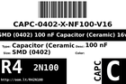
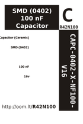
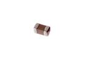

Contents
========

* [C4N10016 > SMD (0402) 100 nF Capacitor (Ceramic) 16v](#c4n10016--smd-0402-100-nf-capacitor-ceramic-16v)
	* [Datasheets](#datasheets)
	* [Labels](#labels)
	* [EDA](#eda)
	* [Images](#images)
	* [Tags](#tags)
  
![][im]
# C4N10016 > SMD (0402) 100 nF Capacitor (Ceramic) 16v

- ID: CAPC-0402-X-NF100-V16
- Hex ID: C4N10016
- Name: SMD (0402) 100 nF Capacitor (Ceramic) 16v
- Description: SMD (0402) 100 nF Capacitor (Ceramic) 16v
- Long Link: [http://oom.lt/CAPC-0402-X-NF100-V16](http://oom.lt/CAPC-0402-X-NF100-V16)
- Short Link: [http://oom.lt/C4N10016](http://oom.lt/C4N10016)

## Datasheets

- Datasheet: [datasheet.pdf](datasheet.pdf)

## Labels
  
  

|label-front|label-inventory|label-spec|
| :---: | :---: | :---: |
||||

## EDA

### Footprints
  

|[  FOOTPRINT-kicad-kicad-footprints-Capacitor_SMD-C_0402_1005Metric](https://github.com/oomlout/oomlout_OOMP_eda/tree/main/FOOTPRINT/kicad/kicad-footprints/Capacitor_SMD/C_0402_1005Metric/)|[  FOOTPRINT-kicad-kicad-footprints-Capacitor_SMD-C_0402_1005Metric_Pad0.74x0.62mm_HandSolder](https://github.com/oomlout/oomlout_OOMP_eda/tree/main/FOOTPRINT/kicad/kicad-footprints/Capacitor_SMD/C_0402_1005Metric_Pad0.74x0.62mm_HandSolder/)|||
| :---: | :---: | :---: | :---: |

### Symbols
  

|[  SYMBOL-kicad-kicad-symbols-Device-C](https://github.com/oomlout/oomlout_OOMP_eda/tree/main/SYMBOL/kicad/kicad-symbols/Device/C/)||||
| :---: | :---: | :---: | :---: |

## Images
  
  

|image|label-front|label-inventory|label-spec|
| :---: | :---: | :---: | :---: |
|||||

## Tags

- oompType: CAPC
- oompSize: 0402
- oompColor: X
- oompDesc: NF100
- oompIndex: V16
- oplPartNumber: {'code': 'C-JLCC', 'name': 'JLC Parts Library', 'partID': 'C1525', 'desc': '16V 100nF X7R ??10% 0402  Multilayer Ceramic Capacitors MLCC - SMD/SMT ROHS'}
- distributorPartNumber: {'code': 'C-LCSC', 'name': 'LCSC', 'partID': 'C1525'}
- manufacturerPartNumber: {'code': 'C-XXXX', 'name': 'Samsung Electro-Mechanics', 'partID': 'CL05B104KO5NNNC'}
- hexID: C4N10016
- oompID: CAPC-0402-X-NF100-V16
- footprintKicad: FOOTPRINT-kicad-kicad-footprints-Capacitor_SMD-C_0402_1005Metric
- footprintKicad: FOOTPRINT-kicad-kicad-footprints-Capacitor_SMD-C_0402_1005Metric_Pad0.74x0.62mm_HandSolder
- symbolKicad: SYMBOL-kicad-kicad-symbols-Device-C

[im]: image_450.jpg
