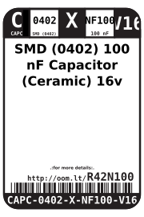
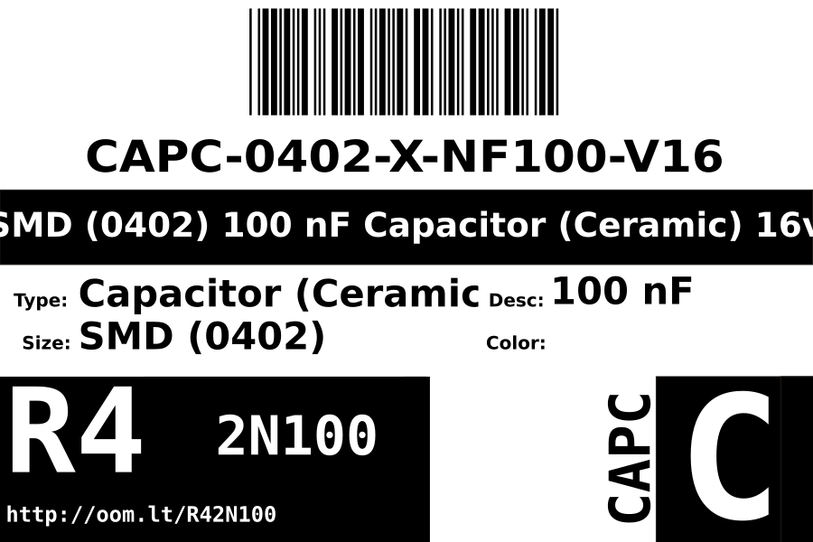

Contents
========

* [CAPC-0402-X-NF100-V16>SMD (0402) 100 nF Capacitor (Ceramic) 16v](#capc-0402-x-nf100-v16smd-0402-100-nf-capacitor-ceramic-16v)
	* [Images](#images)
	* [Datasheets](#datasheets)
	* [Labels](#labels)
	* [EDA](#eda)
		* [Symbols](#symbols)
	* [Tags](#tags)
  
![][im]
# CAPC-0402-X-NF100-V16>SMD (0402) 100 nF Capacitor (Ceramic) 16v

- ID: CAPC-0402-X-NF100-V16
- Name: CAPC-0402-X-NF100-V16

## Images
  
  

|image|
| :---: |
||

## Datasheets

- Datasheet: [datasheet.pdf](datasheet.pdf)

## Labels
  
  

|label-front|label-inventory|label-spec|
| :---: | :---: | :---: |
||||

## EDA

### Symbols

## Tags

- oompID: CAPC-0402-X-NF100-V16
- name: SMD (0402) 100 nF Capacitor (Ceramic) 16v
- hexID: R42N100
- oompSort: 
- oompType: CAPC
- oompSize: 0402
- oompColor: X
- oompDesc: NF100
- oompIndex: V16
- oompVersion: 99
- oompClass: Surface Mount
- oompClassCode: SMDS
- ooNumPins: 2
- oompBbls: template;XXXX-0402-X-XXXX-XX-bbls
- oompDiag: template;XXXX-0402-X-XXXX-XX-diag
- oompIden: template;XXXX-0402-X-XXXX-XX-iden
- oompSchem: template;CAPC-XXXX-X-XXXX-XX-schem
- oompSimp: template;XXXX-0402-X-XXXX-XX-simp
- ooDesignator: C1

[im]: image_600.jpg
