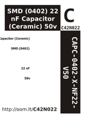

Contents
========

* [C42N022 > SMD (0402) 22 nF Capacitor (Ceramic) 50v](#c42n022--smd-0402-22-nf-capacitor-ceramic-50v)
	* [Datasheets](#datasheets)
	* [Labels](#labels)
	* [EDA](#eda)
	* [Images](#images)
	* [Tags](#tags)
  
![][im]
# C42N022 > SMD (0402) 22 nF Capacitor (Ceramic) 50v

- ID: CAPC-0402-X-NF22-V50
- Hex ID: C42N022
- Name: SMD (0402) 22 nF Capacitor (Ceramic) 50v
- Description: SMD (0402) 22 nF Capacitor (Ceramic) 50v
- Long Link: [http://oom.lt/CAPC-0402-X-NF22-V50](http://oom.lt/CAPC-0402-X-NF22-V50)
- Short Link: [http://oom.lt/C42N022](http://oom.lt/C42N022)

## Datasheets

- Datasheet: [datasheet.pdf](datasheet.pdf)

## Labels
  
  

|label-front|label-inventory|label-spec|
| :---: | :---: | :---: |
||||

## EDA
  

### Instances
  
Used 4 times.  
Prevalance: (4\10986) 0.0364%  

|Project|Occur- rences|Identifiers|
| :---: | :---: | :---: |
|[PROJ-SPAR-11083-STAN-01 FM Tuner Basic Breakout-Si4703](https://github.com/oomlout/oomlout_OOMP_projects/tree/main/PROJ-SPAR-11083-STAN-01/)|[1](https://github.com/oomlout/oomlout_OOMP_projects/tree/main/PROJ-SPAR-11083-STAN-01/)|[C2](https://github.com/oomlout/oomlout_OOMP_projects/tree/main/PROJ-SPAR-11083-STAN-01/)|
|[PROJ-SPAR-11129-STAN-01 Si4707 Breakout](https://github.com/oomlout/oomlout_OOMP_projects/tree/main/PROJ-SPAR-11129-STAN-01/)|[1](https://github.com/oomlout/oomlout_OOMP_projects/tree/main/PROJ-SPAR-11129-STAN-01/)|[C1](https://github.com/oomlout/oomlout_OOMP_projects/tree/main/PROJ-SPAR-11129-STAN-01/)|
|[PROJ-SPAR-11703-STAN-01 UDB5](https://github.com/oomlout/oomlout_OOMP_projects/tree/main/PROJ-SPAR-11703-STAN-01/)|[2](https://github.com/oomlout/oomlout_OOMP_projects/tree/main/PROJ-SPAR-11703-STAN-01/)|[C10, C11](https://github.com/oomlout/oomlout_OOMP_projects/tree/main/PROJ-SPAR-11703-STAN-01/)|

## Images
  
  

|image|label-front|label-inventory|label-spec|
| :---: | :---: | :---: | :---: |
|||||

## Tags

- oompID: CAPC-0402-X-NF22-V50
- name: SMD (0402) 22 nF Capacitor (Ceramic) 50v
- hexID: C42N022
- oompType: CAPC
- oompSize: 0402
- oompColor: X
- oompDesc: NF22
- oompIndex: V50
- oompVersion: 999
- ooWidth: 0.5mm
- ooHeight: 0.5mm
- ooLength: 1mm
- oompBbls: template;XXXX-0402-X-XXXX-XX-bbls
- oompDiag: template;XXXX-0402-X-XXXX-XX-diag
- oompIden: template;XXXX-0402-X-XXXX-XX-iden
- oompSchem: template;CAPC-XXXX-X-XXXX-XX-schem
- oompSimp: template;XXXX-0402-X-XXXX-XX-simp
- ooDesignator: C1
- oompInstances: {'PROJECT': 'PROJ-SPAR-11083-STAN-01', 'ID': 'C2'}
- oompInstances: {'PROJECT': 'PROJ-SPAR-11129-STAN-01', 'ID': 'C1'}
- oompInstances: {'PROJECT': 'PROJ-SPAR-11703-STAN-01', 'ID': 'C10'}
- oompInstances: {'PROJECT': 'PROJ-SPAR-11703-STAN-01', 'ID': 'C11'}

[im]: image_450.jpg
