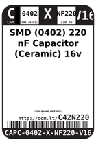
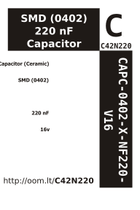

Contents
========

* [C42N220 > SMD (0402) 220 nF Capacitor (Ceramic) 16v](#c42n220--smd-0402-220-nf-capacitor-ceramic-16v)
	* [Datasheets](#datasheets)
	* [Labels](#labels)
	* [EDA](#eda)
	* [Images](#images)
	* [Tags](#tags)
  
![][im]
# C42N220 > SMD (0402) 220 nF Capacitor (Ceramic) 16v

- ID: CAPC-0402-X-NF220-V16
- Hex ID: C42N220
- Name: SMD (0402) 220 nF Capacitor (Ceramic) 16v
- Description: SMD (0402) 220 nF Capacitor (Ceramic) 16v
- Long Link: [http://oom.lt/CAPC-0402-X-NF220-V16](http://oom.lt/CAPC-0402-X-NF220-V16)
- Short Link: [http://oom.lt/C42N220](http://oom.lt/C42N220)

## Datasheets

- Datasheet: [datasheet.pdf](datasheet.pdf)

## Labels
  
  

|label-front|label-inventory|label-spec|
| :---: | :---: | :---: |
||||

## EDA

### Footprints
  

|[  FOOTPRINT-kicad-kicad-footprints-Capacitor_SMD-C_0402_1005Metric](https://github.com/oomlout/oomlout_OOMP_eda/tree/main/FOOTPRINT/kicad/kicad-footprints/Capacitor_SMD/C_0402_1005Metric/)|[  FOOTPRINT-kicad-kicad-footprints-Capacitor_SMD-C_0402_1005Metric_Pad0.74x0.62mm_HandSolder](https://github.com/oomlout/oomlout_OOMP_eda/tree/main/FOOTPRINT/kicad/kicad-footprints/Capacitor_SMD/C_0402_1005Metric_Pad0.74x0.62mm_HandSolder/)|||
| :---: | :---: | :---: | :---: |

### Symbols
  

|[  ----](https://github.com/oomlout/oomlout_OOMP_parts/tree/main/----/)||||
| :---: | :---: | :---: | :---: |
  

### Instances
  
Used 6 times.  
Prevalance: (6\10986) 0.0546%  

|Project|Occur- rences|Identifiers|
| :---: | :---: | :---: |
|[PROJ-SPAR-10507-STAN-01 Quadstepper Motor Driver](https://github.com/oomlout/oomlout_OOMP_projects/tree/main/PROJ-SPAR-10507-STAN-01/)|[4](https://github.com/oomlout/oomlout_OOMP_projects/tree/main/PROJ-SPAR-10507-STAN-01/)|[C8, C14, C20, C26](https://github.com/oomlout/oomlout_OOMP_projects/tree/main/PROJ-SPAR-10507-STAN-01/)|
|[PROJ-SPAR-10530-STAN-01 Triple Axis Magnetometer-HMC5883L](https://github.com/oomlout/oomlout_OOMP_projects/tree/main/PROJ-SPAR-10530-STAN-01/)|[1](https://github.com/oomlout/oomlout_OOMP_projects/tree/main/PROJ-SPAR-10530-STAN-01/)|[C2](https://github.com/oomlout/oomlout_OOMP_projects/tree/main/PROJ-SPAR-10530-STAN-01/)|
|[PROJ-SPAR-10888-STAN-01 LSM303 Breakout](https://github.com/oomlout/oomlout_OOMP_projects/tree/main/PROJ-SPAR-10888-STAN-01/)|[1](https://github.com/oomlout/oomlout_OOMP_projects/tree/main/PROJ-SPAR-10888-STAN-01/)|[C3](https://github.com/oomlout/oomlout_OOMP_projects/tree/main/PROJ-SPAR-10888-STAN-01/)|

## Images
  
  

|image|label-front|label-inventory|label-spec|
| :---: | :---: | :---: | :---: |
|||||

## Tags

- oompID: CAPC-0402-X-NF220-V16
- name: SMD (0402) 220 nF Capacitor (Ceramic) 16v
- hexID: C42N220
- oompType: CAPC
- oompSize: 0402
- oompColor: X
- oompDesc: NF220
- oompIndex: V16
- oompVersion: 999
- ooWidth: 0.5mm
- ooHeight: 0.5mm
- ooLength: 1mm
- oompBbls: template;XXXX-0402-X-XXXX-XX-bbls
- oompDiag: template;XXXX-0402-X-XXXX-XX-diag
- oompIden: template;XXXX-0402-X-XXXX-XX-iden
- oompSchem: template;CAPC-XXXX-X-XXXX-XX-schem
- oompSimp: template;XXXX-0402-X-XXXX-XX-simp
- ooDesignator: C1
- oompInstances: {'PROJECT': 'PROJ-SPAR-10507-STAN-01', 'ID': 'C8'}
- oompInstances: {'PROJECT': 'PROJ-SPAR-10507-STAN-01', 'ID': 'C14'}
- oompInstances: {'PROJECT': 'PROJ-SPAR-10507-STAN-01', 'ID': 'C20'}
- oompInstances: {'PROJECT': 'PROJ-SPAR-10507-STAN-01', 'ID': 'C26'}
- oompInstances: {'PROJECT': 'PROJ-SPAR-10530-STAN-01', 'ID': 'C2'}
- oompInstances: {'PROJECT': 'PROJ-SPAR-10888-STAN-01', 'ID': 'C3'}
- symbolKicad: SYMBOL-kicad-kicad-symbols-Switch-C
- footprintKicad: FOOTPRINT-kicad-kicad-footprints-Capacitor_SMD-C_0402_1005Metric
- footprintKicad: FOOTPRINT-kicad-kicad-footprints-Capacitor_SMD-C_0402_1005Metric_Pad0.74x0.62mm_HandSolder

[im]: image_450.jpg
