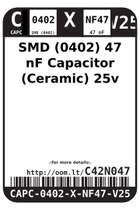
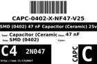
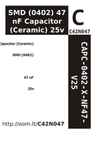

Contents
========

* [C42N047 > SMD (0402) 47 nF Capacitor (Ceramic) 25v](#c42n047--smd-0402-47-nf-capacitor-ceramic-25v)
	* [Datasheets](#datasheets)
	* [Labels](#labels)
	* [EDA](#eda)
	* [Images](#images)
	* [Tags](#tags)
  
![][im]
# C42N047 > SMD (0402) 47 nF Capacitor (Ceramic) 25v

- ID: CAPC-0402-X-NF47-V25
- Hex ID: C42N047
- Name: SMD (0402) 47 nF Capacitor (Ceramic) 25v
- Description: SMD (0402) 47 nF Capacitor (Ceramic) 25v
- Long Link: [http://oom.lt/CAPC-0402-X-NF47-V25](http://oom.lt/CAPC-0402-X-NF47-V25)
- Short Link: [http://oom.lt/C42N047](http://oom.lt/C42N047)

## Datasheets

- Datasheet: [datasheet.pdf](datasheet.pdf)

## Labels
  
  

|label-front|label-inventory|label-spec|
| :---: | :---: | :---: |
||||

## EDA
  

### Instances
  
Used 4 times.  
Prevalance: (4\10986) 0.0364%  

|OOMP Instances|
| :---: |
|[PROJ-SPAR-10587-STAN-01  Music Instrument Shield  Used 1 times. C12](https://github.com/oomlout/oomlout_OOMP_projects/tree/main/PROJ-SPAR-10587-STAN-01/)|
|[PROJ-SPAR-10608-STAN-01  MP3 Breakout-VS1033D  Used 1 times. C11](https://github.com/oomlout/oomlout_OOMP_projects/tree/main/PROJ-SPAR-10608-STAN-01/)|
|[PROJ-SPAR-11013-STAN-01  LilyPad MP3 Player  Used 1 times. C16](https://github.com/oomlout/oomlout_OOMP_projects/tree/main/PROJ-SPAR-11013-STAN-01/)|
|[PROJ-SPAR-11684-STAN-01  MP3 Breakout-VS1063  Used 1 times. C11](https://github.com/oomlout/oomlout_OOMP_projects/tree/main/PROJ-SPAR-11684-STAN-01/)|

## Images
  
  

|image|label-front|label-inventory|label-spec|
| :---: | :---: | :---: | :---: |
|||||

## Tags

- oompID: CAPC-0402-X-NF47-V25
- name: SMD (0402) 47 nF Capacitor (Ceramic) 25v
- hexID: C42N047
- oompType: CAPC
- oompSize: 0402
- oompColor: X
- oompDesc: NF47
- oompIndex: V25
- oompVersion: 999
- ooWidth: 0.5mm
- ooHeight: 0.5mm
- ooLength: 1mm
- oompBbls: template;XXXX-0402-X-XXXX-XX-bbls
- oompDiag: template;XXXX-0402-X-XXXX-XX-diag
- oompIden: template;XXXX-0402-X-XXXX-XX-iden
- oompSchem: template;CAPC-XXXX-X-XXXX-XX-schem
- oompSimp: template;XXXX-0402-X-XXXX-XX-simp
- ooDesignator: C1
- oompInstances: {'PROJECT': 'PROJ-SPAR-10587-STAN-01', 'ID': 'C12'}
- oompInstances: {'PROJECT': 'PROJ-SPAR-10608-STAN-01', 'ID': 'C11'}
- oompInstances: {'PROJECT': 'PROJ-SPAR-11013-STAN-01', 'ID': 'C16'}
- oompInstances: {'PROJECT': 'PROJ-SPAR-11684-STAN-01', 'ID': 'C11'}

[im]: image_450.jpg
