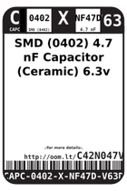
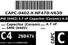
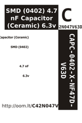

Contents
========

* [C42N047V63D > SMD (0402) 4.7 nF Capacitor (Ceramic) 6.3v](#c42n047v63d--smd-0402-47-nf-capacitor-ceramic-63v)
	* [Labels](#labels)
	* [EDA](#eda)
	* [Images](#images)
	* [Tags](#tags)
  
![][im]
# C42N047V63D > SMD (0402) 4.7 nF Capacitor (Ceramic) 6.3v

- ID: CAPC-0402-X-NF47D-V63D
- Hex ID: C42N047V63D
- Name: SMD (0402) 4.7 nF Capacitor (Ceramic) 6.3v
- Description: SMD (0402) 4.7 nF Capacitor (Ceramic) 6.3v
- Long Link: [http://oom.lt/CAPC-0402-X-NF47D-V63D](http://oom.lt/CAPC-0402-X-NF47D-V63D)
- Short Link: [http://oom.lt/C42N047V63D](http://oom.lt/C42N047V63D)

## Labels
  
  

|label-front|label-inventory|label-spec|
| :---: | :---: | :---: |
||||

## EDA

### Footprints
  

|[  FOOTPRINT-kicad-kicad-footprints-Capacitor_SMD-C_0402_1005Metric](https://github.com/oomlout/oomlout_OOMP_eda/tree/main/FOOTPRINT/kicad/kicad-footprints/Capacitor_SMD/C_0402_1005Metric/)|[  FOOTPRINT-kicad-kicad-footprints-Capacitor_SMD-C_0402_1005Metric_Pad0.74x0.62mm_HandSolder](https://github.com/oomlout/oomlout_OOMP_eda/tree/main/FOOTPRINT/kicad/kicad-footprints/Capacitor_SMD/C_0402_1005Metric_Pad0.74x0.62mm_HandSolder/)|||
| :---: | :---: | :---: | :---: |

### Symbols
  

|[  SYMBOL-kicad-kicad-symbols-Device-C](https://github.com/oomlout/oomlout_OOMP_eda/tree/main/SYMBOL/kicad/kicad-symbols/Device/C/)||||
| :---: | :---: | :---: | :---: |

## Images
  
  

|image|label-front|label-inventory|label-spec|
| :---: | :---: | :---: | :---: |
|||||

## Tags

- oompID: CAPC-0402-X-NF47D-V63D
- name: SMD (0402) 4.7 nF Capacitor (Ceramic) 6.3v
- hexID: C42N047V63D
- oompType: CAPC
- oompSize: 0402
- oompColor: X
- oompDesc: NF47D
- oompIndex: V63D
- oompVersion: 999
- ooWidth: 0.5mm
- ooHeight: 0.5mm
- ooLength: 1mm
- oompBbls: template;XXXX-0402-X-XXXX-XX-bbls
- oompDiag: template;XXXX-0402-X-XXXX-XX-diag
- oompIden: template;XXXX-0402-X-XXXX-XX-iden
- oompSchem: template;CAPC-XXXX-X-XXXX-XX-schem
- oompSimp: template;XXXX-0402-X-XXXX-XX-simp
- ooDesignator: C1
- symbolKicad: SYMBOL-kicad-kicad-symbols-Device-C
- footprintKicad: FOOTPRINT-kicad-kicad-footprints-Capacitor_SMD-C_0402_1005Metric
- footprintKicad: FOOTPRINT-kicad-kicad-footprints-Capacitor_SMD-C_0402_1005Metric_Pad0.74x0.62mm_HandSolder

[im]: image_450.jpg
