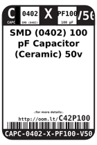
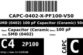
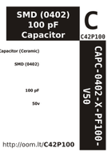

Contents
========

* [C42P100 > SMD (0402) 100 pF Capacitor (Ceramic) 50v](#c42p100--smd-0402-100-pf-capacitor-ceramic-50v)
	* [Datasheets](#datasheets)
	* [Labels](#labels)
	* [EDA](#eda)
	* [Images](#images)
	* [Tags](#tags)
  
![][im]
# C42P100 > SMD (0402) 100 pF Capacitor (Ceramic) 50v

- ID: CAPC-0402-X-PF100-V50
- Hex ID: C42P100
- Name: SMD (0402) 100 pF Capacitor (Ceramic) 50v
- Description: SMD (0402) 100 pF Capacitor (Ceramic) 50v
- Long Link: [http://oom.lt/CAPC-0402-X-PF100-V50](http://oom.lt/CAPC-0402-X-PF100-V50)
- Short Link: [http://oom.lt/C42P100](http://oom.lt/C42P100)

## Datasheets

- Datasheet: [datasheet.pdf](datasheet.pdf)

## Labels
  
  

|label-front|label-inventory|label-spec|
| :---: | :---: | :---: |
||||

## EDA

### Instances
  
  
Used 2 times.  
Prevalance: (2\10986) 0.0182%  

|OOMP Instances|
| :---: |
|[PROJ-ADAF-5325-STAN-01  Adafruit QT Py ESP32 S2 PCB  Used 1 times. C16](https://github.com/oomlout/oomlout_OOMP_projects/tree/main/PROJ-ADAF-5325-STAN-01/)|
|[PROJ-SPAR-13990-STAN-01  nRF52832 Breakout  Used 1 times. C5](https://github.com/oomlout/oomlout_OOMP_projects/tree/main/PROJ-SPAR-13990-STAN-01/)|

### Symbols

## Images
  
  

|image|label-front|label-inventory|label-spec|
| :---: | :---: | :---: | :---: |
|||||

## Tags

- oompID: CAPC-0402-X-PF100-V50
- name: SMD (0402) 100 pF Capacitor (Ceramic) 50v
- hexID: C42P100
- oompType: CAPC
- oompSize: 0402
- oompColor: X
- oompDesc: PF100
- oompIndex: V50
- oompVersion: 999
- ooWidth: 0.5mm
- ooHeight: 0.5mm
- ooLength: 1mm
- oompBbls: template;XXXX-0402-X-XXXX-XX-bbls
- oompDiag: template;XXXX-0402-X-XXXX-XX-diag
- oompIden: template;XXXX-0402-X-XXXX-XX-iden
- oompSchem: template;CAPC-XXXX-X-XXXX-XX-schem
- oompSimp: template;XXXX-0402-X-XXXX-XX-simp
- ooDesignator: C1
- oompInstances: {'PROJECT': 'PROJ-ADAF-5325-STAN-01', 'ID': 'C16'}
- oompInstances: {'PROJECT': 'PROJ-SPAR-13990-STAN-01', 'ID': 'C5'}

[im]: image_450.jpg
