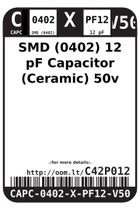

Contents
========

* [C4P12 > SMD (0402) 12 pF Capacitor (Ceramic) 50v](#c4p12--smd-0402-12-pf-capacitor-ceramic-50v)
	* [Datasheets](#datasheets)
	* [Labels](#labels)
	* [EDA](#eda)
	* [Images](#images)
	* [Tags](#tags)
  
![][im]
# C4P12 > SMD (0402) 12 pF Capacitor (Ceramic) 50v

- ID: CAPC-0402-X-PF12-V50
- Hex ID: C4P12
- Name: SMD (0402) 12 pF Capacitor (Ceramic) 50v
- Description: SMD (0402) 12 pF Capacitor (Ceramic) 50v
- Long Link: [http://oom.lt/CAPC-0402-X-PF12-V50](http://oom.lt/CAPC-0402-X-PF12-V50)
- Short Link: [http://oom.lt/C4P12](http://oom.lt/C4P12)

## Datasheets

- Datasheet: [datasheet.pdf](datasheet.pdf)

## Labels
  
  

|label-front|label-inventory|label-spec|
| :---: | :---: | :---: |
||||

## EDA
  

### Instances
  
Used 6 times.  
Prevalance: (6\10986) 0.0546%  

|Project|Occur- rences|Identifiers|
| :---: | :---: | :---: |
|[PROJ-ADAF-4333-STAN-01 Adafruit Circuit Playground Bluefruit PCB](https://github.com/oomlout/oomlout_OOMP_projects/tree/main/PROJ-ADAF-4333-STAN-01/)|[2](https://github.com/oomlout/oomlout_OOMP_projects/tree/main/PROJ-ADAF-4333-STAN-01/)|[C12, C13](https://github.com/oomlout/oomlout_OOMP_projects/tree/main/PROJ-ADAF-4333-STAN-01/)|
|[PROJ-SPAR-11197-STAN-01 ATmega128RFA1 Dev](https://github.com/oomlout/oomlout_OOMP_projects/tree/main/PROJ-SPAR-11197-STAN-01/)|[4](https://github.com/oomlout/oomlout_OOMP_projects/tree/main/PROJ-SPAR-11197-STAN-01/)|[C5, C6, C7, C8](https://github.com/oomlout/oomlout_OOMP_projects/tree/main/PROJ-SPAR-11197-STAN-01/)|

## Images
  
  

|image|label-front|label-inventory|label-spec|
| :---: | :---: | :---: | :---: |
|||||

## Tags

- oompType: CAPC
- oompSize: 0402
- oompColor: X
- oompDesc: PF12
- oompIndex: V50
- oplPartNumber: {'code': 'C-JLCC', 'name': 'JLC Parts Library', 'partID': 'C1547', 'desc': '50V 12pF C0G ??5% 0402  Multilayer Ceramic Capacitors MLCC - SMD/SMT ROHS'}
- distributorPartNumber: {'code': 'C-LCSC', 'name': 'LCSC', 'partID': 'C1547'}
- manufacturerPartNumber: {'code': 'C-XXXX', 'name': 'FH (Guangdong Fenghua Advanced Tech)', 'partID': '0402CG120J500NT'}
- hexID: C4P12
- oompID: CAPC-0402-X-PF12-V50
- oompInstances: {'PROJECT': 'PROJ-ADAF-4333-STAN-01', 'ID': 'C12'}
- oompInstances: {'PROJECT': 'PROJ-ADAF-4333-STAN-01', 'ID': 'C13'}
- oompInstances: {'PROJECT': 'PROJ-SPAR-11197-STAN-01', 'ID': 'C5'}
- oompInstances: {'PROJECT': 'PROJ-SPAR-11197-STAN-01', 'ID': 'C6'}
- oompInstances: {'PROJECT': 'PROJ-SPAR-11197-STAN-01', 'ID': 'C7'}
- oompInstances: {'PROJECT': 'PROJ-SPAR-11197-STAN-01', 'ID': 'C8'}

[im]: image_450.jpg
