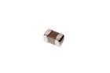

Contents
========

* [C42P015 > SMD (0402) 15 pF Capacitor (Ceramic) 50v](#c42p015--smd-0402-15-pf-capacitor-ceramic-50v)
	* [Datasheets](#datasheets)
	* [Labels](#labels)
	* [EDA](#eda)
	* [Images](#images)
	* [Tags](#tags)
  
![][im]
# C42P015 > SMD (0402) 15 pF Capacitor (Ceramic) 50v

- ID: CAPC-0402-X-PF15-V50
- Hex ID: C42P015
- Name: SMD (0402) 15 pF Capacitor (Ceramic) 50v
- Description: SMD (0402) 15 pF Capacitor (Ceramic) 50v
- Long Link: [http://oom.lt/CAPC-0402-X-PF15-V50](http://oom.lt/CAPC-0402-X-PF15-V50)
- Short Link: [http://oom.lt/C42P015](http://oom.lt/C42P015)

## Datasheets

- Datasheet: [datasheet.pdf](datasheet.pdf)

## Labels
  
  

|label-front|label-inventory|label-spec|
| :---: | :---: | :---: |
||||

## EDA

### Instances
  
  
Used 6 times.  
Prevalance: (6\10986) 0.0546%  

|OOMP Instances|
| :---: |
|[PROJ-SPAR-13664-STAN-01  SAMD21 Mini Breakout  Used 2 times. C5, C6](https://github.com/oomlout/oomlout_OOMP_projects/tree/main/PROJ-SPAR-13664-STAN-01/)|
|[PROJ-SPAR-13990-STAN-01  nRF52832 Breakout  Used 2 times. C13, C14](https://github.com/oomlout/oomlout_OOMP_projects/tree/main/PROJ-SPAR-13990-STAN-01/)|
|[PROJ-SPAR-14713-STAN-01  SAMD51 Thing Plus  Used 2 times. C1, C2](https://github.com/oomlout/oomlout_OOMP_projects/tree/main/PROJ-SPAR-14713-STAN-01/)|

### Symbols

## Images
  
  

|image|label-front|label-inventory|label-spec|
| :---: | :---: | :---: | :---: |
|||||

## Tags

- oompID: CAPC-0402-X-PF15-V50
- name: SMD (0402) 15 pF Capacitor (Ceramic) 50v
- hexID: C42P015
- oompSort: CAPC0402PF15
- oompType: CAPC
- oompSize: 0402
- oompColor: X
- oompDesc: PF15
- oompIndex: V50
- oompVersion: 98
- oompBbls: template;XXXX-0402-X-XXXX-XX-bbls
- oompDiag: template;XXXX-0402-X-XXXX-XX-diag
- oompIden: template;XXXX-0402-X-XXXX-XX-iden
- oompSchem: template;CAPC-XXXX-X-XXXX-XX-schem
- oompSimp: template;XXXX-0402-X-XXXX-XX-simp
- ooDesignator: C1
- oompInstances: {'PROJECT': 'PROJ-SPAR-13664-STAN-01', 'ID': 'C5'}
- oompInstances: {'PROJECT': 'PROJ-SPAR-13664-STAN-01', 'ID': 'C6'}
- oompInstances: {'PROJECT': 'PROJ-SPAR-13990-STAN-01', 'ID': 'C13'}
- oompInstances: {'PROJECT': 'PROJ-SPAR-13990-STAN-01', 'ID': 'C14'}
- oompInstances: {'PROJECT': 'PROJ-SPAR-14713-STAN-01', 'ID': 'C1'}
- oompInstances: {'PROJECT': 'PROJ-SPAR-14713-STAN-01', 'ID': 'C2'}

[im]: image_450.jpg
