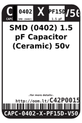
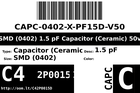

Contents
========

* [C42P0015D > SMD (0402) 1.5 pF Capacitor (Ceramic) 50v](#c42p0015d--smd-0402-15-pf-capacitor-ceramic-50v)
	* [Images](#images)
	* [Datasheets](#datasheets)
	* [Labels](#labels)
	* [EDA](#eda)
	* [Tags](#tags)
  
![][im]
# C42P0015D > SMD (0402) 1.5 pF Capacitor (Ceramic) 50v

- ID: CAPC-0402-X-PF15D-V50
- Hex ID: C42P0015D
- Name: SMD (0402) 1.5 pF Capacitor (Ceramic) 50v
- Description: SMD (0402) 1.5 pF Capacitor (Ceramic) 50v

## Images
  
  

|image|label-front|label-inventory|label-spec|
| :---: | :---: | :---: | :---: |
|||||

## Datasheets

- Datasheet: [datasheet.pdf](datasheet.pdf)

## Labels
  
  

|label-front|label-inventory|label-spec|
| :---: | :---: | :---: |
||||

## EDA

### Symbols

## Tags

- oompID: CAPC-0402-X-PF15D-V50
- name: SMD (0402) 1.5 pF Capacitor (Ceramic) 50v
- hexID: C42P0015D
- oompType: CAPC
- oompSize: 0402
- oompColor: X
- oompDesc: PF15D
- oompIndex: V50
- oompVersion: 999
- ooWidth: 0.5mm
- ooHeight: 0.5mm
- ooLength: 1mm
- oompBbls: template;XXXX-0402-X-XXXX-XX-bbls
- oompDiag: template;XXXX-0402-X-XXXX-XX-diag
- oompIden: template;XXXX-0402-X-XXXX-XX-iden
- oompSchem: template;CAPC-XXXX-X-XXXX-XX-schem
- oompSimp: template;XXXX-0402-X-XXXX-XX-simp
- ooDesignator: C1

[im]: image_450.jpg
