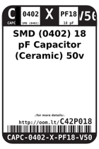
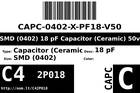
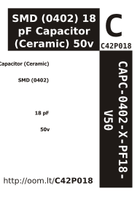

Contents
========

* [C42P018 > SMD (0402) 18 pF Capacitor (Ceramic) 50v](#c42p018--smd-0402-18-pf-capacitor-ceramic-50v)
	* [Datasheets](#datasheets)
	* [Labels](#labels)
	* [EDA](#eda)
	* [Images](#images)
	* [Tags](#tags)
  
![][im]
# C42P018 > SMD (0402) 18 pF Capacitor (Ceramic) 50v

- ID: CAPC-0402-X-PF18-V50
- Hex ID: C42P018
- Name: SMD (0402) 18 pF Capacitor (Ceramic) 50v
- Description: SMD (0402) 18 pF Capacitor (Ceramic) 50v
- Long Link: [http://oom.lt/CAPC-0402-X-PF18-V50](http://oom.lt/CAPC-0402-X-PF18-V50)
- Short Link: [http://oom.lt/C42P018](http://oom.lt/C42P018)

## Datasheets

- Datasheet: [datasheet.pdf](datasheet.pdf)

## Labels
  
  

|label-front|label-inventory|label-spec|
| :---: | :---: | :---: |
||||

## EDA

### Instances
  
  
Used 10 times.  
Prevalance: (10\10986) 0.091%  

|OOMP Instances|
| :---: |
|[PROJ-SPAR-10406-STAN-01  RFID Evaluation Shield  Used 2 times. C5, C6](https://github.com/oomlout/oomlout_OOMP_projects/tree/main/PROJ-SPAR-10406-STAN-01/)|
|[PROJ-SPAR-10608-STAN-01  MP3 Breakout-VS1033D  Used 2 times. C3, C8](https://github.com/oomlout/oomlout_OOMP_projects/tree/main/PROJ-SPAR-10608-STAN-01/)|
|[PROJ-SPAR-10864-STAN-01  PoEthernet Shield  Used 2 times. C3, C4](https://github.com/oomlout/oomlout_OOMP_projects/tree/main/PROJ-SPAR-10864-STAN-01/)|
|[PROJ-SPAR-11684-STAN-01  MP3 Breakout-VS1063  Used 2 times. C3, C8](https://github.com/oomlout/oomlout_OOMP_projects/tree/main/PROJ-SPAR-11684-STAN-01/)|
|[PROJ-SPAR-11801-STAN-01  Tiny-AVR-Programmer  Used 2 times. C2, C4](https://github.com/oomlout/oomlout_OOMP_projects/tree/main/PROJ-SPAR-11801-STAN-01/)|

### Symbols

## Images
  
  

|image|label-front|label-inventory|label-spec|
| :---: | :---: | :---: | :---: |
|||||

## Tags

- oompID: CAPC-0402-X-PF18-V50
- name: SMD (0402) 18 pF Capacitor (Ceramic) 50v
- hexID: C42P018
- oompType: CAPC
- oompSize: 0402
- oompColor: X
- oompDesc: PF18
- oompIndex: V50
- oompVersion: 999
- ooWidth: 0.5mm
- ooHeight: 0.5mm
- ooLength: 1mm
- oompBbls: template;XXXX-0402-X-XXXX-XX-bbls
- oompDiag: template;XXXX-0402-X-XXXX-XX-diag
- oompIden: template;XXXX-0402-X-XXXX-XX-iden
- oompSchem: template;CAPC-XXXX-X-XXXX-XX-schem
- oompSimp: template;XXXX-0402-X-XXXX-XX-simp
- ooDesignator: C1
- oompInstances: {'PROJECT': 'PROJ-SPAR-10406-STAN-01', 'ID': 'C5'}
- oompInstances: {'PROJECT': 'PROJ-SPAR-10406-STAN-01', 'ID': 'C6'}
- oompInstances: {'PROJECT': 'PROJ-SPAR-10608-STAN-01', 'ID': 'C3'}
- oompInstances: {'PROJECT': 'PROJ-SPAR-10608-STAN-01', 'ID': 'C8'}
- oompInstances: {'PROJECT': 'PROJ-SPAR-10864-STAN-01', 'ID': 'C3'}
- oompInstances: {'PROJECT': 'PROJ-SPAR-10864-STAN-01', 'ID': 'C4'}
- oompInstances: {'PROJECT': 'PROJ-SPAR-11684-STAN-01', 'ID': 'C3'}
- oompInstances: {'PROJECT': 'PROJ-SPAR-11684-STAN-01', 'ID': 'C8'}
- oompInstances: {'PROJECT': 'PROJ-SPAR-11801-STAN-01', 'ID': 'C2'}
- oompInstances: {'PROJECT': 'PROJ-SPAR-11801-STAN-01', 'ID': 'C4'}

[im]: image_450.jpg
