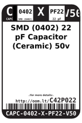
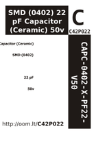

Contents
========

* [C4P22 > SMD (0402) 22 pF Capacitor (Ceramic) 50v](#c4p22--smd-0402-22-pf-capacitor-ceramic-50v)
	* [Datasheets](#datasheets)
	* [Labels](#labels)
	* [EDA](#eda)
	* [Images](#images)
	* [Tags](#tags)
  
![][im]
# C4P22 > SMD (0402) 22 pF Capacitor (Ceramic) 50v

- ID: CAPC-0402-X-PF22-V50
- Hex ID: C4P22
- Name: SMD (0402) 22 pF Capacitor (Ceramic) 50v
- Description: SMD (0402) 22 pF Capacitor (Ceramic) 50v
- Long Link: [http://oom.lt/CAPC-0402-X-PF22-V50](http://oom.lt/CAPC-0402-X-PF22-V50)
- Short Link: [http://oom.lt/C4P22](http://oom.lt/C4P22)

## Datasheets

- Datasheet: [datasheet.pdf](datasheet.pdf)

## Labels
  
  

|label-front|label-inventory|label-spec|
| :---: | :---: | :---: |
||||

## EDA

### Footprints
  

|[  FOOTPRINT-kicad-kicad-footprints-Capacitor_SMD-C_0402_1005Metric](https://github.com/oomlout/oomlout_OOMP_eda/tree/main/FOOTPRINT/kicad/kicad-footprints/Capacitor_SMD/C_0402_1005Metric/)|[  FOOTPRINT-kicad-kicad-footprints-Capacitor_SMD-C_0402_1005Metric_Pad0.74x0.62mm_HandSolder](https://github.com/oomlout/oomlout_OOMP_eda/tree/main/FOOTPRINT/kicad/kicad-footprints/Capacitor_SMD/C_0402_1005Metric_Pad0.74x0.62mm_HandSolder/)|||
| :---: | :---: | :---: | :---: |

### Symbols
  

|[  ----](https://github.com/oomlout/oomlout_OOMP_parts/tree/main/----/)||||
| :---: | :---: | :---: | :---: |
  

### Instances
  
Used 28 times.  
Prevalance: (28\10986) 0.2549%  

|Project|Occur- rences|Identifiers|
| :---: | :---: | :---: |
|[PROJ-ADAF-4888-STAN-01 Adafruit ItsyBitsy RP2040 PCB](https://github.com/oomlout/oomlout_OOMP_projects/tree/main/PROJ-ADAF-4888-STAN-01/)|[2](https://github.com/oomlout/oomlout_OOMP_projects/tree/main/PROJ-ADAF-4888-STAN-01/)|[C19, C20](https://github.com/oomlout/oomlout_OOMP_projects/tree/main/PROJ-ADAF-4888-STAN-01/)|
|[PROJ-ADAF-4900-STAN-01 Adafruit QT Py RP2040 PCB](https://github.com/oomlout/oomlout_OOMP_projects/tree/main/PROJ-ADAF-4900-STAN-01/)|[2](https://github.com/oomlout/oomlout_OOMP_projects/tree/main/PROJ-ADAF-4900-STAN-01/)|[C19, C20](https://github.com/oomlout/oomlout_OOMP_projects/tree/main/PROJ-ADAF-4900-STAN-01/)|
|[PROJ-ADAF-5302-STAN-01 Adafruit KB2040 PCB](https://github.com/oomlout/oomlout_OOMP_projects/tree/main/PROJ-ADAF-5302-STAN-01/)|[2](https://github.com/oomlout/oomlout_OOMP_projects/tree/main/PROJ-ADAF-5302-STAN-01/)|[C19, C20](https://github.com/oomlout/oomlout_OOMP_projects/tree/main/PROJ-ADAF-5302-STAN-01/)|
|[PROJ-ARDU-DUE-STAN-01 Arduino DUE](https://github.com/oomlout/oomlout_OOMP_projects/tree/main/PROJ-ARDU-DUE-STAN-01/)|[7](https://github.com/oomlout/oomlout_OOMP_projects/tree/main/PROJ-ARDU-DUE-STAN-01/)|[C21, C22, C23, C24, C25, C39, C40](https://github.com/oomlout/oomlout_OOMP_projects/tree/main/PROJ-ARDU-DUE-STAN-01/)|
|[PROJ-ARDU-MICRO-STAN-01 Arduino Micro](https://github.com/oomlout/oomlout_OOMP_projects/tree/main/PROJ-ARDU-MICRO-STAN-01/)|[2](https://github.com/oomlout/oomlout_OOMP_projects/tree/main/PROJ-ARDU-MICRO-STAN-01/)|[C12, C13](https://github.com/oomlout/oomlout_OOMP_projects/tree/main/PROJ-ARDU-MICRO-STAN-01/)|
|[PROJ-SPAR-10160-STAN-01 DeadOn RTC](https://github.com/oomlout/oomlout_OOMP_projects/tree/main/PROJ-SPAR-10160-STAN-01/)|[1](https://github.com/oomlout/oomlout_OOMP_projects/tree/main/PROJ-SPAR-10160-STAN-01/)|[C1](https://github.com/oomlout/oomlout_OOMP_projects/tree/main/PROJ-SPAR-10160-STAN-01/)|
|[PROJ-SPAR-10406-STAN-01 RFID Evaluation Shield](https://github.com/oomlout/oomlout_OOMP_projects/tree/main/PROJ-SPAR-10406-STAN-01/)|[2](https://github.com/oomlout/oomlout_OOMP_projects/tree/main/PROJ-SPAR-10406-STAN-01/)|[C2, C7](https://github.com/oomlout/oomlout_OOMP_projects/tree/main/PROJ-SPAR-10406-STAN-01/)|
|[PROJ-SPAR-10587-STAN-01 Music Instrument Shield](https://github.com/oomlout/oomlout_OOMP_projects/tree/main/PROJ-SPAR-10587-STAN-01/)|[2](https://github.com/oomlout/oomlout_OOMP_projects/tree/main/PROJ-SPAR-10587-STAN-01/)|[C3, C8](https://github.com/oomlout/oomlout_OOMP_projects/tree/main/PROJ-SPAR-10587-STAN-01/)|
|[PROJ-SPAR-11013-STAN-01 LilyPad MP3 Player](https://github.com/oomlout/oomlout_OOMP_projects/tree/main/PROJ-SPAR-11013-STAN-01/)|[2](https://github.com/oomlout/oomlout_OOMP_projects/tree/main/PROJ-SPAR-11013-STAN-01/)|[C11, C12](https://github.com/oomlout/oomlout_OOMP_projects/tree/main/PROJ-SPAR-11013-STAN-01/)|
|[PROJ-SPAR-11058-STAN-01 Venus GPS SMA Connector](https://github.com/oomlout/oomlout_OOMP_projects/tree/main/PROJ-SPAR-11058-STAN-01/)|[1](https://github.com/oomlout/oomlout_OOMP_projects/tree/main/PROJ-SPAR-11058-STAN-01/)|[C4](https://github.com/oomlout/oomlout_OOMP_projects/tree/main/PROJ-SPAR-11058-STAN-01/)|
|[PROJ-SPAR-11083-STAN-01 FM Tuner Basic Breakout-Si4703](https://github.com/oomlout/oomlout_OOMP_projects/tree/main/PROJ-SPAR-11083-STAN-01/)|[2](https://github.com/oomlout/oomlout_OOMP_projects/tree/main/PROJ-SPAR-11083-STAN-01/)|[C3, C4](https://github.com/oomlout/oomlout_OOMP_projects/tree/main/PROJ-SPAR-11083-STAN-01/)|
|[PROJ-SPAR-11129-STAN-01 Si4707 Breakout](https://github.com/oomlout/oomlout_OOMP_projects/tree/main/PROJ-SPAR-11129-STAN-01/)|[2](https://github.com/oomlout/oomlout_OOMP_projects/tree/main/PROJ-SPAR-11129-STAN-01/)|[C5, C6](https://github.com/oomlout/oomlout_OOMP_projects/tree/main/PROJ-SPAR-11129-STAN-01/)|
|[PROJ-SPAR-11197-STAN-01 ATmega128RFA1 Dev](https://github.com/oomlout/oomlout_OOMP_projects/tree/main/PROJ-SPAR-11197-STAN-01/)|[1](https://github.com/oomlout/oomlout_OOMP_projects/tree/main/PROJ-SPAR-11197-STAN-01/)|[C11](https://github.com/oomlout/oomlout_OOMP_projects/tree/main/PROJ-SPAR-11197-STAN-01/)|

## Images
  
  

|image|label-front|label-inventory|label-spec|
| :---: | :---: | :---: | :---: |
|||||

## Tags

- oompType: CAPC
- oompSize: 0402
- oompColor: X
- oompDesc: PF22
- oompIndex: V50
- oplPartNumber: {'code': 'C-JLCC', 'name': 'JLC Parts Library', 'partID': 'C1555', 'desc': '50V 22pF C0G ??5% 0402  Multilayer Ceramic Capacitors MLCC - SMD/SMT ROHS'}
- distributorPartNumber: {'code': 'C-LCSC', 'name': 'LCSC', 'partID': 'C1555'}
- manufacturerPartNumber: {'code': 'C-XXXX', 'name': 'FH (Guangdong Fenghua Advanced Tech)', 'partID': '0402CG220J500NT'}
- hexID: C4P22
- oompID: CAPC-0402-X-PF22-V50
- oompInstances: {'PROJECT': 'PROJ-ADAF-4888-STAN-01', 'ID': 'C19'}
- oompInstances: {'PROJECT': 'PROJ-ADAF-4888-STAN-01', 'ID': 'C20'}
- oompInstances: {'PROJECT': 'PROJ-ADAF-4900-STAN-01', 'ID': 'C19'}
- oompInstances: {'PROJECT': 'PROJ-ADAF-4900-STAN-01', 'ID': 'C20'}
- oompInstances: {'PROJECT': 'PROJ-ADAF-5302-STAN-01', 'ID': 'C19'}
- oompInstances: {'PROJECT': 'PROJ-ADAF-5302-STAN-01', 'ID': 'C20'}
- oompInstances: {'PROJECT': 'PROJ-ARDU-DUE-STAN-01', 'ID': 'C21'}
- oompInstances: {'PROJECT': 'PROJ-ARDU-DUE-STAN-01', 'ID': 'C22'}
- oompInstances: {'PROJECT': 'PROJ-ARDU-DUE-STAN-01', 'ID': 'C23'}
- oompInstances: {'PROJECT': 'PROJ-ARDU-DUE-STAN-01', 'ID': 'C24'}
- oompInstances: {'PROJECT': 'PROJ-ARDU-DUE-STAN-01', 'ID': 'C25'}
- oompInstances: {'PROJECT': 'PROJ-ARDU-DUE-STAN-01', 'ID': 'C39'}
- oompInstances: {'PROJECT': 'PROJ-ARDU-DUE-STAN-01', 'ID': 'C40'}
- oompInstances: {'PROJECT': 'PROJ-ARDU-MICRO-STAN-01', 'ID': 'C12'}
- oompInstances: {'PROJECT': 'PROJ-ARDU-MICRO-STAN-01', 'ID': 'C13'}
- oompInstances: {'PROJECT': 'PROJ-SPAR-10160-STAN-01', 'ID': 'C1'}
- oompInstances: {'PROJECT': 'PROJ-SPAR-10406-STAN-01', 'ID': 'C2'}
- oompInstances: {'PROJECT': 'PROJ-SPAR-10406-STAN-01', 'ID': 'C7'}
- oompInstances: {'PROJECT': 'PROJ-SPAR-10587-STAN-01', 'ID': 'C3'}
- oompInstances: {'PROJECT': 'PROJ-SPAR-10587-STAN-01', 'ID': 'C8'}
- oompInstances: {'PROJECT': 'PROJ-SPAR-11013-STAN-01', 'ID': 'C11'}
- oompInstances: {'PROJECT': 'PROJ-SPAR-11013-STAN-01', 'ID': 'C12'}
- oompInstances: {'PROJECT': 'PROJ-SPAR-11058-STAN-01', 'ID': 'C4'}
- oompInstances: {'PROJECT': 'PROJ-SPAR-11083-STAN-01', 'ID': 'C3'}
- oompInstances: {'PROJECT': 'PROJ-SPAR-11083-STAN-01', 'ID': 'C4'}
- oompInstances: {'PROJECT': 'PROJ-SPAR-11129-STAN-01', 'ID': 'C5'}
- oompInstances: {'PROJECT': 'PROJ-SPAR-11129-STAN-01', 'ID': 'C6'}
- oompInstances: {'PROJECT': 'PROJ-SPAR-11197-STAN-01', 'ID': 'C11'}
- symbolKicad: SYMBOL-kicad-kicad-symbols-Switch-C
- footprintKicad: FOOTPRINT-kicad-kicad-footprints-Capacitor_SMD-C_0402_1005Metric
- footprintKicad: FOOTPRINT-kicad-kicad-footprints-Capacitor_SMD-C_0402_1005Metric_Pad0.74x0.62mm_HandSolder

[im]: image_450.jpg
